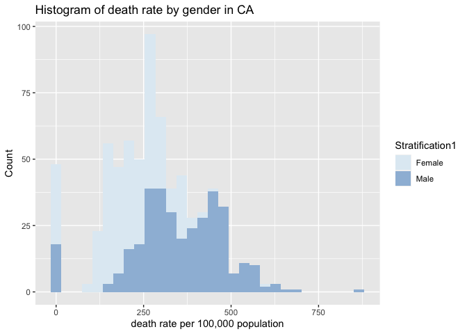
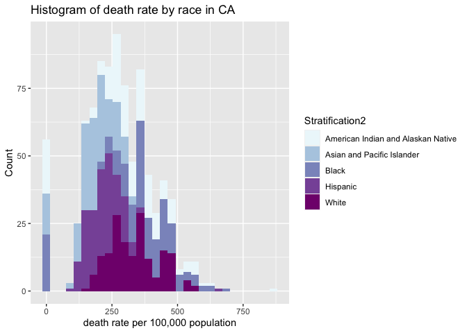

Midterm Project
================
Caroline He
10/19/2021

# PM566 Midterm Project

## Introduction

#### (provide background on your dataset and formulated question)

##### Data Background

2013 to 2015, 3-year average. Rates are age-standardized. County rates
are spatially smoothed. The data can be viewed by gender and
race/ethnicity. Data source: National Vital Statistics System.
Additional data, maps, and methodology can be viewed on the Interactive
Atlas of Heart Disease and Stroke <http://www.cdc.gov/dhdsp/maps/atlas>
What is the association between Heart diseases death and two
stratification (gender and races) in California?

## Methods

#### (include how and where the data were acquired, how you cleaned and wrangled the data, what tools you used for data exploration)

``` r
library(gsubfn)
```

    ## Loading required package: proto

    ## Could not load tcltk.  Will use slower R code instead.

``` r
library(data.table)
library(dplyr)
```

    ## 
    ## Attaching package: 'dplyr'

    ## The following objects are masked from 'package:data.table':
    ## 
    ##     between, first, last

    ## The following objects are masked from 'package:stats':
    ## 
    ##     filter, lag

    ## The following objects are masked from 'package:base':
    ## 
    ##     intersect, setdiff, setequal, union

``` r
library(dtplyr)
library(tidyr)
library(readr)
library(ggplot2)
library(leaflet)
library(sf)
```

    ## Linking to GEOS 3.8.1, GDAL 3.2.1, PROJ 7.2.1

``` r
library(raster)
```

    ## Loading required package: sp

    ## 
    ## Attaching package: 'raster'

    ## The following object is masked from 'package:tidyr':
    ## 
    ##     extract

    ## The following object is masked from 'package:dplyr':
    ## 
    ##     select

    ## The following object is masked from 'package:data.table':
    ## 
    ##     shift

``` r
# download and read in the data
if (!file.exists("Heart_Disease_Mortality_Data_Among_US_Adults__35___by_State_Territory_and_County.csv")) {
download.file("https://chronicdata.cdc.gov/api/views/i2vk-mgdh/rows.csv?accessType=DOWNLOAD", 
              method="libcurl", 
              timeout = 60
              )
}
heartdisease <- data.table::fread("Heart_Disease_Mortality_Data_Among_US_Adults__35___by_State_Territory_and_County.csv")
```

``` r
# check for NAs
knitr::kable(dim(heartdisease))
```

|     x |
|------:|
| 59076 |
|    19 |

``` r
knitr::kable(head(heartdisease))
```

| Year | LocationAbbr | LocationDesc   | GeographicLevel | DataSource | Class                   | Topic                   | Data\_Value | Data\_Value\_Unit      | Data\_Value\_Type                                     | Data\_Value\_Footnote\_Symbol | Data\_Value\_Footnote | StratificationCategory1 | Stratification1 | StratificationCategory2 | Stratification2 | TopicID | LocationID | Location 1               |
|-----:|:-------------|:---------------|:----------------|:-----------|:------------------------|:------------------------|------------:|:-----------------------|:------------------------------------------------------|:------------------------------|:----------------------|:------------------------|:----------------|:------------------------|:----------------|:--------|-----------:|:-------------------------|
| 2014 | AK           | Aleutians East | County          | NVSS       | Cardiovascular Diseases | Heart Disease Mortality |       105.3 | per 100,000 population | Age-adjusted, Spatially Smoothed, 3-year Average Rate |                               |                       | Gender                  | Overall         | Race/Ethnicity          | Overall         | T2      |       2013 | (55.440626, -161.962562) |
| 2014 | AK           | Aleutians West | County          | NVSS       | Cardiovascular Diseases | Heart Disease Mortality |       211.9 | per 100,000 population | Age-adjusted, Spatially Smoothed, 3-year Average Rate |                               |                       | Gender                  | Overall         | Race/Ethnicity          | Overall         | T2      |       2016 | (52.995403, -170.251538) |
| 2014 | AK           | Anchorage      | County          | NVSS       | Cardiovascular Diseases | Heart Disease Mortality |       257.9 | per 100,000 population | Age-adjusted, Spatially Smoothed, 3-year Average Rate |                               |                       | Gender                  | Overall         | Race/Ethnicity          | Overall         | T2      |       2020 | (61.159049, -149.103905) |
| 2014 | AK           | Bethel         | County          | NVSS       | Cardiovascular Diseases | Heart Disease Mortality |       351.6 | per 100,000 population | Age-adjusted, Spatially Smoothed, 3-year Average Rate |                               |                       | Gender                  | Overall         | Race/Ethnicity          | Overall         | T2      |       2050 | (60.924483, -159.749655) |
| 2014 | AK           | Bristol Bay    | County          | NVSS       | Cardiovascular Diseases | Heart Disease Mortality |          NA | per 100,000 population | Age-adjusted, Spatially Smoothed, 3-year Average Rate | \~                            | Insufficient Data     | Gender                  | Overall         | Race/Ethnicity          | Overall         | T2      |       2060 | (58.754192, -156.694709) |
| 2014 | AK           | Denali         | County          | NVSS       | Cardiovascular Diseases | Heart Disease Mortality |       305.5 | per 100,000 population | Age-adjusted, Spatially Smoothed, 3-year Average Rate |                               |                       | Gender                  | Overall         | Race/Ethnicity          | Overall         | T2      |       2068 | (63.678399, -149.962076) |

``` r
knitr::kable(tail(heartdisease))
```

| Year | LocationAbbr | LocationDesc     | GeographicLevel | DataSource | Class                   | Topic                   | Data\_Value | Data\_Value\_Unit      | Data\_Value\_Type                                     | Data\_Value\_Footnote\_Symbol | Data\_Value\_Footnote | StratificationCategory1 | Stratification1 | StratificationCategory2 | Stratification2            | TopicID | LocationID | Location 1               |
|-----:|:-------------|:-----------------|:----------------|:-----------|:------------------------|:------------------------|------------:|:-----------------------|:------------------------------------------------------|:------------------------------|:----------------------|:------------------------|:----------------|:------------------------|:---------------------------|:--------|-----------:|:-------------------------|
| 2014 | AK           | Denali           | County          | NVSS       | Cardiovascular Diseases | Heart Disease Mortality |          NA | per 100,000 population | Age-adjusted, Spatially Smoothed, 3-year Average Rate | \~                            | Insufficient Data     | Gender                  | Overall         | Race/Ethnicity          | Black                      | T2      |       2068 | (63.678399, -149.962076) |
| 2014 | TX           | Lubbock County   | County          | NVSS       | Cardiovascular Diseases | Heart Disease Mortality |          NA | per 100,000 population | Age-adjusted, Spatially Smoothed, 3-year Average Rate | \~                            | Insufficient Data     | Gender                  | Male            | Race/Ethnicity          | Asian and Pacific Islander | T2      |      48303 | (33.613697, -101.820878) |
| 2014 | TX           | Mitchell County  | County          | NVSS       | Cardiovascular Diseases | Heart Disease Mortality |          NA | per 100,000 population | Age-adjusted, Spatially Smoothed, 3-year Average Rate | \~                            | Insufficient Data     | Gender                  | Male            | Race/Ethnicity          | Black                      | T2      |      48335 | (32.306972, -100.919542) |
| 2014 | IA           | Winnebago County | County          | NVSS       | Cardiovascular Diseases | Heart Disease Mortality |          NA | per 100,000 population | Age-adjusted, Spatially Smoothed, 3-year Average Rate | \~                            | Insufficient Data     | Gender                  | Female          | Race/Ethnicity          | Asian and Pacific Islander | T2      |      19189 | (43.375754, -93.73907)   |
| 2014 | WV           | Lewis County     | County          | NVSS       | Cardiovascular Diseases | Heart Disease Mortality |          NA | per 100,000 population | Age-adjusted, Spatially Smoothed, 3-year Average Rate | \~                            | Insufficient Data     | Gender                  | Female          | Race/Ethnicity          | Asian and Pacific Islander | T2      |      54041 | (38.995666, -80.505332)  |
| 2014 | KS           | Republic County  | County          | NVSS       | Cardiovascular Diseases | Heart Disease Mortality |          NA | per 100,000 population | Age-adjusted, Spatially Smoothed, 3-year Average Rate | \~                            | Insufficient Data     | Gender                  | Female          | Race/Ethnicity          | Asian and Pacific Islander | T2      |      20157 | (39.82459, -97.646162)   |

``` r
knitr::kable(summary(is.na(heartdisease)))
```

|     | Year          | LocationAbbr  | LocationDesc  | GeographicLevel | DataSource    | Class         | Topic         | Data\_Value   | Data\_Value\_Unit | Data\_Value\_Type | Data\_Value\_Footnote\_Symbol | Data\_Value\_Footnote | StratificationCategory1 | Stratification1 | StratificationCategory2 | Stratification2 | TopicID       | LocationID    | Location 1    |
|:----|:--------------|:--------------|:--------------|:----------------|:--------------|:--------------|:--------------|:--------------|:------------------|:------------------|:------------------------------|:----------------------|:------------------------|:----------------|:------------------------|:----------------|:--------------|:--------------|:--------------|
|     | Mode :logical | Mode :logical | Mode :logical | Mode :logical   | Mode :logical | Mode :logical | Mode :logical | Mode :logical | Mode :logical     | Mode :logical     | Mode :logical                 | Mode :logical         | Mode :logical           | Mode :logical   | Mode :logical           | Mode :logical   | Mode :logical | Mode :logical | Mode :logical |
|     | FALSE:59076   | FALSE:59076   | FALSE:59076   | FALSE:59076     | FALSE:59076   | FALSE:59076   | FALSE:59076   | FALSE:32149   | FALSE:59076       | FALSE:59076       | FALSE:59076                   | FALSE:59076           | FALSE:59076             | FALSE:59076     | FALSE:59076             | FALSE:59076     | FALSE:59076   | FALSE:59076   | FALSE:59076   |
|     | NA            | NA            | NA            | NA              | NA            | NA            | NA            | TRUE :26927   | NA                | NA                | NA                            | NA                    | NA                      | NA              | NA                      | NA              | NA            | NA            | NA            |

``` r
# Looks like only Data_Value contained NAs
heartdisease$Data_Value <- heartdisease$Data_Value %>% replace_na(0)
mean(is.na(heartdisease$Data_Value))
```

    ## [1] 0

``` r
knitr::kable(summary(is.na(heartdisease)))
```

|     | Year          | LocationAbbr  | LocationDesc  | GeographicLevel | DataSource    | Class         | Topic         | Data\_Value   | Data\_Value\_Unit | Data\_Value\_Type | Data\_Value\_Footnote\_Symbol | Data\_Value\_Footnote | StratificationCategory1 | Stratification1 | StratificationCategory2 | Stratification2 | TopicID       | LocationID    | Location 1    |
|:----|:--------------|:--------------|:--------------|:----------------|:--------------|:--------------|:--------------|:--------------|:------------------|:------------------|:------------------------------|:----------------------|:------------------------|:----------------|:------------------------|:----------------|:--------------|:--------------|:--------------|
|     | Mode :logical | Mode :logical | Mode :logical | Mode :logical   | Mode :logical | Mode :logical | Mode :logical | Mode :logical | Mode :logical     | Mode :logical     | Mode :logical                 | Mode :logical         | Mode :logical           | Mode :logical   | Mode :logical           | Mode :logical   | Mode :logical | Mode :logical | Mode :logical |
|     | FALSE:59076   | FALSE:59076   | FALSE:59076   | FALSE:59076     | FALSE:59076   | FALSE:59076   | FALSE:59076   | FALSE:59076   | FALSE:59076       | FALSE:59076       | FALSE:59076                   | FALSE:59076           | FALSE:59076             | FALSE:59076     | FALSE:59076             | FALSE:59076     | FALSE:59076   | FALSE:59076   | FALSE:59076   |

``` r
# selec data in California
heartdisease_CA <- heartdisease[LocationAbbr == 'CA' & GeographicLevel == 'County']
knitr::kable(head(heartdisease_CA))
```

| Year | LocationAbbr | LocationDesc     | GeographicLevel | DataSource | Class                   | Topic                   | Data\_Value | Data\_Value\_Unit      | Data\_Value\_Type                                     | Data\_Value\_Footnote\_Symbol | Data\_Value\_Footnote | StratificationCategory1 | Stratification1 | StratificationCategory2 | Stratification2 | TopicID | LocationID | Location 1               |
|-----:|:-------------|:-----------------|:----------------|:-----------|:------------------------|:------------------------|------------:|:-----------------------|:------------------------------------------------------|:------------------------------|:----------------------|:------------------------|:----------------|:------------------------|:----------------|:--------|-----------:|:-------------------------|
| 2014 | CA           | Alameda County   | County          | NVSS       | Cardiovascular Diseases | Heart Disease Mortality |       225.6 | per 100,000 population | Age-adjusted, Spatially Smoothed, 3-year Average Rate |                               |                       | Gender                  | Overall         | Race/Ethnicity          | Overall         | T2      |       6001 | (37.640732, -121.874174) |
| 2014 | CA           | Alpine County    | County          | NVSS       | Cardiovascular Diseases | Heart Disease Mortality |       286.3 | per 100,000 population | Age-adjusted, Spatially Smoothed, 3-year Average Rate |                               |                       | Gender                  | Overall         | Race/Ethnicity          | Overall         | T2      |       6003 | (38.596494, -119.817775) |
| 2014 | CA           | Amador County    | County          | NVSS       | Cardiovascular Diseases | Heart Disease Mortality |       312.7 | per 100,000 population | Age-adjusted, Spatially Smoothed, 3-year Average Rate |                               |                       | Gender                  | Overall         | Race/Ethnicity          | Overall         | T2      |       6005 | (38.441847, -120.650063) |
| 2014 | CA           | Butte County     | County          | NVSS       | Cardiovascular Diseases | Heart Disease Mortality |       335.6 | per 100,000 population | Age-adjusted, Spatially Smoothed, 3-year Average Rate |                               |                       | Gender                  | Overall         | Race/Ethnicity          | Overall         | T2      |       6007 | (39.663077, -121.592018) |
| 2014 | CA           | Calaveras County | County          | NVSS       | Cardiovascular Diseases | Heart Disease Mortality |       343.2 | per 100,000 population | Age-adjusted, Spatially Smoothed, 3-year Average Rate |                               |                       | Gender                  | Overall         | Race/Ethnicity          | Overall         | T2      |       6009 | (38.202946, -120.544084) |
| 2014 | CA           | Colusa County    | County          | NVSS       | Cardiovascular Diseases | Heart Disease Mortality |       309.2 | per 100,000 population | Age-adjusted, Spatially Smoothed, 3-year Average Rate |                               |                       | Gender                  | Overall         | Race/Ethnicity          | Overall         | T2      |       6011 | (39.178048, -122.229505) |

``` r
knitr::kable(dim(heartdisease_CA))
```

|    x |
|-----:|
| 1044 |
|   19 |

``` r
# remove "()" in strings
heartdisease_CA$`Location 1` <- gsub("[()]", "", heartdisease_CA$`Location 1`)
# separate lat and lon variables
heartdisease_CA <- heartdisease_CA %>%
  separate(col = 'Location 1', into=c('lat', 'lon'), sep=',')
# convert chr to num
heartdisease_CA$Data_Value <- as.numeric(heartdisease_CA$Data_Value)
heartdisease_CA$lat <- as.numeric(heartdisease_CA$lat)
heartdisease_CA$lon <- as.numeric(heartdisease_CA$lon)
# stratify into different death rate range
heartdisease_CA[, death_rate_range := 
          fifelse(Data_Value < 100, "<100",
                  fifelse(Data_Value >= 100 & Data_Value < 200, "100-200",
                          fifelse(Data_Value >= 200 & Data_Value < 300, "200-300",
                                  fifelse(Data_Value >= 300 & Data_Value < 400, "300-400",
                                          fifelse(Data_Value >= 400 & Data_Value <500, "400-500",
                                                  fifelse(Data_Value >= 500 & Data_Value < 600, "500-600",
                                                          fifelse(Data_Value > 600, ">600", "none")))))))]
knitr::kable(head(heartdisease_CA))
```

| Year | LocationAbbr | LocationDesc     | GeographicLevel | DataSource | Class                   | Topic                   | Data\_Value | Data\_Value\_Unit      | Data\_Value\_Type                                     | Data\_Value\_Footnote\_Symbol | Data\_Value\_Footnote | StratificationCategory1 | Stratification1 | StratificationCategory2 | Stratification2 | TopicID | LocationID |      lat |       lon | death\_rate\_range |
|-----:|:-------------|:-----------------|:----------------|:-----------|:------------------------|:------------------------|------------:|:-----------------------|:------------------------------------------------------|:------------------------------|:----------------------|:------------------------|:----------------|:------------------------|:----------------|:--------|-----------:|---------:|----------:|:-------------------|
| 2014 | CA           | Alameda County   | County          | NVSS       | Cardiovascular Diseases | Heart Disease Mortality |       225.6 | per 100,000 population | Age-adjusted, Spatially Smoothed, 3-year Average Rate |                               |                       | Gender                  | Overall         | Race/Ethnicity          | Overall         | T2      |       6001 | 37.64073 | -121.8742 | 200-300            |
| 2014 | CA           | Alpine County    | County          | NVSS       | Cardiovascular Diseases | Heart Disease Mortality |       286.3 | per 100,000 population | Age-adjusted, Spatially Smoothed, 3-year Average Rate |                               |                       | Gender                  | Overall         | Race/Ethnicity          | Overall         | T2      |       6003 | 38.59649 | -119.8178 | 200-300            |
| 2014 | CA           | Amador County    | County          | NVSS       | Cardiovascular Diseases | Heart Disease Mortality |       312.7 | per 100,000 population | Age-adjusted, Spatially Smoothed, 3-year Average Rate |                               |                       | Gender                  | Overall         | Race/Ethnicity          | Overall         | T2      |       6005 | 38.44185 | -120.6501 | 300-400            |
| 2014 | CA           | Butte County     | County          | NVSS       | Cardiovascular Diseases | Heart Disease Mortality |       335.6 | per 100,000 population | Age-adjusted, Spatially Smoothed, 3-year Average Rate |                               |                       | Gender                  | Overall         | Race/Ethnicity          | Overall         | T2      |       6007 | 39.66308 | -121.5920 | 300-400            |
| 2014 | CA           | Calaveras County | County          | NVSS       | Cardiovascular Diseases | Heart Disease Mortality |       343.2 | per 100,000 population | Age-adjusted, Spatially Smoothed, 3-year Average Rate |                               |                       | Gender                  | Overall         | Race/Ethnicity          | Overall         | T2      |       6009 | 38.20295 | -120.5441 | 300-400            |
| 2014 | CA           | Colusa County    | County          | NVSS       | Cardiovascular Diseases | Heart Disease Mortality |       309.2 | per 100,000 population | Age-adjusted, Spatially Smoothed, 3-year Average Rate |                               |                       | Gender                  | Overall         | Race/Ethnicity          | Overall         | T2      |       6011 | 39.17805 | -122.2295 | 300-400            |

``` r
CA_gender <- heartdisease_CA[Stratification1 != 'Overall']
knitr::kable(head(CA_gender))
```

| Year | LocationAbbr | LocationDesc     | GeographicLevel | DataSource | Class                   | Topic                   | Data\_Value | Data\_Value\_Unit      | Data\_Value\_Type                                     | Data\_Value\_Footnote\_Symbol | Data\_Value\_Footnote | StratificationCategory1 | Stratification1 | StratificationCategory2 | Stratification2 | TopicID | LocationID |      lat |       lon | death\_rate\_range |
|-----:|:-------------|:-----------------|:----------------|:-----------|:------------------------|:------------------------|------------:|:-----------------------|:------------------------------------------------------|:------------------------------|:----------------------|:------------------------|:----------------|:------------------------|:----------------|:--------|-----------:|---------:|----------:|:-------------------|
| 2014 | CA           | Alameda County   | County          | NVSS       | Cardiovascular Diseases | Heart Disease Mortality |       295.7 | per 100,000 population | Age-adjusted, Spatially Smoothed, 3-year Average Rate |                               |                       | Gender                  | Male            | Race/Ethnicity          | Overall         | T2      |       6001 | 37.64073 | -121.8742 | 200-300            |
| 2014 | CA           | Alpine County    | County          | NVSS       | Cardiovascular Diseases | Heart Disease Mortality |       374.5 | per 100,000 population | Age-adjusted, Spatially Smoothed, 3-year Average Rate |                               |                       | Gender                  | Male            | Race/Ethnicity          | Overall         | T2      |       6003 | 38.59649 | -119.8178 | 300-400            |
| 2014 | CA           | Amador County    | County          | NVSS       | Cardiovascular Diseases | Heart Disease Mortality |       408.0 | per 100,000 population | Age-adjusted, Spatially Smoothed, 3-year Average Rate |                               |                       | Gender                  | Male            | Race/Ethnicity          | Overall         | T2      |       6005 | 38.44185 | -120.6501 | 400-500            |
| 2014 | CA           | Butte County     | County          | NVSS       | Cardiovascular Diseases | Heart Disease Mortality |       450.5 | per 100,000 population | Age-adjusted, Spatially Smoothed, 3-year Average Rate |                               |                       | Gender                  | Male            | Race/Ethnicity          | Overall         | T2      |       6007 | 39.66308 | -121.5920 | 400-500            |
| 2014 | CA           | Calaveras County | County          | NVSS       | Cardiovascular Diseases | Heart Disease Mortality |       436.7 | per 100,000 population | Age-adjusted, Spatially Smoothed, 3-year Average Rate |                               |                       | Gender                  | Male            | Race/Ethnicity          | Overall         | T2      |       6009 | 38.20295 | -120.5441 | 400-500            |
| 2014 | CA           | Colusa County    | County          | NVSS       | Cardiovascular Diseases | Heart Disease Mortality |       401.4 | per 100,000 population | Age-adjusted, Spatially Smoothed, 3-year Average Rate |                               |                       | Gender                  | Male            | Race/Ethnicity          | Overall         | T2      |       6011 | 39.17805 | -122.2295 | 400-500            |

``` r
CA_race <- heartdisease_CA[Stratification2 != 'Overall']
knitr::kable(head(CA_race))
```

| Year | LocationAbbr | LocationDesc     | GeographicLevel | DataSource | Class                   | Topic                   | Data\_Value | Data\_Value\_Unit      | Data\_Value\_Type                                     | Data\_Value\_Footnote\_Symbol | Data\_Value\_Footnote | StratificationCategory1 | Stratification1 | StratificationCategory2 | Stratification2 | TopicID | LocationID |      lat |       lon | death\_rate\_range |
|-----:|:-------------|:-----------------|:----------------|:-----------|:------------------------|:------------------------|------------:|:-----------------------|:------------------------------------------------------|:------------------------------|:----------------------|:------------------------|:----------------|:------------------------|:----------------|:--------|-----------:|---------:|----------:|:-------------------|
| 2014 | CA           | Alameda County   | County          | NVSS       | Cardiovascular Diseases | Heart Disease Mortality |       257.9 | per 100,000 population | Age-adjusted, Spatially Smoothed, 3-year Average Rate |                               |                       | Gender                  | Overall         | Race/Ethnicity          | White           | T2      |       6001 | 37.64073 | -121.8742 | 200-300            |
| 2014 | CA           | Alpine County    | County          | NVSS       | Cardiovascular Diseases | Heart Disease Mortality |       295.4 | per 100,000 population | Age-adjusted, Spatially Smoothed, 3-year Average Rate |                               |                       | Gender                  | Overall         | Race/Ethnicity          | White           | T2      |       6003 | 38.59649 | -119.8178 | 200-300            |
| 2014 | CA           | Amador County    | County          | NVSS       | Cardiovascular Diseases | Heart Disease Mortality |       322.2 | per 100,000 population | Age-adjusted, Spatially Smoothed, 3-year Average Rate |                               |                       | Gender                  | Overall         | Race/Ethnicity          | White           | T2      |       6005 | 38.44185 | -120.6501 | 300-400            |
| 2014 | CA           | Butte County     | County          | NVSS       | Cardiovascular Diseases | Heart Disease Mortality |       348.8 | per 100,000 population | Age-adjusted, Spatially Smoothed, 3-year Average Rate |                               |                       | Gender                  | Overall         | Race/Ethnicity          | White           | T2      |       6007 | 39.66308 | -121.5920 | 300-400            |
| 2014 | CA           | Calaveras County | County          | NVSS       | Cardiovascular Diseases | Heart Disease Mortality |       356.4 | per 100,000 population | Age-adjusted, Spatially Smoothed, 3-year Average Rate |                               |                       | Gender                  | Overall         | Race/Ethnicity          | White           | T2      |       6009 | 38.20295 | -120.5441 | 300-400            |
| 2014 | CA           | Colusa County    | County          | NVSS       | Cardiovascular Diseases | Heart Disease Mortality |       358.2 | per 100,000 population | Age-adjusted, Spatially Smoothed, 3-year Average Rate |                               |                       | Gender                  | Overall         | Race/Ethnicity          | White           | T2      |       6011 | 39.17805 | -122.2295 | 300-400            |

``` r
CA_overall <- heartdisease_CA[Stratification1 == 'Overall' & Stratification2 == 'Overall']
knitr::kable(head(CA_overall))
```

| Year | LocationAbbr | LocationDesc     | GeographicLevel | DataSource | Class                   | Topic                   | Data\_Value | Data\_Value\_Unit      | Data\_Value\_Type                                     | Data\_Value\_Footnote\_Symbol | Data\_Value\_Footnote | StratificationCategory1 | Stratification1 | StratificationCategory2 | Stratification2 | TopicID | LocationID |      lat |       lon | death\_rate\_range |
|-----:|:-------------|:-----------------|:----------------|:-----------|:------------------------|:------------------------|------------:|:-----------------------|:------------------------------------------------------|:------------------------------|:----------------------|:------------------------|:----------------|:------------------------|:----------------|:--------|-----------:|---------:|----------:|:-------------------|
| 2014 | CA           | Alameda County   | County          | NVSS       | Cardiovascular Diseases | Heart Disease Mortality |       225.6 | per 100,000 population | Age-adjusted, Spatially Smoothed, 3-year Average Rate |                               |                       | Gender                  | Overall         | Race/Ethnicity          | Overall         | T2      |       6001 | 37.64073 | -121.8742 | 200-300            |
| 2014 | CA           | Alpine County    | County          | NVSS       | Cardiovascular Diseases | Heart Disease Mortality |       286.3 | per 100,000 population | Age-adjusted, Spatially Smoothed, 3-year Average Rate |                               |                       | Gender                  | Overall         | Race/Ethnicity          | Overall         | T2      |       6003 | 38.59649 | -119.8178 | 200-300            |
| 2014 | CA           | Amador County    | County          | NVSS       | Cardiovascular Diseases | Heart Disease Mortality |       312.7 | per 100,000 population | Age-adjusted, Spatially Smoothed, 3-year Average Rate |                               |                       | Gender                  | Overall         | Race/Ethnicity          | Overall         | T2      |       6005 | 38.44185 | -120.6501 | 300-400            |
| 2014 | CA           | Butte County     | County          | NVSS       | Cardiovascular Diseases | Heart Disease Mortality |       335.6 | per 100,000 population | Age-adjusted, Spatially Smoothed, 3-year Average Rate |                               |                       | Gender                  | Overall         | Race/Ethnicity          | Overall         | T2      |       6007 | 39.66308 | -121.5920 | 300-400            |
| 2014 | CA           | Calaveras County | County          | NVSS       | Cardiovascular Diseases | Heart Disease Mortality |       343.2 | per 100,000 population | Age-adjusted, Spatially Smoothed, 3-year Average Rate |                               |                       | Gender                  | Overall         | Race/Ethnicity          | Overall         | T2      |       6009 | 38.20295 | -120.5441 | 300-400            |
| 2014 | CA           | Colusa County    | County          | NVSS       | Cardiovascular Diseases | Heart Disease Mortality |       309.2 | per 100,000 population | Age-adjusted, Spatially Smoothed, 3-year Average Rate |                               |                       | Gender                  | Overall         | Race/Ethnicity          | Overall         | T2      |       6011 | 39.17805 | -122.2295 | 300-400            |

``` r
knitr::kable(dim(CA_overall))
```

|   x |
|----:|
|  58 |
|  21 |

## Preliminary Results

#### (provide summary statistics in tabular form and publication-quality figures, take a look at the kable function from knitr to write nice tables in Rmarkdown)

``` r
CA_gender %>%
    ggplot(mapping = aes(x = Data_Value)) + 
    geom_histogram(mapping = aes (fill = Stratification1)) +
    scale_fill_brewer(palette = "BuPu") +
    labs(
      x = "death rate per 100,000 population",
      y = "Count",
      title = "Histogram of death rate by gender in CA")
```

    ## `stat_bin()` using `bins = 30`. Pick better value with `binwidth`.

<!-- -->

``` r
CA_race %>%
    ggplot(mapping = aes(x = Data_Value)) + 
    geom_histogram(mapping = aes (fill = Stratification2)) +
    scale_fill_brewer(palette = "BuPu") +
    labs(
      x = "death rate per 100,000 population",
      y = "Count",
      title = "Histogram of death rate by race in CA")
```

    ## `stat_bin()` using `bins = 30`. Pick better value with `binwidth`.

<!-- -->

``` r
CA_male <- heartdisease_CA[Stratification1 == 'Male']
CA_female <- heartdisease_CA[Stratification1 == 'Female']

temp.pal <- colorNumeric(palette = "YlGnBu", domain = CA_gender$Data_Value)

map_gender <- leaflet() %>% 
  addProviderTiles('CartoDB.Positron') %>% 
  addCircles(
    data = CA_male,
    lat = ~lat, lng=~lon,
    label = CA_male$LocationDesc, color = ~ temp.pal(Data_Value),
    opacity = 1, fillOpacity = 1, radius = 500, group = "Male"
    ) %>%
  addCircles(
    data = CA_female,
    lat = ~lat, lng=~lon,
    label = CA_female$LocationDesc, color = ~ temp.pal(Data_Value),
    opacity = 1, fillOpacity = 1, radius = 500, group = "Female"
    ) %>%
  addCircles(
    data = CA_overall,
    lat = ~lat, lng=~lon,
    label = CA_overall$LocationDesc, color = ~ temp.pal(Data_Value),
    opacity = 1, fillOpacity = 1, radius = 500, group = "Overall"
    ) %>%
  addLayersControl(baseGroups = c("Male", "Famle", "Overall")) %>%
  addLegend('bottomleft', pal=temp.pal, values=CA_gender$Data_Value,
          title='heart diseases death rate per 100,000 population based on gender in CA', opacity=1)
map_gender
```

<div id="htmlwidget-2b913e4c4dee5df00006" style="width:672px;height:480px;" class="leaflet html-widget"></div>
<script type="application/json" data-for="htmlwidget-2b913e4c4dee5df00006">{"x":{"options":{"crs":{"crsClass":"L.CRS.EPSG3857","code":null,"proj4def":null,"projectedBounds":null,"options":{}}},"calls":[{"method":"addProviderTiles","args":["CartoDB.Positron",null,null,{"errorTileUrl":"","noWrap":false,"detectRetina":false}]},{"method":"addCircles","args":[[37.640732,38.596494,38.441847,39.663077,38.202946,39.178048,37.913598,41.738952,38.775788,36.754708,39.597469,40.698187,33.041824,36.508867,35.345591,36.078649,39.09737,40.669961,34.322796,37.212682,38.073204,37.575843,39.436309,37.186923,41.583941,37.933321,36.216903,38.508289,39.295924,33.704545,39.061511,40.002158,33.745425,38.465312,36.605701,34.844701,33.035423,37.746542,37.932727,35.390034,37.423939,34.672496,37.224522,37.052057,40.758306,39.576693,41.588337,38.288602,38.527617,37.553933,39.033545,40.12057,40.64749,36.220455,38.024398,34.472949,38.68661,39.268646,37.640732,38.596494,38.441847,39.663077,38.202946,39.178048,37.913598,41.738952,38.775788,36.754708,39.597469,40.698187,33.041824,36.508867,35.345591,36.078649,39.09737,40.669961,34.322796,37.212682,38.073204,37.575843,39.436309,37.186923,41.583941,37.933321,36.216903,38.508289,39.295924,33.704545,39.061511,40.002158,33.745425,38.465312,36.605701,34.844701,33.035423,37.746542,37.932727,35.390034,37.423939,34.672496,37.224522,37.052057,40.758306,39.576693,41.588337,38.288602,38.527617,37.553933,39.033545,40.12057,40.64749,36.220455,38.024398,34.472949,38.68661,39.268646,37.640732,38.441847,39.663077,38.202946,39.178048,37.913598,41.738952,38.775788,36.754708,39.597469,33.041824,36.508867,35.345591,36.078649,39.09737,40.669961,34.322796,37.212682,38.073204,37.575843,39.436309,37.186923,41.583941,37.933321,36.216903,38.508289,39.295924,33.704545,39.061511,40.002158,33.745425,38.465312,36.605701,34.844701,33.035423,37.746542,37.932727,35.390034,37.423939,34.672496,37.224522,37.052057,39.576693,38.288602,38.527617,37.553933,39.033545,40.12057,40.64749,36.220455,38.024398,34.472949,38.68661,39.268646,37.640732,38.596494,38.441847,39.663077,38.202946,39.178048,37.913598,41.738952,38.775788,36.754708,39.597469,40.698187,33.041824,36.508867,35.345591,36.078649,39.09737,40.669961,34.322796,37.212682,38.073204,37.575843,39.436309,37.186923,41.583941,37.933321,36.216903,38.508289,39.295924,33.704545,39.061511,40.002158,33.745425,38.465312,36.605701,34.844701,33.035423,37.746542,37.932727,35.390034,37.423939,34.672496,37.224522,37.052057,40.758306,39.576693,41.588337,38.288602,38.527617,37.553933,39.033545,40.12057,40.64749,36.220455,38.024398,34.472949,38.68661,39.268646,37.640732,38.596494,38.441847,39.663077,38.202946,39.178048,37.913598,41.738952,38.775788,36.754708,39.597469,40.698187,33.041824,36.508867,35.345591,36.078649,39.09737,40.669961,34.322796,37.212682,38.073204,37.575843,39.436309,37.186923,41.583941,37.933321,36.216903,38.508289,39.295924,33.704545,39.061511,40.002158,33.745425,38.465312,36.605701,34.844701,33.035423,37.746542,37.932727,35.390034,37.423939,34.672496,37.224522,37.052057,40.758306,39.576693,41.588337,38.288602,38.527617,37.553933,39.033545,40.12057,40.64749,36.220455,38.024398,34.472949,38.68661,39.268646,37.746542,37.933321,37.212682,37.186923,37.913598,38.68661,39.295924,37.224522,40.758306,41.738952,39.033545,38.073204,36.078649,37.423939,35.345591,34.322796,33.041824,40.698187,38.527617,39.663077,38.596494,33.035423,38.596494,37.640732,40.669961,34.844701,36.220455,38.508289,33.745425,40.698187,38.024398,40.64749,37.052057,41.588337,39.061511,37.553933,40.758306,41.583941,33.704545,34.472949,36.754708,38.465312,37.575843,38.441847,35.390034,39.268646,39.597469,36.508867,38.775788,39.178048,38.202946,36.216903,39.576693,34.672496,40.002158,39.436309,39.09737,37.932727,36.605701,40.12057,38.288602,41.588337],[-121.874174,-119.817775,-120.650063,-121.592018,-120.544084,-122.229505,-121.912906,-123.889508,-120.518515,-119.641323,-122.383535,-123.863888,-115.364568,-117.407146,-118.73308,-119.803263,-122.744185,-120.589843,-118.221787,-119.74733,-122.720114,-119.896002,-123.377828,-120.704731,-120.718904,-118.882552,-121.227026,-122.327344,-120.761996,-117.756775,-120.710638,-120.838191,-115.994935,-121.31769,-121.060133,-116.176459,-116.737646,-122.430647,-121.264123,-120.400968,-122.322358,-120.012285,-121.684758,-121.982295,-122.03692,-120.505271,-122.533844,-121.913023,-122.887364,-120.989631,-121.687339,-122.226655,-123.104847,-118.792225,-119.946028,-119.076397,-121.897776,-121.340045,-121.874174,-119.817775,-120.650063,-121.592018,-120.544084,-122.229505,-121.912906,-123.889508,-120.518515,-119.641323,-122.383535,-123.863888,-115.364568,-117.407146,-118.73308,-119.803263,-122.744185,-120.589843,-118.221787,-119.74733,-122.720114,-119.896002,-123.377828,-120.704731,-120.718904,-118.882552,-121.227026,-122.327344,-120.761996,-117.756775,-120.710638,-120.838191,-115.994935,-121.31769,-121.060133,-116.176459,-116.737646,-122.430647,-121.264123,-120.400968,-122.322358,-120.012285,-121.684758,-121.982295,-122.03692,-120.505271,-122.533844,-121.913023,-122.887364,-120.989631,-121.687339,-122.226655,-123.104847,-118.792225,-119.946028,-119.076397,-121.897776,-121.340045,-121.874174,-120.650063,-121.592018,-120.544084,-122.229505,-121.912906,-123.889508,-120.518515,-119.641323,-122.383535,-115.364568,-117.407146,-118.73308,-119.803263,-122.744185,-120.589843,-118.221787,-119.74733,-122.720114,-119.896002,-123.377828,-120.704731,-120.718904,-118.882552,-121.227026,-122.327344,-120.761996,-117.756775,-120.710638,-120.838191,-115.994935,-121.31769,-121.060133,-116.176459,-116.737646,-122.430647,-121.264123,-120.400968,-122.322358,-120.012285,-121.684758,-121.982295,-120.505271,-121.913023,-122.887364,-120.989631,-121.687339,-122.226655,-123.104847,-118.792225,-119.946028,-119.076397,-121.897776,-121.340045,-121.874174,-119.817775,-120.650063,-121.592018,-120.544084,-122.229505,-121.912906,-123.889508,-120.518515,-119.641323,-122.383535,-123.863888,-115.364568,-117.407146,-118.73308,-119.803263,-122.744185,-120.589843,-118.221787,-119.74733,-122.720114,-119.896002,-123.377828,-120.704731,-120.718904,-118.882552,-121.227026,-122.327344,-120.761996,-117.756775,-120.710638,-120.838191,-115.994935,-121.31769,-121.060133,-116.176459,-116.737646,-122.430647,-121.264123,-120.400968,-122.322358,-120.012285,-121.684758,-121.982295,-122.03692,-120.505271,-122.533844,-121.913023,-122.887364,-120.989631,-121.687339,-122.226655,-123.104847,-118.792225,-119.946028,-119.076397,-121.897776,-121.340045,-121.874174,-119.817775,-120.650063,-121.592018,-120.544084,-122.229505,-121.912906,-123.889508,-120.518515,-119.641323,-122.383535,-123.863888,-115.364568,-117.407146,-118.73308,-119.803263,-122.744185,-120.589843,-118.221787,-119.74733,-122.720114,-119.896002,-123.377828,-120.704731,-120.718904,-118.882552,-121.227026,-122.327344,-120.761996,-117.756775,-120.710638,-120.838191,-115.994935,-121.31769,-121.060133,-116.176459,-116.737646,-122.430647,-121.264123,-120.400968,-122.322358,-120.012285,-121.684758,-121.982295,-122.03692,-120.505271,-122.533844,-121.913023,-122.887364,-120.989631,-121.687339,-122.226655,-123.104847,-118.792225,-119.946028,-119.076397,-121.897776,-121.340045,-122.430647,-118.882552,-119.74733,-120.704731,-121.912906,-121.897776,-120.761996,-121.684758,-122.03692,-123.889508,-121.687339,-122.720114,-119.803263,-122.322358,-118.73308,-118.221787,-115.364568,-123.863888,-122.887364,-121.592018,-119.817775,-116.737646,-119.817775,-121.874174,-120.589843,-116.176459,-118.792225,-122.327344,-115.994935,-123.863888,-119.946028,-123.104847,-121.982295,-122.533844,-120.710638,-120.989631,-122.03692,-120.718904,-117.756775,-119.076397,-119.641323,-121.31769,-119.896002,-120.650063,-120.400968,-121.340045,-122.383535,-117.407146,-120.518515,-122.229505,-120.544084,-121.227026,-120.505271,-120.012285,-120.838191,-123.377828,-122.744185,-121.264123,-121.060133,-122.226655,-121.913023,-122.533844],500,null,"Male",{"interactive":true,"className":"","stroke":true,"color":["#94D4B9","#67C2BF","#53BBC2","#3DB0C3","#40B5C4","#57BDC1","#97D5B9","#3CAFC3","#7BCBBC","#55BCC2","#47B8C3","#40B5C4","#59BDC1","#56BCC2","#36A7C2","#69C3BF","#37A8C3","#39ABC3","#63C1C0","#56BCC2","#AADDB7","#4CB9C3","#53BBC2","#59BDC1","#3DB1C4","#74C8BD","#97D5B9","#71C7BE","#9BD7B9","#7BCBBC","#7BCBBC","#3BAEC3","#57BCC2","#54BBC2","#7DCCBB","#40B4C4","#78CABC","#A4DBB8","#4CB9C3","#93D4B9","#94D4B9","#78CABC","#ACDEB7","#83CEBB","#3CAFC3","#5EBFC1","#3FB3C4","#84CFBB","#7ECDBB","#38A9C3","#4DB9C3","#3FB4C4","#3EB2C4","#3DB1C3","#54BBC2","#7BCBBC","#77C9BC","#2C9DC1","#77C9BD","#61C0C0","#48B8C3","#36A7C3","#39ABC3","#38A9C3","#8BD1BA","#3BADC3","#76C9BD","#38AAC3","#39AAC3","#3EB1C4","#1F8BBD","#37A9C3","#1E92C0","#40B5C4","#35A6C2","#32A2C2","#3EB2C4","#3CAEC3","#A2DAB8","#3BAEC3","#45B7C4","#35A6C2","#38AAC3","#6DC5BE","#7DCCBB","#5CBEC1","#9BD7B9","#5EBFC1","#7BCBBC","#38A9C3","#3DB0C3","#3EB2C4","#71C6BE","#2597C1","#6BC4BF","#7DCCBB","#35A6C2","#8BD1BA","#7FCDBB","#6FC6BE","#85CFBB","#80CDBB","#39ABC3","#5CBEC1","#3BAEC3","#73C8BD","#77C9BD","#2294C0","#35A6C2","#3AACC3","#3BAEC3","#1D90C0","#42B6C4","#69C3BF","#5DBFC1","#2187BB","#41B5C4","#FFFFD9","#75C8BD","#2185BA","#38A9C3","#41B6C4","#FFFFD9","#65C1C0","#2194C0","#35A6C2","#3BADC3","#2184BA","#236DAF","#3FB3C4","#3CAEC3","#4BB9C3","#2370B1","#236CAF","#7DCCBB","#2088BC","#3EB2C4","#1F8DBE","#51BAC2","#299AC1","#87D0BA","#50BAC2","#45B7C4","#40B5C4","#3DB1C3","#58BDC1","#34A5C2","#30A1C2","#48B8C3","#1E91C0","#3BAEC3","#3DB1C4","#2899C1","#CFECB3","#4DB9C3","#2552A2","#57BCC2","#67C3BF","#39ABC3","#42B6C4","#5CBEC1","#2F9FC2","#3CAFC3","#79CABC","#FFFFD9","#2377B4","#76C9BD","#1F8BBD","#37A9C3","#63C1C0","#BDE5B5","#D3EEB3","#95D5B9","#B4E1B6","#89D0BA","#CBEAB4","#C2E7B5","#2261A9","#C2E7B5","#91D3BA","#A9DCB7","#68C3BF","#8FD2BA","#91D3BA","#77C9BD","#90D3BA","#C9EAB4","#7DCCBB","#97D6B9","#9DD8B8","#CFECB3","#92D4B9","#B5E1B6","#A8DCB7","#A3DAB8","#A2DAB8","#C6E9B4","#CBEBB4","#A0D9B8","#AEDFB7","#78CABC","#84CFBB","#9CD7B9","#A0D9B8","#A5DBB8","#93D4B9","#A9DCB7","#BEE5B5","#8AD1BA","#CEECB3","#BCE4B5","#B3E1B6","#BAE3B6","#BDE5B5","#6EC5BE","#A6DBB8","#95D5B9","#C6E8B4","#CDEBB4","#8DD2BA","#ADDEB7","#96D5B9","#79CABC","#8BD1BA","#A0D9B8","#AEDEB7","#BEE5B5","#90D3BA","#31A2C2","#FFFFD9","#40B5C4","#69C3BF","#1F8CBE","#227EB7","#A6DBB8","#32A3C2","#A9DDB7","#71C7BE","#3AACC3","#1F8BBD","#33A3C2","#3CAEC3","#4FBAC3","#60C0C0","#236EB0","#227EB7","#6FC6BE","#76C9BD","#FFFFD9","#ABDDB7","#1F92C0","#54BCC2","#1E90BF","#70C6BE","#91D3BA","#46B7C4","#39ABC3","#60C0C0","#081D58","#4EBAC3","#3EB1C4","#2294C0","#62C1C0","#32A2C2","#55BCC2","#FFFFD9","#7ACBBC","#5ABEC1","#FFFFD9","#56BCC2","#95D5B9","#8BD1BA","#35A6C2","#3AACC3","#34A5C2","#3DB0C3","#42B6C4","#AFDFB7","#2697C1","#39AAC3","#2185BB","#59BDC1","#99D6B9","#76C9BD","#30A0C2","#9CD8B9","#D0ECB3","#8FD3BA","#99D6B9","#CAEAB4","#CEECB4","#D9F0B3","#B5E1B6","#DDF2B2","#FFFFD9","#FFFFD9","#9FD9B8","#E0F3B2","#98D6B9","#B6E2B6","#ABDDB7","#B4E1B6","#C7E9B4","#FFFFD9","#B1E0B6","#8ED2BA","#FFFFD9","#CAEAB4","#FFFFD9","#D3EEB3","#A8DCB7","#AFDFB7","#7ACBBC","#CBEBB4","#C9EAB4","#FFFFD9","#7ECCBB","#FFFFD9","#C4E8B4","#B7E2B6","#A4DBB8","#93D4B9","#FFFFD9","#ADDEB7","#CEECB4","#B5E1B6","#91D3BA","#A4DBB8","#92D4B9","#A2DAB8","#A1D9B8","#A6DBB8","#DFF2B2","#97D6B9","#A5DBB8","#ABDDB7","#94D4B9","#9BD7B9","#B0DFB7","#AEDFB7","#FFFFD9","#D5EFB3","#FFFFD9","#A3DAB8","#D1EDB3","#ADDEB7","#C1E6B5","#FFFFD9"],"weight":5,"opacity":1,"fill":true,"fillColor":["#94D4B9","#67C2BF","#53BBC2","#3DB0C3","#40B5C4","#57BDC1","#97D5B9","#3CAFC3","#7BCBBC","#55BCC2","#47B8C3","#40B5C4","#59BDC1","#56BCC2","#36A7C2","#69C3BF","#37A8C3","#39ABC3","#63C1C0","#56BCC2","#AADDB7","#4CB9C3","#53BBC2","#59BDC1","#3DB1C4","#74C8BD","#97D5B9","#71C7BE","#9BD7B9","#7BCBBC","#7BCBBC","#3BAEC3","#57BCC2","#54BBC2","#7DCCBB","#40B4C4","#78CABC","#A4DBB8","#4CB9C3","#93D4B9","#94D4B9","#78CABC","#ACDEB7","#83CEBB","#3CAFC3","#5EBFC1","#3FB3C4","#84CFBB","#7ECDBB","#38A9C3","#4DB9C3","#3FB4C4","#3EB2C4","#3DB1C3","#54BBC2","#7BCBBC","#77C9BC","#2C9DC1","#77C9BD","#61C0C0","#48B8C3","#36A7C3","#39ABC3","#38A9C3","#8BD1BA","#3BADC3","#76C9BD","#38AAC3","#39AAC3","#3EB1C4","#1F8BBD","#37A9C3","#1E92C0","#40B5C4","#35A6C2","#32A2C2","#3EB2C4","#3CAEC3","#A2DAB8","#3BAEC3","#45B7C4","#35A6C2","#38AAC3","#6DC5BE","#7DCCBB","#5CBEC1","#9BD7B9","#5EBFC1","#7BCBBC","#38A9C3","#3DB0C3","#3EB2C4","#71C6BE","#2597C1","#6BC4BF","#7DCCBB","#35A6C2","#8BD1BA","#7FCDBB","#6FC6BE","#85CFBB","#80CDBB","#39ABC3","#5CBEC1","#3BAEC3","#73C8BD","#77C9BD","#2294C0","#35A6C2","#3AACC3","#3BAEC3","#1D90C0","#42B6C4","#69C3BF","#5DBFC1","#2187BB","#41B5C4","#FFFFD9","#75C8BD","#2185BA","#38A9C3","#41B6C4","#FFFFD9","#65C1C0","#2194C0","#35A6C2","#3BADC3","#2184BA","#236DAF","#3FB3C4","#3CAEC3","#4BB9C3","#2370B1","#236CAF","#7DCCBB","#2088BC","#3EB2C4","#1F8DBE","#51BAC2","#299AC1","#87D0BA","#50BAC2","#45B7C4","#40B5C4","#3DB1C3","#58BDC1","#34A5C2","#30A1C2","#48B8C3","#1E91C0","#3BAEC3","#3DB1C4","#2899C1","#CFECB3","#4DB9C3","#2552A2","#57BCC2","#67C3BF","#39ABC3","#42B6C4","#5CBEC1","#2F9FC2","#3CAFC3","#79CABC","#FFFFD9","#2377B4","#76C9BD","#1F8BBD","#37A9C3","#63C1C0","#BDE5B5","#D3EEB3","#95D5B9","#B4E1B6","#89D0BA","#CBEAB4","#C2E7B5","#2261A9","#C2E7B5","#91D3BA","#A9DCB7","#68C3BF","#8FD2BA","#91D3BA","#77C9BD","#90D3BA","#C9EAB4","#7DCCBB","#97D6B9","#9DD8B8","#CFECB3","#92D4B9","#B5E1B6","#A8DCB7","#A3DAB8","#A2DAB8","#C6E9B4","#CBEBB4","#A0D9B8","#AEDFB7","#78CABC","#84CFBB","#9CD7B9","#A0D9B8","#A5DBB8","#93D4B9","#A9DCB7","#BEE5B5","#8AD1BA","#CEECB3","#BCE4B5","#B3E1B6","#BAE3B6","#BDE5B5","#6EC5BE","#A6DBB8","#95D5B9","#C6E8B4","#CDEBB4","#8DD2BA","#ADDEB7","#96D5B9","#79CABC","#8BD1BA","#A0D9B8","#AEDEB7","#BEE5B5","#90D3BA","#31A2C2","#FFFFD9","#40B5C4","#69C3BF","#1F8CBE","#227EB7","#A6DBB8","#32A3C2","#A9DDB7","#71C7BE","#3AACC3","#1F8BBD","#33A3C2","#3CAEC3","#4FBAC3","#60C0C0","#236EB0","#227EB7","#6FC6BE","#76C9BD","#FFFFD9","#ABDDB7","#1F92C0","#54BCC2","#1E90BF","#70C6BE","#91D3BA","#46B7C4","#39ABC3","#60C0C0","#081D58","#4EBAC3","#3EB1C4","#2294C0","#62C1C0","#32A2C2","#55BCC2","#FFFFD9","#7ACBBC","#5ABEC1","#FFFFD9","#56BCC2","#95D5B9","#8BD1BA","#35A6C2","#3AACC3","#34A5C2","#3DB0C3","#42B6C4","#AFDFB7","#2697C1","#39AAC3","#2185BB","#59BDC1","#99D6B9","#76C9BD","#30A0C2","#9CD8B9","#D0ECB3","#8FD3BA","#99D6B9","#CAEAB4","#CEECB4","#D9F0B3","#B5E1B6","#DDF2B2","#FFFFD9","#FFFFD9","#9FD9B8","#E0F3B2","#98D6B9","#B6E2B6","#ABDDB7","#B4E1B6","#C7E9B4","#FFFFD9","#B1E0B6","#8ED2BA","#FFFFD9","#CAEAB4","#FFFFD9","#D3EEB3","#A8DCB7","#AFDFB7","#7ACBBC","#CBEBB4","#C9EAB4","#FFFFD9","#7ECCBB","#FFFFD9","#C4E8B4","#B7E2B6","#A4DBB8","#93D4B9","#FFFFD9","#ADDEB7","#CEECB4","#B5E1B6","#91D3BA","#A4DBB8","#92D4B9","#A2DAB8","#A1D9B8","#A6DBB8","#DFF2B2","#97D6B9","#A5DBB8","#ABDDB7","#94D4B9","#9BD7B9","#B0DFB7","#AEDFB7","#FFFFD9","#D5EFB3","#FFFFD9","#A3DAB8","#D1EDB3","#ADDEB7","#C1E6B5","#FFFFD9"],"fillOpacity":1},null,null,["Alameda County","Alpine County","Amador County","Butte County","Calaveras County","Colusa County","Contra Costa County","Del Norte County","El Dorado County","Fresno County","Glenn County","Humboldt County","Imperial County","Inyo County","Kern County","Kings County","Lake County","Lassen County","Los Angeles County","Madera County","Marin County","Mariposa County","Mendocino County","Merced County","Modoc County","Mono County","Monterey County","Napa County","Nevada County","Orange County","Placer County","Plumas County","Riverside County","Sacramento County","San Benito County","San Bernardino County","San Diego County","San Francisco County","San Joaquin County","San Luis Obispo County","San Mateo County","Santa Barbara County","Santa Clara County","Santa Cruz County","Shasta County","Sierra County","Siskiyou County","Solano County","Sonoma County","Stanislaus County","Sutter County","Tehama County","Trinity County","Tulare County","Tuolumne County","Ventura County","Yolo County","Yuba County","Alameda County","Alpine County","Amador County","Butte County","Calaveras County","Colusa County","Contra Costa County","Del Norte County","El Dorado County","Fresno County","Glenn County","Humboldt County","Imperial County","Inyo County","Kern County","Kings County","Lake County","Lassen County","Los Angeles County","Madera County","Marin County","Mariposa County","Mendocino County","Merced County","Modoc County","Mono County","Monterey County","Napa County","Nevada County","Orange County","Placer County","Plumas County","Riverside County","Sacramento County","San Benito County","San Bernardino County","San Diego County","San Francisco County","San Joaquin County","San Luis Obispo County","San Mateo County","Santa Barbara County","Santa Clara County","Santa Cruz County","Shasta County","Sierra County","Siskiyou County","Solano County","Sonoma County","Stanislaus County","Sutter County","Tehama County","Trinity County","Tulare County","Tuolumne County","Ventura County","Yolo County","Yuba County","Alameda County","Amador County","Butte County","Calaveras County","Colusa County","Contra Costa County","Del Norte County","El Dorado County","Fresno County","Glenn County","Imperial County","Inyo County","Kern County","Kings County","Lake County","Lassen County","Los Angeles County","Madera County","Marin County","Mariposa County","Mendocino County","Merced County","Modoc County","Mono County","Monterey County","Napa County","Nevada County","Orange County","Placer County","Plumas County","Riverside County","Sacramento County","San Benito County","San Bernardino County","San Diego County","San Francisco County","San Joaquin County","San Luis Obispo County","San Mateo County","Santa Barbara County","Santa Clara County","Santa Cruz County","Sierra County","Solano County","Sonoma County","Stanislaus County","Sutter County","Tehama County","Trinity County","Tulare County","Tuolumne County","Ventura County","Yolo County","Yuba County","Alameda County","Alpine County","Amador County","Butte County","Calaveras County","Colusa County","Contra Costa County","Del Norte County","El Dorado County","Fresno County","Glenn County","Humboldt County","Imperial County","Inyo County","Kern County","Kings County","Lake County","Lassen County","Los Angeles County","Madera County","Marin County","Mariposa County","Mendocino County","Merced County","Modoc County","Mono County","Monterey County","Napa County","Nevada County","Orange County","Placer County","Plumas County","Riverside County","Sacramento County","San Benito County","San Bernardino County","San Diego County","San Francisco County","San Joaquin County","San Luis Obispo County","San Mateo County","Santa Barbara County","Santa Clara County","Santa Cruz County","Shasta County","Sierra County","Siskiyou County","Solano County","Sonoma County","Stanislaus County","Sutter County","Tehama County","Trinity County","Tulare County","Tuolumne County","Ventura County","Yolo County","Yuba County","Alameda County","Alpine County","Amador County","Butte County","Calaveras County","Colusa County","Contra Costa County","Del Norte County","El Dorado County","Fresno County","Glenn County","Humboldt County","Imperial County","Inyo County","Kern County","Kings County","Lake County","Lassen County","Los Angeles County","Madera County","Marin County","Mariposa County","Mendocino County","Merced County","Modoc County","Mono County","Monterey County","Napa County","Nevada County","Orange County","Placer County","Plumas County","Riverside County","Sacramento County","San Benito County","San Bernardino County","San Diego County","San Francisco County","San Joaquin County","San Luis Obispo County","San Mateo County","Santa Barbara County","Santa Clara County","Santa Cruz County","Shasta County","Sierra County","Siskiyou County","Solano County","Sonoma County","Stanislaus County","Sutter County","Tehama County","Trinity County","Tulare County","Tuolumne County","Ventura County","Yolo County","Yuba County","San Francisco County","Mono County","Madera County","Merced County","Contra Costa County","Yolo County","Nevada County","Santa Clara County","Shasta County","Del Norte County","Sutter County","Marin County","Kings County","San Mateo County","Kern County","Los Angeles County","Imperial County","Humboldt County","Sonoma County","Butte County","Alpine County","San Diego County","Alpine County","Alameda County","Lassen County","San Bernardino County","Tulare County","Napa County","Riverside County","Humboldt County","Tuolumne County","Trinity County","Santa Cruz County","Siskiyou County","Placer County","Stanislaus County","Shasta County","Modoc County","Orange County","Ventura County","Fresno County","Sacramento County","Mariposa County","Amador County","San Luis Obispo County","Yuba County","Glenn County","Inyo County","El Dorado County","Colusa County","Calaveras County","Monterey County","Sierra County","Santa Barbara County","Plumas County","Mendocino County","Lake County","San Joaquin County","San Benito County","Tehama County","Solano County","Siskiyou County"],{"interactive":false,"permanent":false,"direction":"auto","opacity":1,"offset":[0,0],"textsize":"10px","textOnly":false,"className":"","sticky":true},null,null]},{"method":"addCircles","args":[[37.640732,38.596494,38.441847,39.663077,38.202946,39.178048,37.913598,41.738952,38.775788,36.754708,39.597469,40.698187,33.041824,36.508867,35.345591,36.078649,39.09737,40.669961,34.322796,37.212682,38.073204,37.575843,39.436309,37.186923,41.583941,37.933321,36.216903,38.508289,39.295924,33.704545,39.061511,40.002158,33.745425,38.465312,36.605701,34.844701,33.035423,37.746542,37.932727,35.390034,37.423939,34.672496,37.224522,37.052057,40.758306,39.576693,41.588337,38.288602,38.527617,37.553933,39.033545,40.12057,40.64749,36.220455,38.024398,34.472949,38.68661,39.268646,37.640732,38.596494,38.441847,39.663077,38.202946,39.178048,37.913598,41.738952,38.775788,36.754708,39.597469,40.698187,33.041824,36.508867,35.345591,36.078649,39.09737,40.669961,34.322796,37.212682,38.073204,37.575843,39.436309,37.186923,41.583941,37.933321,36.216903,38.508289,39.295924,33.704545,39.061511,40.002158,33.745425,38.465312,36.605701,34.844701,33.035423,37.746542,37.932727,35.390034,37.423939,34.672496,37.224522,37.052057,40.758306,39.576693,41.588337,38.288602,38.527617,37.553933,39.033545,40.12057,40.64749,36.220455,38.024398,34.472949,38.68661,39.268646,37.640732,38.596494,38.441847,38.202946,39.178048,37.913598,41.738952,38.775788,36.754708,39.597469,40.698187,33.041824,36.508867,35.345591,36.078649,39.09737,40.669961,34.322796,37.212682,38.073204,37.575843,39.436309,37.186923,41.583941,37.933321,36.216903,38.508289,39.295924,33.704545,39.061511,40.002158,33.745425,38.465312,36.605701,34.844701,33.035423,37.746542,37.932727,35.390034,37.423939,34.672496,37.224522,37.052057,40.758306,39.576693,41.588337,38.288602,38.527617,37.553933,39.033545,40.12057,40.64749,36.220455,38.024398,34.472949,38.68661,39.268646,37.640732,38.596494,38.441847,39.663077,38.202946,39.178048,37.913598,41.738952,38.775788,36.754708,39.597469,40.698187,33.041824,36.508867,35.345591,36.078649,39.09737,40.669961,34.322796,37.212682,38.073204,37.575843,39.436309,37.186923,41.583941,37.933321,36.216903,38.508289,39.295924,33.704545,39.061511,40.002158,33.745425,38.465312,36.605701,34.844701,33.035423,37.746542,37.932727,35.390034,37.423939,34.672496,37.224522,37.052057,40.758306,39.576693,41.588337,38.288602,38.527617,37.553933,39.033545,40.12057,40.64749,36.220455,38.024398,34.472949,38.68661,39.268646,37.640732,38.596494,38.441847,38.202946,39.178048,37.913598,41.738952,38.775788,36.754708,39.597469,40.698187,33.041824,36.508867,35.345591,36.078649,39.09737,40.669961,34.322796,37.212682,38.073204,37.575843,39.436309,37.186923,41.583941,37.933321,36.216903,38.508289,39.295924,33.704545,39.061511,40.002158,33.745425,38.465312,36.605701,34.844701,33.035423,37.746542,37.932727,35.390034,34.672496,37.224522,40.758306,39.576693,41.588337,38.288602,38.527617,37.553933,39.033545,40.12057,40.64749,36.220455,38.024398,34.472949,38.68661,39.663077,37.575843,40.12057,37.186923,36.508867,38.073204,36.216903,39.295924,35.390034,37.933321,37.640732,38.465312,39.09737,34.472949,38.527617,41.583941,37.423939,39.061511,41.738952,36.078649,37.913598,40.758306,37.423939,39.268646,33.035423,37.553933,34.672496,33.745425,36.605701,38.288602,37.746542,37.052057,33.704545,33.041824,40.669961,38.775788,39.178048,36.220455,38.68661,40.698187,40.64749,41.588337,36.754708,39.663077,40.002158,34.844701,39.033545,37.052057,39.663077,38.441847,39.597469,35.345591,39.436309,37.224522,38.596494,37.212682,39.576693,38.024398,38.508289,37.932727,39.268646,34.322796,38.202946],[-121.874174,-119.817775,-120.650063,-121.592018,-120.544084,-122.229505,-121.912906,-123.889508,-120.518515,-119.641323,-122.383535,-123.863888,-115.364568,-117.407146,-118.73308,-119.803263,-122.744185,-120.589843,-118.221787,-119.74733,-122.720114,-119.896002,-123.377828,-120.704731,-120.718904,-118.882552,-121.227026,-122.327344,-120.761996,-117.756775,-120.710638,-120.838191,-115.994935,-121.31769,-121.060133,-116.176459,-116.737646,-122.430647,-121.264123,-120.400968,-122.322358,-120.012285,-121.684758,-121.982295,-122.03692,-120.505271,-122.533844,-121.913023,-122.887364,-120.989631,-121.687339,-122.226655,-123.104847,-118.792225,-119.946028,-119.076397,-121.897776,-121.340045,-121.874174,-119.817775,-120.650063,-121.592018,-120.544084,-122.229505,-121.912906,-123.889508,-120.518515,-119.641323,-122.383535,-123.863888,-115.364568,-117.407146,-118.73308,-119.803263,-122.744185,-120.589843,-118.221787,-119.74733,-122.720114,-119.896002,-123.377828,-120.704731,-120.718904,-118.882552,-121.227026,-122.327344,-120.761996,-117.756775,-120.710638,-120.838191,-115.994935,-121.31769,-121.060133,-116.176459,-116.737646,-122.430647,-121.264123,-120.400968,-122.322358,-120.012285,-121.684758,-121.982295,-122.03692,-120.505271,-122.533844,-121.913023,-122.887364,-120.989631,-121.687339,-122.226655,-123.104847,-118.792225,-119.946028,-119.076397,-121.897776,-121.340045,-121.874174,-119.817775,-120.650063,-120.544084,-122.229505,-121.912906,-123.889508,-120.518515,-119.641323,-122.383535,-123.863888,-115.364568,-117.407146,-118.73308,-119.803263,-122.744185,-120.589843,-118.221787,-119.74733,-122.720114,-119.896002,-123.377828,-120.704731,-120.718904,-118.882552,-121.227026,-122.327344,-120.761996,-117.756775,-120.710638,-120.838191,-115.994935,-121.31769,-121.060133,-116.176459,-116.737646,-122.430647,-121.264123,-120.400968,-122.322358,-120.012285,-121.684758,-121.982295,-122.03692,-120.505271,-122.533844,-121.913023,-122.887364,-120.989631,-121.687339,-122.226655,-123.104847,-118.792225,-119.946028,-119.076397,-121.897776,-121.340045,-121.874174,-119.817775,-120.650063,-121.592018,-120.544084,-122.229505,-121.912906,-123.889508,-120.518515,-119.641323,-122.383535,-123.863888,-115.364568,-117.407146,-118.73308,-119.803263,-122.744185,-120.589843,-118.221787,-119.74733,-122.720114,-119.896002,-123.377828,-120.704731,-120.718904,-118.882552,-121.227026,-122.327344,-120.761996,-117.756775,-120.710638,-120.838191,-115.994935,-121.31769,-121.060133,-116.176459,-116.737646,-122.430647,-121.264123,-120.400968,-122.322358,-120.012285,-121.684758,-121.982295,-122.03692,-120.505271,-122.533844,-121.913023,-122.887364,-120.989631,-121.687339,-122.226655,-123.104847,-118.792225,-119.946028,-119.076397,-121.897776,-121.340045,-121.874174,-119.817775,-120.650063,-120.544084,-122.229505,-121.912906,-123.889508,-120.518515,-119.641323,-122.383535,-123.863888,-115.364568,-117.407146,-118.73308,-119.803263,-122.744185,-120.589843,-118.221787,-119.74733,-122.720114,-119.896002,-123.377828,-120.704731,-120.718904,-118.882552,-121.227026,-122.327344,-120.761996,-117.756775,-120.710638,-120.838191,-115.994935,-121.31769,-121.060133,-116.176459,-116.737646,-122.430647,-121.264123,-120.400968,-120.012285,-121.684758,-122.03692,-120.505271,-122.533844,-121.913023,-122.887364,-120.989631,-121.687339,-122.226655,-123.104847,-118.792225,-119.946028,-119.076397,-121.897776,-121.592018,-119.896002,-122.226655,-120.704731,-117.407146,-122.720114,-121.227026,-120.761996,-120.400968,-118.882552,-121.874174,-121.31769,-122.744185,-119.076397,-122.887364,-120.718904,-122.322358,-120.710638,-123.889508,-119.803263,-121.912906,-122.03692,-122.322358,-121.340045,-116.737646,-120.989631,-120.012285,-115.994935,-121.060133,-121.913023,-122.430647,-121.982295,-117.756775,-115.364568,-120.589843,-120.518515,-122.229505,-118.792225,-121.897776,-123.863888,-123.104847,-122.533844,-119.641323,-121.592018,-120.838191,-116.176459,-121.687339,-121.982295,-121.592018,-120.650063,-122.383535,-118.73308,-123.377828,-121.684758,-119.817775,-119.74733,-120.505271,-119.946028,-122.327344,-121.264123,-121.340045,-118.221787,-120.544084],500,null,"Female",{"interactive":true,"className":"","stroke":true,"color":["#D6EFB3","#C7E9B4","#BBE4B5","#B7E2B6","#AADDB7","#BBE4B5","#D6EFB3","#9DD8B9","#CAEAB4","#A8DCB7","#B0DFB7","#AFDFB7","#CCEBB4","#A1D9B8","#83CEBB","#A9DDB7","#A1D9B8","#9AD7B9","#BBE4B5","#AADDB7","#DFF2B2","#A1D9B8","#BBE4B5","#9CD8B9","#9ED8B8","#B1E0B7","#D5EFB3","#CAEAB4","#CFECB3","#C7E9B4","#D1EDB3","#B3E1B6","#ABDDB7","#B6E2B6","#D3EEB3","#95D5B9","#CBEBB4","#DAF0B3","#B3E1B6","#D2EDB3","#D9F0B3","#CFECB3","#DAF0B3","#D4EEB3","#98D6B9","#B3E1B6","#ABDDB7","#D2EDB3","#CDEBB4","#86CFBA","#A8DCB7","#AEDEB7","#A3DAB8","#8FD2BA","#A7DCB7","#CDECB4","#C7E9B4","#9BD7B9","#CFECB3","#C4E8B4","#B7E2B6","#B4E1B6","#A1D9B8","#AFDFB7","#D4EEB3","#A2DAB8","#C7E9B4","#92D4B9","#ACDEB7","#A8DCB7","#A5DBB8","#90D3BA","#74C8BD","#9ED8B8","#A2DAB8","#90D3BA","#A5DBB8","#9BD7B9","#DDF2B2","#99D6B9","#B4E1B6","#7CCCBC","#94D4B9","#ADDEB7","#D0ECB3","#C2E7B5","#CEECB3","#B7E2B6","#CEECB4","#B2E0B6","#9CD8B9","#A8DCB7","#CEECB3","#72C7BD","#C7E9B4","#D1EDB3","#9AD7B9","#CEECB3","#D0EDB3","#CAEAB4","#CFECB3","#D1EDB3","#94D4B9","#B0DFB7","#A5DBB8","#CDEBB4","#CAEAB4","#6FC6BE","#8DD2BA","#A5DBB8","#9ED8B8","#76C9BD","#A9DDB7","#C6E9B4","#BEE5B5","#80CDBB","#9FD8B8","#FFFFD9","#89D0BA","#6BC4BF","#A4DAB8","#8CD2BA","#FFFFD9","#99D6B9","#70C6BE","#FFFFD9","#FFFFD9","#73C8BD","#62C1C0","#65C2C0","#59BDC1","#BAE3B6","#3AACC3","#68C3BF","#6BC4BF","#BCE4B5","#69C3BF","#B0DFB7","#68C3BF","#FFFFD9","#74C8BD","#99D6B9","#B4E1B6","#6AC4BF","#6EC5BE","#95D5B9","#6FC6BE","#71C7BE","#95D5B9","#AEDFB7","#6AC4BF","#77C9BD","#8FD3BA","#78CABC","#74C8BD","#ACDEB7","#77C9BD","#C3E7B4","#C7E9B4","#FFFFD9","#46B7C4","#FFFFD9","#A0D9B8","#BAE3B6","#84CFBB","#96D5B9","#FFFFD9","#FFFFD9","#56BCC2","#74C8BD","#6BC4BF","#A1D9B8","#A3DAB8","#E3F4B2","#E4F5B2","#D8F0B3","#EAF7B1","#D6EFB3","#E0F3B2","#E4F5B2","#E1F3B2","#DBF1B3","#CCEBB4","#DEF2B2","#DEF2B2","#D5EFB3","#C8EAB4","#B8E3B6","#CAEAB4","#E0F3B2","#E2F4B2","#D2EDB3","#CDEBB4","#F2FABC","#CEECB4","#E4F4B2","#D0ECB3","#E2F4B2","#CDEBB4","#DBF1B3","#E5F5B2","#E4F5B2","#D8F0B3","#E0F3B2","#E5F5B2","#CEECB3","#D5EEB3","#D4EEB3","#CBEBB4","#D7EFB3","#E2F4B2","#DCF1B2","#E8F6B1","#E2F3B2","#DCF1B2","#E1F3B2","#D2EDB3","#DFF2B2","#E2F4B2","#E7F6B2","#E2F3B2","#EBF7B1","#D1EDB3","#E1F3B2","#E2F4B2","#E1F3B2","#BBE4B5","#CEECB3","#DAF0B3","#DBF1B2","#E9F6B1","#D4EEB3","#FFFFD9","#AFDFB7","#FFFFD9","#68C3BF","#FFFFD9","#2374B3","#B7E2B6","#B7E2B6","#75C8BD","#AEDFB7","#88D0BA","#A9DDB7","#9FD8B8","#9FD9B8","#6DC5BE","#8ED2BA","#A1D9B8","#A7DCB8","#FFFFD9","#FFFFD9","#D2EDB3","#B8E3B6","#A1D9B8","#C9EAB4","#A3DAB8","#FFFFD9","#FFFFD9","#A3DAB8","#C3E7B4","#6AC4BF","#8DD2BA","#C0E6B5","#9DD8B8","#9AD7B9","#9ED8B8","#FFFFD9","#CCEBB4","#96D5B9","#A6DBB8","#A5DBB8","#5FBFC0","#FFFFD9","#C5E8B4","#D0ECB3","#E4F4B2","#C2E7B5","#B2E0B6","#82CEBB","#9CD8B9","#A1DAB8","#FFFFD9","#A2DAB8","#B4E1B6","#FFFFD9","#DEF2B2","#D3EEB3","#E4F5B2","#D5EFB3","#E9F7B1","#DEF2B2","#DCF1B2","#DAF1B3","#D4EEB3","#EEF8B3","#DEF2B2","#D7EFB3","#E9F6B1","#E5F5B2","#D4EEB3","#E9F6B1","#E6F5B2","#FFFFD9","#D5EEB3","#EDF8B2","#FFFFD9","#FFFFD9","#E4F5B2","#E2F3B2","#E8F6B1","#F1F9B9","#E0F3B2","#EAF7B1","#DFF3B2","#E9F6B1","#EAF7B1","#E0F3B2","#E1F3B2","#D5EFB3","#E2F4B2","#D0ECB3","#CDEBB4","#DDF2B2","#FFFFD9","#FFFFD9","#FFFFD9","#DBF1B3","#D6EFB3","#E1F3B2","#DAF1B3","#DDF1B2","#FFFFD9","#FFFFD9","#DDF2B2","#CBEAB4","#CEECB3","#DAF0B3","#ECF8B1","#FFFFD9","#D5EEB3","#D6EFB3","#E1F3B2","#E1F3B2","#DFF3B2","#FFFFD9","#DFF2B2","#DDF1B2"],"weight":5,"opacity":1,"fill":true,"fillColor":["#D6EFB3","#C7E9B4","#BBE4B5","#B7E2B6","#AADDB7","#BBE4B5","#D6EFB3","#9DD8B9","#CAEAB4","#A8DCB7","#B0DFB7","#AFDFB7","#CCEBB4","#A1D9B8","#83CEBB","#A9DDB7","#A1D9B8","#9AD7B9","#BBE4B5","#AADDB7","#DFF2B2","#A1D9B8","#BBE4B5","#9CD8B9","#9ED8B8","#B1E0B7","#D5EFB3","#CAEAB4","#CFECB3","#C7E9B4","#D1EDB3","#B3E1B6","#ABDDB7","#B6E2B6","#D3EEB3","#95D5B9","#CBEBB4","#DAF0B3","#B3E1B6","#D2EDB3","#D9F0B3","#CFECB3","#DAF0B3","#D4EEB3","#98D6B9","#B3E1B6","#ABDDB7","#D2EDB3","#CDEBB4","#86CFBA","#A8DCB7","#AEDEB7","#A3DAB8","#8FD2BA","#A7DCB7","#CDECB4","#C7E9B4","#9BD7B9","#CFECB3","#C4E8B4","#B7E2B6","#B4E1B6","#A1D9B8","#AFDFB7","#D4EEB3","#A2DAB8","#C7E9B4","#92D4B9","#ACDEB7","#A8DCB7","#A5DBB8","#90D3BA","#74C8BD","#9ED8B8","#A2DAB8","#90D3BA","#A5DBB8","#9BD7B9","#DDF2B2","#99D6B9","#B4E1B6","#7CCCBC","#94D4B9","#ADDEB7","#D0ECB3","#C2E7B5","#CEECB3","#B7E2B6","#CEECB4","#B2E0B6","#9CD8B9","#A8DCB7","#CEECB3","#72C7BD","#C7E9B4","#D1EDB3","#9AD7B9","#CEECB3","#D0EDB3","#CAEAB4","#CFECB3","#D1EDB3","#94D4B9","#B0DFB7","#A5DBB8","#CDEBB4","#CAEAB4","#6FC6BE","#8DD2BA","#A5DBB8","#9ED8B8","#76C9BD","#A9DDB7","#C6E9B4","#BEE5B5","#80CDBB","#9FD8B8","#FFFFD9","#89D0BA","#6BC4BF","#A4DAB8","#8CD2BA","#FFFFD9","#99D6B9","#70C6BE","#FFFFD9","#FFFFD9","#73C8BD","#62C1C0","#65C2C0","#59BDC1","#BAE3B6","#3AACC3","#68C3BF","#6BC4BF","#BCE4B5","#69C3BF","#B0DFB7","#68C3BF","#FFFFD9","#74C8BD","#99D6B9","#B4E1B6","#6AC4BF","#6EC5BE","#95D5B9","#6FC6BE","#71C7BE","#95D5B9","#AEDFB7","#6AC4BF","#77C9BD","#8FD3BA","#78CABC","#74C8BD","#ACDEB7","#77C9BD","#C3E7B4","#C7E9B4","#FFFFD9","#46B7C4","#FFFFD9","#A0D9B8","#BAE3B6","#84CFBB","#96D5B9","#FFFFD9","#FFFFD9","#56BCC2","#74C8BD","#6BC4BF","#A1D9B8","#A3DAB8","#E3F4B2","#E4F5B2","#D8F0B3","#EAF7B1","#D6EFB3","#E0F3B2","#E4F5B2","#E1F3B2","#DBF1B3","#CCEBB4","#DEF2B2","#DEF2B2","#D5EFB3","#C8EAB4","#B8E3B6","#CAEAB4","#E0F3B2","#E2F4B2","#D2EDB3","#CDEBB4","#F2FABC","#CEECB4","#E4F4B2","#D0ECB3","#E2F4B2","#CDEBB4","#DBF1B3","#E5F5B2","#E4F5B2","#D8F0B3","#E0F3B2","#E5F5B2","#CEECB3","#D5EEB3","#D4EEB3","#CBEBB4","#D7EFB3","#E2F4B2","#DCF1B2","#E8F6B1","#E2F3B2","#DCF1B2","#E1F3B2","#D2EDB3","#DFF2B2","#E2F4B2","#E7F6B2","#E2F3B2","#EBF7B1","#D1EDB3","#E1F3B2","#E2F4B2","#E1F3B2","#BBE4B5","#CEECB3","#DAF0B3","#DBF1B2","#E9F6B1","#D4EEB3","#FFFFD9","#AFDFB7","#FFFFD9","#68C3BF","#FFFFD9","#2374B3","#B7E2B6","#B7E2B6","#75C8BD","#AEDFB7","#88D0BA","#A9DDB7","#9FD8B8","#9FD9B8","#6DC5BE","#8ED2BA","#A1D9B8","#A7DCB8","#FFFFD9","#FFFFD9","#D2EDB3","#B8E3B6","#A1D9B8","#C9EAB4","#A3DAB8","#FFFFD9","#FFFFD9","#A3DAB8","#C3E7B4","#6AC4BF","#8DD2BA","#C0E6B5","#9DD8B8","#9AD7B9","#9ED8B8","#FFFFD9","#CCEBB4","#96D5B9","#A6DBB8","#A5DBB8","#5FBFC0","#FFFFD9","#C5E8B4","#D0ECB3","#E4F4B2","#C2E7B5","#B2E0B6","#82CEBB","#9CD8B9","#A1DAB8","#FFFFD9","#A2DAB8","#B4E1B6","#FFFFD9","#DEF2B2","#D3EEB3","#E4F5B2","#D5EFB3","#E9F7B1","#DEF2B2","#DCF1B2","#DAF1B3","#D4EEB3","#EEF8B3","#DEF2B2","#D7EFB3","#E9F6B1","#E5F5B2","#D4EEB3","#E9F6B1","#E6F5B2","#FFFFD9","#D5EEB3","#EDF8B2","#FFFFD9","#FFFFD9","#E4F5B2","#E2F3B2","#E8F6B1","#F1F9B9","#E0F3B2","#EAF7B1","#DFF3B2","#E9F6B1","#EAF7B1","#E0F3B2","#E1F3B2","#D5EFB3","#E2F4B2","#D0ECB3","#CDEBB4","#DDF2B2","#FFFFD9","#FFFFD9","#FFFFD9","#DBF1B3","#D6EFB3","#E1F3B2","#DAF1B3","#DDF1B2","#FFFFD9","#FFFFD9","#DDF2B2","#CBEAB4","#CEECB3","#DAF0B3","#ECF8B1","#FFFFD9","#D5EEB3","#D6EFB3","#E1F3B2","#E1F3B2","#DFF3B2","#FFFFD9","#DFF2B2","#DDF1B2"],"fillOpacity":1},null,null,["Alameda County","Alpine County","Amador County","Butte County","Calaveras County","Colusa County","Contra Costa County","Del Norte County","El Dorado County","Fresno County","Glenn County","Humboldt County","Imperial County","Inyo County","Kern County","Kings County","Lake County","Lassen County","Los Angeles County","Madera County","Marin County","Mariposa County","Mendocino County","Merced County","Modoc County","Mono County","Monterey County","Napa County","Nevada County","Orange County","Placer County","Plumas County","Riverside County","Sacramento County","San Benito County","San Bernardino County","San Diego County","San Francisco County","San Joaquin County","San Luis Obispo County","San Mateo County","Santa Barbara County","Santa Clara County","Santa Cruz County","Shasta County","Sierra County","Siskiyou County","Solano County","Sonoma County","Stanislaus County","Sutter County","Tehama County","Trinity County","Tulare County","Tuolumne County","Ventura County","Yolo County","Yuba County","Alameda County","Alpine County","Amador County","Butte County","Calaveras County","Colusa County","Contra Costa County","Del Norte County","El Dorado County","Fresno County","Glenn County","Humboldt County","Imperial County","Inyo County","Kern County","Kings County","Lake County","Lassen County","Los Angeles County","Madera County","Marin County","Mariposa County","Mendocino County","Merced County","Modoc County","Mono County","Monterey County","Napa County","Nevada County","Orange County","Placer County","Plumas County","Riverside County","Sacramento County","San Benito County","San Bernardino County","San Diego County","San Francisco County","San Joaquin County","San Luis Obispo County","San Mateo County","Santa Barbara County","Santa Clara County","Santa Cruz County","Shasta County","Sierra County","Siskiyou County","Solano County","Sonoma County","Stanislaus County","Sutter County","Tehama County","Trinity County","Tulare County","Tuolumne County","Ventura County","Yolo County","Yuba County","Alameda County","Alpine County","Amador County","Calaveras County","Colusa County","Contra Costa County","Del Norte County","El Dorado County","Fresno County","Glenn County","Humboldt County","Imperial County","Inyo County","Kern County","Kings County","Lake County","Lassen County","Los Angeles County","Madera County","Marin County","Mariposa County","Mendocino County","Merced County","Modoc County","Mono County","Monterey County","Napa County","Nevada County","Orange County","Placer County","Plumas County","Riverside County","Sacramento County","San Benito County","San Bernardino County","San Diego County","San Francisco County","San Joaquin County","San Luis Obispo County","San Mateo County","Santa Barbara County","Santa Clara County","Santa Cruz County","Shasta County","Sierra County","Siskiyou County","Solano County","Sonoma County","Stanislaus County","Sutter County","Tehama County","Trinity County","Tulare County","Tuolumne County","Ventura County","Yolo County","Yuba County","Alameda County","Alpine County","Amador County","Butte County","Calaveras County","Colusa County","Contra Costa County","Del Norte County","El Dorado County","Fresno County","Glenn County","Humboldt County","Imperial County","Inyo County","Kern County","Kings County","Lake County","Lassen County","Los Angeles County","Madera County","Marin County","Mariposa County","Mendocino County","Merced County","Modoc County","Mono County","Monterey County","Napa County","Nevada County","Orange County","Placer County","Plumas County","Riverside County","Sacramento County","San Benito County","San Bernardino County","San Diego County","San Francisco County","San Joaquin County","San Luis Obispo County","San Mateo County","Santa Barbara County","Santa Clara County","Santa Cruz County","Shasta County","Sierra County","Siskiyou County","Solano County","Sonoma County","Stanislaus County","Sutter County","Tehama County","Trinity County","Tulare County","Tuolumne County","Ventura County","Yolo County","Yuba County","Alameda County","Alpine County","Amador County","Calaveras County","Colusa County","Contra Costa County","Del Norte County","El Dorado County","Fresno County","Glenn County","Humboldt County","Imperial County","Inyo County","Kern County","Kings County","Lake County","Lassen County","Los Angeles County","Madera County","Marin County","Mariposa County","Mendocino County","Merced County","Modoc County","Mono County","Monterey County","Napa County","Nevada County","Orange County","Placer County","Plumas County","Riverside County","Sacramento County","San Benito County","San Bernardino County","San Diego County","San Francisco County","San Joaquin County","San Luis Obispo County","Santa Barbara County","Santa Clara County","Shasta County","Sierra County","Siskiyou County","Solano County","Sonoma County","Stanislaus County","Sutter County","Tehama County","Trinity County","Tulare County","Tuolumne County","Ventura County","Yolo County","Butte County","Mariposa County","Tehama County","Merced County","Inyo County","Marin County","Monterey County","Nevada County","San Luis Obispo County","Mono County","Alameda County","Sacramento County","Lake County","Ventura County","Sonoma County","Modoc County","San Mateo County","Placer County","Del Norte County","Kings County","Contra Costa County","Shasta County","San Mateo County","Yuba County","San Diego County","Stanislaus County","Santa Barbara County","Riverside County","San Benito County","Solano County","San Francisco County","Santa Cruz County","Orange County","Imperial County","Lassen County","El Dorado County","Colusa County","Tulare County","Yolo County","Humboldt County","Trinity County","Siskiyou County","Fresno County","Butte County","Plumas County","San Bernardino County","Sutter County","Santa Cruz County","Butte County","Amador County","Glenn County","Kern County","Mendocino County","Santa Clara County","Alpine County","Madera County","Sierra County","Tuolumne County","Napa County","San Joaquin County","Yuba County","Los Angeles County","Calaveras County"],{"interactive":false,"permanent":false,"direction":"auto","opacity":1,"offset":[0,0],"textsize":"10px","textOnly":false,"className":"","sticky":true},null,null]},{"method":"addCircles","args":[[37.640732,38.596494,38.441847,39.663077,38.202946,39.178048,37.913598,41.738952,38.775788,36.754708,39.597469,40.698187,33.041824,36.508867,35.345591,36.078649,39.09737,40.669961,34.322796,37.212682,38.073204,37.575843,39.436309,37.186923,41.583941,37.933321,36.216903,38.508289,39.295924,33.704545,39.061511,40.002158,33.745425,38.465312,36.605701,34.844701,33.035423,37.746542,37.932727,35.390034,37.423939,34.672496,37.224522,37.052057,40.758306,39.576693,41.588337,38.288602,38.527617,37.553933,39.033545,40.12057,40.64749,36.220455,38.024398,34.472949,38.68661,39.268646],[-121.874174,-119.817775,-120.650063,-121.592018,-120.544084,-122.229505,-121.912906,-123.889508,-120.518515,-119.641323,-122.383535,-123.863888,-115.364568,-117.407146,-118.73308,-119.803263,-122.744185,-120.589843,-118.221787,-119.74733,-122.720114,-119.896002,-123.377828,-120.704731,-120.718904,-118.882552,-121.227026,-122.327344,-120.761996,-117.756775,-120.710638,-120.838191,-115.994935,-121.31769,-121.060133,-116.176459,-116.737646,-122.430647,-121.264123,-120.400968,-122.322358,-120.012285,-121.684758,-121.982295,-122.03692,-120.505271,-122.533844,-121.913023,-122.887364,-120.989631,-121.687339,-122.226655,-123.104847,-118.792225,-119.946028,-119.076397,-121.897776,-121.340045],500,null,"Overall",{"interactive":true,"className":"","stroke":true,"color":["#C1E7B5","#9BD7B9","#88D0BA","#7ACBBC","#76C9BD","#8AD1BA","#C2E7B5","#61C0C0","#A8DCB7","#7ECCBB","#7DCCBB","#78CABC","#97D5B9","#83CFBB","#5BBEC1","#89D0BA","#5FBFC0","#69C3BF","#91D3BA","#7ECCBB","#CEECB3","#7BCBBC","#85CFBB","#79CABC","#6EC6BE","#9CD8B9","#C1E6B5","#A3DAB8","#BDE5B5","#A7DCB8","#B1E0B6","#79CABC","#7ECCBB","#86CFBA","#B4E1B6","#6FC6BE","#A9DCB7","#C8E9B4","#80CDBB","#BCE4B5","#C3E7B4","#ADDEB7","#CBEAB4","#B5E2B6","#68C3BF","#94D4B9","#72C7BD","#B7E2B6","#AFDFB7","#61C0C0","#79CABC","#79CABC","#72C7BD","#6AC3BF","#7DCCBB","#AFDFB7","#A7DCB8","#59BDC1"],"weight":5,"opacity":1,"fill":true,"fillColor":["#C1E7B5","#9BD7B9","#88D0BA","#7ACBBC","#76C9BD","#8AD1BA","#C2E7B5","#61C0C0","#A8DCB7","#7ECCBB","#7DCCBB","#78CABC","#97D5B9","#83CFBB","#5BBEC1","#89D0BA","#5FBFC0","#69C3BF","#91D3BA","#7ECCBB","#CEECB3","#7BCBBC","#85CFBB","#79CABC","#6EC6BE","#9CD8B9","#C1E6B5","#A3DAB8","#BDE5B5","#A7DCB8","#B1E0B6","#79CABC","#7ECCBB","#86CFBA","#B4E1B6","#6FC6BE","#A9DCB7","#C8E9B4","#80CDBB","#BCE4B5","#C3E7B4","#ADDEB7","#CBEAB4","#B5E2B6","#68C3BF","#94D4B9","#72C7BD","#B7E2B6","#AFDFB7","#61C0C0","#79CABC","#79CABC","#72C7BD","#6AC3BF","#7DCCBB","#AFDFB7","#A7DCB8","#59BDC1"],"fillOpacity":1},null,null,["Alameda County","Alpine County","Amador County","Butte County","Calaveras County","Colusa County","Contra Costa County","Del Norte County","El Dorado County","Fresno County","Glenn County","Humboldt County","Imperial County","Inyo County","Kern County","Kings County","Lake County","Lassen County","Los Angeles County","Madera County","Marin County","Mariposa County","Mendocino County","Merced County","Modoc County","Mono County","Monterey County","Napa County","Nevada County","Orange County","Placer County","Plumas County","Riverside County","Sacramento County","San Benito County","San Bernardino County","San Diego County","San Francisco County","San Joaquin County","San Luis Obispo County","San Mateo County","Santa Barbara County","Santa Clara County","Santa Cruz County","Shasta County","Sierra County","Siskiyou County","Solano County","Sonoma County","Stanislaus County","Sutter County","Tehama County","Trinity County","Tulare County","Tuolumne County","Ventura County","Yolo County","Yuba County"],{"interactive":false,"permanent":false,"direction":"auto","opacity":1,"offset":[0,0],"textsize":"10px","textOnly":false,"className":"","sticky":true},null,null]},{"method":"addLayersControl","args":[["Male","Famle","Overall"],[],{"collapsed":true,"autoZIndex":true,"position":"topright"}]},{"method":"addLegend","args":[{"colors":["#FFFFD9 , #FFFFD9 0%, #EEF9B4 11.5540150202195%, #CDEBB4 23.1080300404391%, #91D3BA 34.6620450606586%, #58BDC1 46.2160600808781%, #2E9FC2 57.7700751010976%, #2375B3 69.3240901213172%, #264A9F 80.8781051415367%, #1A2B7C 92.4321201617562%, #081D58 "],"labels":["0","100","200","300","400","500","600","700","800"],"na_color":null,"na_label":"NA","opacity":1,"position":"bottomleft","type":"numeric","title":"heart diseases death rate per 100,000 population based on gender in CA","extra":{"p_1":0,"p_n":0.924321201617562},"layerId":null,"className":"info legend","group":null}]}],"limits":{"lat":[33.035423,41.738952],"lng":[-123.889508,-115.364568]}},"evals":[],"jsHooks":[]}</script>

``` r
CA_white <- heartdisease_CA[Stratification2 == 'White']
CA_hispanic <- heartdisease_CA[Stratification2 == 'Hispanic']
CA_black <- heartdisease_CA[Stratification2 == 'Black']
CA_asian_pacific <- heartdisease_CA[Stratification2 == 'Asian and Pacific Islander']
CA_indian_alaskan <- heartdisease_CA[Stratification2 == 'American Indian and Alaskan Native']

temp.pal <- colorNumeric(palette = "YlGnBu", domain = CA_race$Data_Value)

map_race <- leaflet() %>% 
  addProviderTiles('CartoDB.Positron') %>% 
  addCircles(
    data = CA_white,
    lat = ~lat, lng=~lon,
    label = CA_white$LocationDesc, color = ~ temp.pal(Data_Value),
    opacity = 1, fillOpacity = 1, radius = 500, group = "White"
    ) %>%
  addCircles(
    data = CA_hispanic,
    lat = ~lat, lng=~lon,
    label = CA_hispanic$LocationDesc, color = ~ temp.pal(Data_Value),
    opacity = 1, fillOpacity = 1, radius = 500, group = "Hispanic"
    ) %>%
  addCircles(
    data = CA_black,
    lat = ~lat, lng=~lon,
    label = CA_black$LocationDesc, color = ~ temp.pal(Data_Value),
    opacity = 1, fillOpacity = 1, radius = 500, group = "Black"
    ) %>%
  addCircles(
    data = CA_asian_pacific,
    lat = ~lat, lng=~lon,
    label = CA_asian_pacific$LocationDesc, color = ~ temp.pal(Data_Value),
    opacity = 1, fillOpacity = 1, radius = 500, group = "Asian and Pacific Islander"
    ) %>%
  addCircles(
    data = CA_indian_alaskan,
    lat = ~lat, lng=~lon,
    label = CA_indian_alaskan$LocationDesc, color = ~ temp.pal(Data_Value),
    opacity = 1, fillOpacity = 1, radius = 500, group = "American Indian and Alaskan Native"
    ) %>%
  addCircles(
    data = CA_overall,
    lat = ~lat, lng=~lon,
    label = CA_overall$LocationDesc, color = ~ temp.pal(Data_Value),
    opacity = 1, fillOpacity = 1, radius = 500, group = "Overall"
    ) %>%
  addLayersControl(baseGroups = c("White", "Hispanic", "Black", "Asian and Pacific Islander", "American Indian and Alaskan Native", "Overall")) %>%
  addLegend('bottomleft', pal=temp.pal, values=CA_race$Data_Value,
          title='heart diseases death rate per 100,000 population based on gender in CA', opacity=1)
map_race
```

<div id="htmlwidget-3ff5e5fc2de6e53fbdaf" style="width:672px;height:480px;" class="leaflet html-widget"></div>
<script type="application/json" data-for="htmlwidget-3ff5e5fc2de6e53fbdaf">{"x":{"options":{"crs":{"crsClass":"L.CRS.EPSG3857","code":null,"proj4def":null,"projectedBounds":null,"options":{}}},"calls":[{"method":"addProviderTiles","args":["CartoDB.Positron",null,null,{"errorTileUrl":"","noWrap":false,"detectRetina":false}]},{"method":"addCircles","args":[[37.640732,38.596494,38.441847,39.663077,38.202946,39.178048,37.913598,41.738952,38.775788,36.754708,39.597469,40.698187,33.041824,36.508867,35.345591,36.078649,39.09737,40.669961,34.322796,37.212682,38.073204,37.575843,39.436309,37.186923,41.583941,37.933321,36.216903,38.508289,39.295924,33.704545,39.061511,40.002158,33.745425,38.465312,36.605701,34.844701,33.035423,37.746542,37.932727,35.390034,37.423939,34.672496,37.224522,37.052057,40.758306,39.576693,41.588337,38.288602,38.527617,37.553933,39.033545,40.12057,40.64749,36.220455,38.024398,34.472949,38.68661,39.268646,37.640732,38.596494,38.441847,39.663077,38.202946,39.178048,37.913598,41.738952,38.775788,36.754708,39.597469,40.698187,33.041824,36.508867,35.345591,36.078649,39.09737,40.669961,34.322796,37.212682,38.073204,37.575843,39.436309,37.186923,41.583941,37.933321,36.216903,38.508289,39.295924,33.704545,39.061511,40.002158,33.745425,38.465312,36.605701,34.844701,33.035423,37.746542,37.932727,35.390034,37.423939,34.672496,37.224522,37.052057,40.758306,39.576693,41.588337,38.288602,38.527617,37.553933,39.033545,40.12057,40.64749,36.220455,38.024398,34.472949,38.68661,39.268646,37.640732,38.596494,38.441847,39.663077,38.202946,39.178048,37.913598,41.738952,38.775788,36.754708,39.597469,40.698187,33.041824,36.508867,35.345591,36.078649,39.09737,40.669961,34.322796,37.212682,38.073204,37.575843,39.436309,37.186923,41.583941,37.933321,36.216903,38.508289,39.295924,33.704545,39.061511,40.002158,33.745425,38.465312,36.605701,34.844701,33.035423,37.746542,37.932727,35.390034,37.423939,34.672496,37.224522,37.052057,40.758306,39.576693,41.588337,38.288602,38.527617,37.553933,39.033545,40.12057,40.64749,36.220455,38.024398,34.472949,38.68661,39.268646],[-121.874174,-119.817775,-120.650063,-121.592018,-120.544084,-122.229505,-121.912906,-123.889508,-120.518515,-119.641323,-122.383535,-123.863888,-115.364568,-117.407146,-118.73308,-119.803263,-122.744185,-120.589843,-118.221787,-119.74733,-122.720114,-119.896002,-123.377828,-120.704731,-120.718904,-118.882552,-121.227026,-122.327344,-120.761996,-117.756775,-120.710638,-120.838191,-115.994935,-121.31769,-121.060133,-116.176459,-116.737646,-122.430647,-121.264123,-120.400968,-122.322358,-120.012285,-121.684758,-121.982295,-122.03692,-120.505271,-122.533844,-121.913023,-122.887364,-120.989631,-121.687339,-122.226655,-123.104847,-118.792225,-119.946028,-119.076397,-121.897776,-121.340045,-121.874174,-119.817775,-120.650063,-121.592018,-120.544084,-122.229505,-121.912906,-123.889508,-120.518515,-119.641323,-122.383535,-123.863888,-115.364568,-117.407146,-118.73308,-119.803263,-122.744185,-120.589843,-118.221787,-119.74733,-122.720114,-119.896002,-123.377828,-120.704731,-120.718904,-118.882552,-121.227026,-122.327344,-120.761996,-117.756775,-120.710638,-120.838191,-115.994935,-121.31769,-121.060133,-116.176459,-116.737646,-122.430647,-121.264123,-120.400968,-122.322358,-120.012285,-121.684758,-121.982295,-122.03692,-120.505271,-122.533844,-121.913023,-122.887364,-120.989631,-121.687339,-122.226655,-123.104847,-118.792225,-119.946028,-119.076397,-121.897776,-121.340045,-121.874174,-119.817775,-120.650063,-121.592018,-120.544084,-122.229505,-121.912906,-123.889508,-120.518515,-119.641323,-122.383535,-123.863888,-115.364568,-117.407146,-118.73308,-119.803263,-122.744185,-120.589843,-118.221787,-119.74733,-122.720114,-119.896002,-123.377828,-120.704731,-120.718904,-118.882552,-121.227026,-122.327344,-120.761996,-117.756775,-120.710638,-120.838191,-115.994935,-121.31769,-121.060133,-116.176459,-116.737646,-122.430647,-121.264123,-120.400968,-122.322358,-120.012285,-121.684758,-121.982295,-122.03692,-120.505271,-122.533844,-121.913023,-122.887364,-120.989631,-121.687339,-122.226655,-123.104847,-118.792225,-119.946028,-119.076397,-121.897776,-121.340045],500,null,"White",{"interactive":true,"className":"","stroke":true,"color":["#ADDEB7","#94D5B9","#81CEBB","#74C8BD","#70C6BE","#6FC6BE","#BBE4B5","#62C0C0","#A2DAB8","#68C3BF","#73C8BD","#76C9BD","#45B7C4","#70C6BE","#40B4C4","#72C7BD","#5EBFC1","#5EBFC1","#73C7BD","#6DC5BE","#CBEBB4","#73C7BD","#7BCBBC","#58BDC1","#66C2BF","#9DD8B9","#B2E0B6","#90D3BA","#BCE4B5","#8BD1BA","#AEDFB7","#75C9BD","#6DC5BE","#76C9BD","#A9DDB7","#42B6C4","#9CD7B9","#ACDEB7","#69C3BF","#B6E2B6","#B3E0B6","#A3DAB8","#B3E1B6","#B3E1B6","#66C2BF","#93D4B9","#6BC4BF","#AADDB7","#A7DCB7","#40B5C4","#5CBEC1","#71C6BE","#6EC5BE","#41B5C4","#79CABC","#9ED8B8","#94D4B9","#3EB1C4","#77C9BD","#61C0C0","#48B8C3","#36A7C3","#39ABC3","#38A9C3","#8BD1BA","#3BADC3","#76C9BD","#38AAC3","#39AAC3","#3EB1C4","#1F8BBD","#37A9C3","#1E92C0","#40B5C4","#35A6C2","#32A2C2","#3EB2C4","#3CAEC3","#A2DAB8","#3BAEC3","#45B7C4","#35A6C2","#38AAC3","#6DC5BE","#7DCCBB","#5CBEC1","#9BD7B9","#5EBFC1","#7BCBBC","#38A9C3","#3DB0C3","#3EB2C4","#71C6BE","#2597C1","#6BC4BF","#7DCCBB","#35A6C2","#8BD1BA","#7FCDBB","#6FC6BE","#85CFBB","#80CDBB","#39ABC3","#5CBEC1","#3BAEC3","#73C8BD","#77C9BD","#2294C0","#35A6C2","#3AACC3","#3BAEC3","#1D90C0","#42B6C4","#69C3BF","#5DBFC1","#2187BB","#CFECB3","#C4E8B4","#B7E2B6","#B4E1B6","#A1D9B8","#AFDFB7","#D4EEB3","#A2DAB8","#C7E9B4","#92D4B9","#ACDEB7","#A8DCB7","#A5DBB8","#90D3BA","#74C8BD","#9ED8B8","#A2DAB8","#90D3BA","#A5DBB8","#9BD7B9","#DDF2B2","#99D6B9","#B4E1B6","#7CCCBC","#94D4B9","#ADDEB7","#D0ECB3","#C2E7B5","#CEECB3","#B7E2B6","#CEECB4","#B2E0B6","#9CD8B9","#A8DCB7","#CEECB3","#72C7BD","#C7E9B4","#D1EDB3","#9AD7B9","#CEECB3","#D0EDB3","#CAEAB4","#CFECB3","#D1EDB3","#94D4B9","#B0DFB7","#A5DBB8","#CDEBB4","#CAEAB4","#6FC6BE","#8DD2BA","#A5DBB8","#9ED8B8","#76C9BD","#A9DDB7","#C6E9B4","#BEE5B5","#80CDBB"],"weight":5,"opacity":1,"fill":true,"fillColor":["#ADDEB7","#94D5B9","#81CEBB","#74C8BD","#70C6BE","#6FC6BE","#BBE4B5","#62C0C0","#A2DAB8","#68C3BF","#73C8BD","#76C9BD","#45B7C4","#70C6BE","#40B4C4","#72C7BD","#5EBFC1","#5EBFC1","#73C7BD","#6DC5BE","#CBEBB4","#73C7BD","#7BCBBC","#58BDC1","#66C2BF","#9DD8B9","#B2E0B6","#90D3BA","#BCE4B5","#8BD1BA","#AEDFB7","#75C9BD","#6DC5BE","#76C9BD","#A9DDB7","#42B6C4","#9CD7B9","#ACDEB7","#69C3BF","#B6E2B6","#B3E0B6","#A3DAB8","#B3E1B6","#B3E1B6","#66C2BF","#93D4B9","#6BC4BF","#AADDB7","#A7DCB7","#40B5C4","#5CBEC1","#71C6BE","#6EC5BE","#41B5C4","#79CABC","#9ED8B8","#94D4B9","#3EB1C4","#77C9BD","#61C0C0","#48B8C3","#36A7C3","#39ABC3","#38A9C3","#8BD1BA","#3BADC3","#76C9BD","#38AAC3","#39AAC3","#3EB1C4","#1F8BBD","#37A9C3","#1E92C0","#40B5C4","#35A6C2","#32A2C2","#3EB2C4","#3CAEC3","#A2DAB8","#3BAEC3","#45B7C4","#35A6C2","#38AAC3","#6DC5BE","#7DCCBB","#5CBEC1","#9BD7B9","#5EBFC1","#7BCBBC","#38A9C3","#3DB0C3","#3EB2C4","#71C6BE","#2597C1","#6BC4BF","#7DCCBB","#35A6C2","#8BD1BA","#7FCDBB","#6FC6BE","#85CFBB","#80CDBB","#39ABC3","#5CBEC1","#3BAEC3","#73C8BD","#77C9BD","#2294C0","#35A6C2","#3AACC3","#3BAEC3","#1D90C0","#42B6C4","#69C3BF","#5DBFC1","#2187BB","#CFECB3","#C4E8B4","#B7E2B6","#B4E1B6","#A1D9B8","#AFDFB7","#D4EEB3","#A2DAB8","#C7E9B4","#92D4B9","#ACDEB7","#A8DCB7","#A5DBB8","#90D3BA","#74C8BD","#9ED8B8","#A2DAB8","#90D3BA","#A5DBB8","#9BD7B9","#DDF2B2","#99D6B9","#B4E1B6","#7CCCBC","#94D4B9","#ADDEB7","#D0ECB3","#C2E7B5","#CEECB3","#B7E2B6","#CEECB4","#B2E0B6","#9CD8B9","#A8DCB7","#CEECB3","#72C7BD","#C7E9B4","#D1EDB3","#9AD7B9","#CEECB3","#D0EDB3","#CAEAB4","#CFECB3","#D1EDB3","#94D4B9","#B0DFB7","#A5DBB8","#CDEBB4","#CAEAB4","#6FC6BE","#8DD2BA","#A5DBB8","#9ED8B8","#76C9BD","#A9DDB7","#C6E9B4","#BEE5B5","#80CDBB"],"fillOpacity":1},null,null,["Alameda County","Alpine County","Amador County","Butte County","Calaveras County","Colusa County","Contra Costa County","Del Norte County","El Dorado County","Fresno County","Glenn County","Humboldt County","Imperial County","Inyo County","Kern County","Kings County","Lake County","Lassen County","Los Angeles County","Madera County","Marin County","Mariposa County","Mendocino County","Merced County","Modoc County","Mono County","Monterey County","Napa County","Nevada County","Orange County","Placer County","Plumas County","Riverside County","Sacramento County","San Benito County","San Bernardino County","San Diego County","San Francisco County","San Joaquin County","San Luis Obispo County","San Mateo County","Santa Barbara County","Santa Clara County","Santa Cruz County","Shasta County","Sierra County","Siskiyou County","Solano County","Sonoma County","Stanislaus County","Sutter County","Tehama County","Trinity County","Tulare County","Tuolumne County","Ventura County","Yolo County","Yuba County","Alameda County","Alpine County","Amador County","Butte County","Calaveras County","Colusa County","Contra Costa County","Del Norte County","El Dorado County","Fresno County","Glenn County","Humboldt County","Imperial County","Inyo County","Kern County","Kings County","Lake County","Lassen County","Los Angeles County","Madera County","Marin County","Mariposa County","Mendocino County","Merced County","Modoc County","Mono County","Monterey County","Napa County","Nevada County","Orange County","Placer County","Plumas County","Riverside County","Sacramento County","San Benito County","San Bernardino County","San Diego County","San Francisco County","San Joaquin County","San Luis Obispo County","San Mateo County","Santa Barbara County","Santa Clara County","Santa Cruz County","Shasta County","Sierra County","Siskiyou County","Solano County","Sonoma County","Stanislaus County","Sutter County","Tehama County","Trinity County","Tulare County","Tuolumne County","Ventura County","Yolo County","Yuba County","Alameda County","Alpine County","Amador County","Butte County","Calaveras County","Colusa County","Contra Costa County","Del Norte County","El Dorado County","Fresno County","Glenn County","Humboldt County","Imperial County","Inyo County","Kern County","Kings County","Lake County","Lassen County","Los Angeles County","Madera County","Marin County","Mariposa County","Mendocino County","Merced County","Modoc County","Mono County","Monterey County","Napa County","Nevada County","Orange County","Placer County","Plumas County","Riverside County","Sacramento County","San Benito County","San Bernardino County","San Diego County","San Francisco County","San Joaquin County","San Luis Obispo County","San Mateo County","Santa Barbara County","Santa Clara County","Santa Cruz County","Shasta County","Sierra County","Siskiyou County","Solano County","Sonoma County","Stanislaus County","Sutter County","Tehama County","Trinity County","Tulare County","Tuolumne County","Ventura County","Yolo County","Yuba County"],{"interactive":false,"permanent":false,"direction":"auto","opacity":1,"offset":[0,0],"textsize":"10px","textOnly":false,"className":"","sticky":true},null,null]},{"method":"addCircles","args":[[37.640732,38.596494,38.441847,39.663077,38.202946,39.178048,37.913598,41.738952,38.775788,36.754708,39.597469,40.698187,33.041824,36.508867,35.345591,36.078649,39.09737,40.669961,34.322796,37.212682,38.073204,37.575843,39.436309,37.186923,41.583941,37.933321,36.216903,38.508289,39.295924,33.704545,39.061511,40.002158,33.745425,38.465312,36.605701,34.844701,33.035423,37.746542,37.932727,35.390034,37.423939,34.672496,37.224522,37.052057,40.758306,39.576693,41.588337,38.288602,38.527617,37.553933,39.033545,40.12057,40.64749,36.220455,38.024398,34.472949,38.68661,39.268646,37.640732,38.596494,38.441847,39.663077,38.202946,39.178048,37.913598,41.738952,38.775788,36.754708,39.597469,40.698187,33.041824,36.508867,35.345591,36.078649,39.09737,40.669961,34.322796,37.212682,38.073204,37.575843,39.436309,37.186923,41.583941,37.933321,36.216903,38.508289,39.295924,33.704545,39.061511,40.002158,33.745425,38.465312,36.605701,34.844701,33.035423,37.746542,37.932727,35.390034,37.423939,34.672496,37.224522,37.052057,40.758306,39.576693,41.588337,38.288602,38.527617,37.553933,39.033545,40.12057,40.64749,36.220455,38.024398,34.472949,38.68661,39.268646,37.640732,38.596494,38.441847,39.663077,38.202946,39.178048,37.913598,41.738952,38.775788,36.754708,39.597469,40.698187,33.041824,36.508867,35.345591,36.078649,39.09737,40.669961,34.322796,37.212682,38.073204,37.575843,39.436309,37.186923,41.583941,37.933321,36.216903,38.508289,39.295924,33.704545,39.061511,40.002158,33.745425,38.465312,36.605701,34.844701,33.035423,37.746542,37.932727,35.390034,37.423939,34.672496,37.224522,37.052057,40.758306,39.576693,41.588337,38.288602,38.527617,37.553933,39.033545,40.12057,40.64749,36.220455,38.024398,34.472949,38.68661,39.268646],[-121.874174,-119.817775,-120.650063,-121.592018,-120.544084,-122.229505,-121.912906,-123.889508,-120.518515,-119.641323,-122.383535,-123.863888,-115.364568,-117.407146,-118.73308,-119.803263,-122.744185,-120.589843,-118.221787,-119.74733,-122.720114,-119.896002,-123.377828,-120.704731,-120.718904,-118.882552,-121.227026,-122.327344,-120.761996,-117.756775,-120.710638,-120.838191,-115.994935,-121.31769,-121.060133,-116.176459,-116.737646,-122.430647,-121.264123,-120.400968,-122.322358,-120.012285,-121.684758,-121.982295,-122.03692,-120.505271,-122.533844,-121.913023,-122.887364,-120.989631,-121.687339,-122.226655,-123.104847,-118.792225,-119.946028,-119.076397,-121.897776,-121.340045,-121.874174,-119.817775,-120.650063,-121.592018,-120.544084,-122.229505,-121.912906,-123.889508,-120.518515,-119.641323,-122.383535,-123.863888,-115.364568,-117.407146,-118.73308,-119.803263,-122.744185,-120.589843,-118.221787,-119.74733,-122.720114,-119.896002,-123.377828,-120.704731,-120.718904,-118.882552,-121.227026,-122.327344,-120.761996,-117.756775,-120.710638,-120.838191,-115.994935,-121.31769,-121.060133,-116.176459,-116.737646,-122.430647,-121.264123,-120.400968,-122.322358,-120.012285,-121.684758,-121.982295,-122.03692,-120.505271,-122.533844,-121.913023,-122.887364,-120.989631,-121.687339,-122.226655,-123.104847,-118.792225,-119.946028,-119.076397,-121.897776,-121.340045,-121.874174,-119.817775,-120.650063,-121.592018,-120.544084,-122.229505,-121.912906,-123.889508,-120.518515,-119.641323,-122.383535,-123.863888,-115.364568,-117.407146,-118.73308,-119.803263,-122.744185,-120.589843,-118.221787,-119.74733,-122.720114,-119.896002,-123.377828,-120.704731,-120.718904,-118.882552,-121.227026,-122.327344,-120.761996,-117.756775,-120.710638,-120.838191,-115.994935,-121.31769,-121.060133,-116.176459,-116.737646,-122.430647,-121.264123,-120.400968,-122.322358,-120.012285,-121.684758,-121.982295,-122.03692,-120.505271,-122.533844,-121.913023,-122.887364,-120.989631,-121.687339,-122.226655,-123.104847,-118.792225,-119.946028,-119.076397,-121.897776,-121.340045],500,null,"Hispanic",{"interactive":true,"className":"","stroke":true,"color":["#D5EEB3","#DBF1B3","#C2E7B5","#D5EEB3","#BAE3B6","#D5EFB3","#D8EFB3","#B1E0B6","#CFECB3","#B4E1B6","#CBEBB4","#B5E2B6","#BDE5B5","#B1E0B6","#94D4B9","#B1E0B6","#D2EDB3","#C9EAB4","#BDE5B5","#B7E2B6","#EAF7B1","#B9E3B6","#CFECB3","#C0E6B5","#CBEBB4","#B9E3B6","#D2EDB3","#DCF1B2","#CAEAB4","#CBEBB4","#C1E7B5","#C9EAB4","#BAE4B5","#C2E7B5","#C2E7B5","#B4E1B6","#C9EAB4","#D5EEB3","#C0E6B5","#DEF2B2","#D5EEB3","#CEECB4","#D2EDB3","#CAEAB4","#BBE4B5","#CDEBB4","#C1E6B5","#D6EFB3","#DEF2B2","#B6E2B6","#CEECB3","#CBEAB4","#C0E6B5","#A5DBB8","#B6E2B6","#CDEBB4","#D0EDB3","#CCEBB4","#BDE5B5","#D3EEB3","#95D5B9","#B4E1B6","#89D0BA","#CBEAB4","#C2E7B5","#2261A9","#C2E7B5","#91D3BA","#A9DCB7","#68C3BF","#8FD2BA","#91D3BA","#77C9BD","#90D3BA","#C9EAB4","#7DCCBB","#97D6B9","#9DD8B8","#CFECB3","#92D4B9","#B5E1B6","#A8DCB7","#A3DAB8","#A2DAB8","#C6E9B4","#CBEBB4","#A0D9B8","#AEDFB7","#78CABC","#84CFBB","#9CD7B9","#A0D9B8","#A5DBB8","#93D4B9","#A9DCB7","#BEE5B5","#8AD1BA","#CEECB3","#BCE4B5","#B3E1B6","#BAE3B6","#BDE5B5","#6EC5BE","#A6DBB8","#95D5B9","#C6E8B4","#CDEBB4","#8DD2BA","#ADDEB7","#96D5B9","#79CABC","#8BD1BA","#A0D9B8","#AEDEB7","#BEE5B5","#90D3BA","#E3F4B2","#E4F5B2","#D8F0B3","#EAF7B1","#D6EFB3","#E0F3B2","#E4F5B2","#E1F3B2","#DBF1B3","#CCEBB4","#DEF2B2","#DEF2B2","#D5EFB3","#C8EAB4","#B8E3B6","#CAEAB4","#E0F3B2","#E2F4B2","#D2EDB3","#CDEBB4","#F2FABC","#CEECB4","#E4F4B2","#D0ECB3","#E2F4B2","#CDEBB4","#DBF1B3","#E5F5B2","#E4F5B2","#D8F0B3","#E0F3B2","#E5F5B2","#CEECB3","#D5EEB3","#D4EEB3","#CBEBB4","#D7EFB3","#E2F4B2","#DCF1B2","#E8F6B1","#E2F3B2","#DCF1B2","#E1F3B2","#D2EDB3","#DFF2B2","#E2F4B2","#E7F6B2","#E2F3B2","#EBF7B1","#D1EDB3","#E1F3B2","#E2F4B2","#E1F3B2","#BBE4B5","#CEECB3","#DAF0B3","#DBF1B2","#E9F6B1"],"weight":5,"opacity":1,"fill":true,"fillColor":["#D5EEB3","#DBF1B3","#C2E7B5","#D5EEB3","#BAE3B6","#D5EFB3","#D8EFB3","#B1E0B6","#CFECB3","#B4E1B6","#CBEBB4","#B5E2B6","#BDE5B5","#B1E0B6","#94D4B9","#B1E0B6","#D2EDB3","#C9EAB4","#BDE5B5","#B7E2B6","#EAF7B1","#B9E3B6","#CFECB3","#C0E6B5","#CBEBB4","#B9E3B6","#D2EDB3","#DCF1B2","#CAEAB4","#CBEBB4","#C1E7B5","#C9EAB4","#BAE4B5","#C2E7B5","#C2E7B5","#B4E1B6","#C9EAB4","#D5EEB3","#C0E6B5","#DEF2B2","#D5EEB3","#CEECB4","#D2EDB3","#CAEAB4","#BBE4B5","#CDEBB4","#C1E6B5","#D6EFB3","#DEF2B2","#B6E2B6","#CEECB3","#CBEAB4","#C0E6B5","#A5DBB8","#B6E2B6","#CDEBB4","#D0EDB3","#CCEBB4","#BDE5B5","#D3EEB3","#95D5B9","#B4E1B6","#89D0BA","#CBEAB4","#C2E7B5","#2261A9","#C2E7B5","#91D3BA","#A9DCB7","#68C3BF","#8FD2BA","#91D3BA","#77C9BD","#90D3BA","#C9EAB4","#7DCCBB","#97D6B9","#9DD8B8","#CFECB3","#92D4B9","#B5E1B6","#A8DCB7","#A3DAB8","#A2DAB8","#C6E9B4","#CBEBB4","#A0D9B8","#AEDFB7","#78CABC","#84CFBB","#9CD7B9","#A0D9B8","#A5DBB8","#93D4B9","#A9DCB7","#BEE5B5","#8AD1BA","#CEECB3","#BCE4B5","#B3E1B6","#BAE3B6","#BDE5B5","#6EC5BE","#A6DBB8","#95D5B9","#C6E8B4","#CDEBB4","#8DD2BA","#ADDEB7","#96D5B9","#79CABC","#8BD1BA","#A0D9B8","#AEDEB7","#BEE5B5","#90D3BA","#E3F4B2","#E4F5B2","#D8F0B3","#EAF7B1","#D6EFB3","#E0F3B2","#E4F5B2","#E1F3B2","#DBF1B3","#CCEBB4","#DEF2B2","#DEF2B2","#D5EFB3","#C8EAB4","#B8E3B6","#CAEAB4","#E0F3B2","#E2F4B2","#D2EDB3","#CDEBB4","#F2FABC","#CEECB4","#E4F4B2","#D0ECB3","#E2F4B2","#CDEBB4","#DBF1B3","#E5F5B2","#E4F5B2","#D8F0B3","#E0F3B2","#E5F5B2","#CEECB3","#D5EEB3","#D4EEB3","#CBEBB4","#D7EFB3","#E2F4B2","#DCF1B2","#E8F6B1","#E2F3B2","#DCF1B2","#E1F3B2","#D2EDB3","#DFF2B2","#E2F4B2","#E7F6B2","#E2F3B2","#EBF7B1","#D1EDB3","#E1F3B2","#E2F4B2","#E1F3B2","#BBE4B5","#CEECB3","#DAF0B3","#DBF1B2","#E9F6B1"],"fillOpacity":1},null,null,["Alameda County","Alpine County","Amador County","Butte County","Calaveras County","Colusa County","Contra Costa County","Del Norte County","El Dorado County","Fresno County","Glenn County","Humboldt County","Imperial County","Inyo County","Kern County","Kings County","Lake County","Lassen County","Los Angeles County","Madera County","Marin County","Mariposa County","Mendocino County","Merced County","Modoc County","Mono County","Monterey County","Napa County","Nevada County","Orange County","Placer County","Plumas County","Riverside County","Sacramento County","San Benito County","San Bernardino County","San Diego County","San Francisco County","San Joaquin County","San Luis Obispo County","San Mateo County","Santa Barbara County","Santa Clara County","Santa Cruz County","Shasta County","Sierra County","Siskiyou County","Solano County","Sonoma County","Stanislaus County","Sutter County","Tehama County","Trinity County","Tulare County","Tuolumne County","Ventura County","Yolo County","Yuba County","Alameda County","Alpine County","Amador County","Butte County","Calaveras County","Colusa County","Contra Costa County","Del Norte County","El Dorado County","Fresno County","Glenn County","Humboldt County","Imperial County","Inyo County","Kern County","Kings County","Lake County","Lassen County","Los Angeles County","Madera County","Marin County","Mariposa County","Mendocino County","Merced County","Modoc County","Mono County","Monterey County","Napa County","Nevada County","Orange County","Placer County","Plumas County","Riverside County","Sacramento County","San Benito County","San Bernardino County","San Diego County","San Francisco County","San Joaquin County","San Luis Obispo County","San Mateo County","Santa Barbara County","Santa Clara County","Santa Cruz County","Shasta County","Sierra County","Siskiyou County","Solano County","Sonoma County","Stanislaus County","Sutter County","Tehama County","Trinity County","Tulare County","Tuolumne County","Ventura County","Yolo County","Yuba County","Alameda County","Alpine County","Amador County","Butte County","Calaveras County","Colusa County","Contra Costa County","Del Norte County","El Dorado County","Fresno County","Glenn County","Humboldt County","Imperial County","Inyo County","Kern County","Kings County","Lake County","Lassen County","Los Angeles County","Madera County","Marin County","Mariposa County","Mendocino County","Merced County","Modoc County","Mono County","Monterey County","Napa County","Nevada County","Orange County","Placer County","Plumas County","Riverside County","Sacramento County","San Benito County","San Bernardino County","San Diego County","San Francisco County","San Joaquin County","San Luis Obispo County","San Mateo County","Santa Barbara County","Santa Clara County","Santa Cruz County","Shasta County","Sierra County","Siskiyou County","Solano County","Sonoma County","Stanislaus County","Sutter County","Tehama County","Trinity County","Tulare County","Tuolumne County","Ventura County","Yolo County","Yuba County"],{"interactive":false,"permanent":false,"direction":"auto","opacity":1,"offset":[0,0],"textsize":"10px","textOnly":false,"className":"","sticky":true},null,null]},{"method":"addCircles","args":[[37.640732,38.441847,39.663077,38.202946,39.178048,37.913598,41.738952,38.775788,36.754708,39.597469,33.041824,36.508867,35.345591,36.078649,39.09737,40.669961,34.322796,37.212682,38.073204,37.575843,39.436309,37.186923,41.583941,37.933321,36.216903,38.508289,39.295924,33.704545,39.061511,40.002158,33.745425,38.465312,36.605701,34.844701,33.035423,37.746542,37.932727,35.390034,37.423939,34.672496,37.224522,37.052057,40.758306,39.576693,41.588337,38.288602,38.527617,37.553933,39.033545,40.12057,40.64749,36.220455,38.024398,34.472949,38.68661,39.268646,37.640732,38.441847,39.663077,38.202946,39.178048,37.913598,41.738952,38.775788,36.754708,39.597469,33.041824,36.508867,35.345591,36.078649,39.09737,40.669961,34.322796,37.212682,38.073204,37.575843,39.436309,37.186923,41.583941,37.933321,36.216903,38.508289,39.295924,33.704545,39.061511,40.002158,33.745425,38.465312,36.605701,34.844701,33.035423,37.746542,37.932727,35.390034,37.423939,34.672496,37.224522,37.052057,39.576693,38.288602,38.527617,37.553933,39.033545,40.12057,40.64749,36.220455,38.024398,34.472949,38.68661,39.268646,37.640732,38.596494,38.441847,38.202946,39.178048,37.913598,41.738952,38.775788,36.754708,39.597469,40.698187,33.041824,36.508867,35.345591,36.078649,39.09737,40.669961,34.322796,37.212682,38.073204,37.575843,39.436309,37.186923,41.583941,37.933321,36.216903,38.508289,39.295924,33.704545,39.061511,40.002158,33.745425,38.465312,36.605701,34.844701,33.035423,37.746542,37.932727,35.390034,37.423939,34.672496,37.224522,37.052057,40.758306,39.576693,41.588337,38.288602,38.527617,37.553933,39.033545,40.12057,40.64749,36.220455,38.024398,34.472949,38.68661,39.268646,40.698187,38.596494,38.596494,40.758306,39.663077,40.698187,41.588337],[-121.874174,-120.650063,-121.592018,-120.544084,-122.229505,-121.912906,-123.889508,-120.518515,-119.641323,-122.383535,-115.364568,-117.407146,-118.73308,-119.803263,-122.744185,-120.589843,-118.221787,-119.74733,-122.720114,-119.896002,-123.377828,-120.704731,-120.718904,-118.882552,-121.227026,-122.327344,-120.761996,-117.756775,-120.710638,-120.838191,-115.994935,-121.31769,-121.060133,-116.176459,-116.737646,-122.430647,-121.264123,-120.400968,-122.322358,-120.012285,-121.684758,-121.982295,-122.03692,-120.505271,-122.533844,-121.913023,-122.887364,-120.989631,-121.687339,-122.226655,-123.104847,-118.792225,-119.946028,-119.076397,-121.897776,-121.340045,-121.874174,-120.650063,-121.592018,-120.544084,-122.229505,-121.912906,-123.889508,-120.518515,-119.641323,-122.383535,-115.364568,-117.407146,-118.73308,-119.803263,-122.744185,-120.589843,-118.221787,-119.74733,-122.720114,-119.896002,-123.377828,-120.704731,-120.718904,-118.882552,-121.227026,-122.327344,-120.761996,-117.756775,-120.710638,-120.838191,-115.994935,-121.31769,-121.060133,-116.176459,-116.737646,-122.430647,-121.264123,-120.400968,-122.322358,-120.012285,-121.684758,-121.982295,-120.505271,-121.913023,-122.887364,-120.989631,-121.687339,-122.226655,-123.104847,-118.792225,-119.946028,-119.076397,-121.897776,-121.340045,-121.874174,-119.817775,-120.650063,-120.544084,-122.229505,-121.912906,-123.889508,-120.518515,-119.641323,-122.383535,-123.863888,-115.364568,-117.407146,-118.73308,-119.803263,-122.744185,-120.589843,-118.221787,-119.74733,-122.720114,-119.896002,-123.377828,-120.704731,-120.718904,-118.882552,-121.227026,-122.327344,-120.761996,-117.756775,-120.710638,-120.838191,-115.994935,-121.31769,-121.060133,-116.176459,-116.737646,-122.430647,-121.264123,-120.400968,-122.322358,-120.012285,-121.684758,-121.982295,-122.03692,-120.505271,-122.533844,-121.913023,-122.887364,-120.989631,-121.687339,-122.226655,-123.104847,-118.792225,-119.946028,-119.076397,-121.897776,-121.340045,-123.863888,-119.817775,-119.817775,-122.03692,-121.592018,-123.863888,-122.533844],500,null,"Black",{"interactive":true,"className":"","stroke":true,"color":["#76C9BD","#FFFFD9","#76C9BD","#2C9CC1","#6FC6BE","#6FC6BE","#FFFFD9","#96D5B9","#41B6C4","#6CC4BE","#56BCC2","#39AAC3","#2E9EC2","#5FBFC0","#72C7BD","#3FB3C4","#36A8C3","#33A4C2","#A8DCB7","#3BAEC3","#70C6BE","#35A6C2","#3FB4C4","#49B8C3","#9DD8B8","#83CEBB","#53BBC2","#5FBFC0","#6DC5BE","#6AC3BF","#4DB9C3","#62C0C0","#7ECCBB","#3EB2C4","#5CBEC1","#6AC4BF","#40B4C4","#BBE4B5","#78CABC","#39ABC3","#96D5B9","#97D5B9","#72C7BD","#3BAEC3","#96D5B9","#7CCCBC","#86CFBA","#4AB8C3","#66C2BF","#85CFBB","#6FC6BE","#35A6C2","#73C8BD","#3EB1C4","#6BC4BF","#76C9BD","#41B5C4","#FFFFD9","#75C8BD","#2185BA","#38A9C3","#41B6C4","#FFFFD9","#65C1C0","#2194C0","#35A6C2","#3BADC3","#2184BA","#236DAF","#3FB3C4","#3CAEC3","#4BB9C3","#2370B1","#236CAF","#7DCCBB","#2088BC","#3EB2C4","#1F8DBE","#51BAC2","#299AC1","#87D0BA","#50BAC2","#45B7C4","#40B5C4","#3DB1C3","#58BDC1","#34A5C2","#30A1C2","#48B8C3","#1E91C0","#3BAEC3","#3DB1C4","#2899C1","#CFECB3","#4DB9C3","#2552A2","#57BCC2","#67C3BF","#39ABC3","#42B6C4","#5CBEC1","#2F9FC2","#3CAFC3","#79CABC","#FFFFD9","#2377B4","#76C9BD","#1F8BBD","#37A9C3","#63C1C0","#9FD8B8","#FFFFD9","#89D0BA","#6BC4BF","#A4DAB8","#8CD2BA","#FFFFD9","#99D6B9","#70C6BE","#FFFFD9","#FFFFD9","#73C8BD","#62C1C0","#65C2C0","#59BDC1","#BAE3B6","#3AACC3","#68C3BF","#6BC4BF","#BCE4B5","#69C3BF","#B0DFB7","#68C3BF","#FFFFD9","#74C8BD","#99D6B9","#B4E1B6","#6AC4BF","#6EC5BE","#95D5B9","#6FC6BE","#71C7BE","#95D5B9","#AEDFB7","#6AC4BF","#77C9BD","#8FD3BA","#78CABC","#74C8BD","#ACDEB7","#77C9BD","#C3E7B4","#C7E9B4","#FFFFD9","#46B7C4","#FFFFD9","#A0D9B8","#BAE3B6","#84CFBB","#96D5B9","#FFFFD9","#FFFFD9","#56BCC2","#74C8BD","#6BC4BF","#A1D9B8","#A3DAB8","#FFFFD9","#FFFFD9","#FFFFD9","#FFFFD9","#FFFFD9","#FFFFD9","#FFFFD9"],"weight":5,"opacity":1,"fill":true,"fillColor":["#76C9BD","#FFFFD9","#76C9BD","#2C9CC1","#6FC6BE","#6FC6BE","#FFFFD9","#96D5B9","#41B6C4","#6CC4BE","#56BCC2","#39AAC3","#2E9EC2","#5FBFC0","#72C7BD","#3FB3C4","#36A8C3","#33A4C2","#A8DCB7","#3BAEC3","#70C6BE","#35A6C2","#3FB4C4","#49B8C3","#9DD8B8","#83CEBB","#53BBC2","#5FBFC0","#6DC5BE","#6AC3BF","#4DB9C3","#62C0C0","#7ECCBB","#3EB2C4","#5CBEC1","#6AC4BF","#40B4C4","#BBE4B5","#78CABC","#39ABC3","#96D5B9","#97D5B9","#72C7BD","#3BAEC3","#96D5B9","#7CCCBC","#86CFBA","#4AB8C3","#66C2BF","#85CFBB","#6FC6BE","#35A6C2","#73C8BD","#3EB1C4","#6BC4BF","#76C9BD","#41B5C4","#FFFFD9","#75C8BD","#2185BA","#38A9C3","#41B6C4","#FFFFD9","#65C1C0","#2194C0","#35A6C2","#3BADC3","#2184BA","#236DAF","#3FB3C4","#3CAEC3","#4BB9C3","#2370B1","#236CAF","#7DCCBB","#2088BC","#3EB2C4","#1F8DBE","#51BAC2","#299AC1","#87D0BA","#50BAC2","#45B7C4","#40B5C4","#3DB1C3","#58BDC1","#34A5C2","#30A1C2","#48B8C3","#1E91C0","#3BAEC3","#3DB1C4","#2899C1","#CFECB3","#4DB9C3","#2552A2","#57BCC2","#67C3BF","#39ABC3","#42B6C4","#5CBEC1","#2F9FC2","#3CAFC3","#79CABC","#FFFFD9","#2377B4","#76C9BD","#1F8BBD","#37A9C3","#63C1C0","#9FD8B8","#FFFFD9","#89D0BA","#6BC4BF","#A4DAB8","#8CD2BA","#FFFFD9","#99D6B9","#70C6BE","#FFFFD9","#FFFFD9","#73C8BD","#62C1C0","#65C2C0","#59BDC1","#BAE3B6","#3AACC3","#68C3BF","#6BC4BF","#BCE4B5","#69C3BF","#B0DFB7","#68C3BF","#FFFFD9","#74C8BD","#99D6B9","#B4E1B6","#6AC4BF","#6EC5BE","#95D5B9","#6FC6BE","#71C7BE","#95D5B9","#AEDFB7","#6AC4BF","#77C9BD","#8FD3BA","#78CABC","#74C8BD","#ACDEB7","#77C9BD","#C3E7B4","#C7E9B4","#FFFFD9","#46B7C4","#FFFFD9","#A0D9B8","#BAE3B6","#84CFBB","#96D5B9","#FFFFD9","#FFFFD9","#56BCC2","#74C8BD","#6BC4BF","#A1D9B8","#A3DAB8","#FFFFD9","#FFFFD9","#FFFFD9","#FFFFD9","#FFFFD9","#FFFFD9","#FFFFD9"],"fillOpacity":1},null,null,["Alameda County","Amador County","Butte County","Calaveras County","Colusa County","Contra Costa County","Del Norte County","El Dorado County","Fresno County","Glenn County","Imperial County","Inyo County","Kern County","Kings County","Lake County","Lassen County","Los Angeles County","Madera County","Marin County","Mariposa County","Mendocino County","Merced County","Modoc County","Mono County","Monterey County","Napa County","Nevada County","Orange County","Placer County","Plumas County","Riverside County","Sacramento County","San Benito County","San Bernardino County","San Diego County","San Francisco County","San Joaquin County","San Luis Obispo County","San Mateo County","Santa Barbara County","Santa Clara County","Santa Cruz County","Shasta County","Sierra County","Siskiyou County","Solano County","Sonoma County","Stanislaus County","Sutter County","Tehama County","Trinity County","Tulare County","Tuolumne County","Ventura County","Yolo County","Yuba County","Alameda County","Amador County","Butte County","Calaveras County","Colusa County","Contra Costa County","Del Norte County","El Dorado County","Fresno County","Glenn County","Imperial County","Inyo County","Kern County","Kings County","Lake County","Lassen County","Los Angeles County","Madera County","Marin County","Mariposa County","Mendocino County","Merced County","Modoc County","Mono County","Monterey County","Napa County","Nevada County","Orange County","Placer County","Plumas County","Riverside County","Sacramento County","San Benito County","San Bernardino County","San Diego County","San Francisco County","San Joaquin County","San Luis Obispo County","San Mateo County","Santa Barbara County","Santa Clara County","Santa Cruz County","Sierra County","Solano County","Sonoma County","Stanislaus County","Sutter County","Tehama County","Trinity County","Tulare County","Tuolumne County","Ventura County","Yolo County","Yuba County","Alameda County","Alpine County","Amador County","Calaveras County","Colusa County","Contra Costa County","Del Norte County","El Dorado County","Fresno County","Glenn County","Humboldt County","Imperial County","Inyo County","Kern County","Kings County","Lake County","Lassen County","Los Angeles County","Madera County","Marin County","Mariposa County","Mendocino County","Merced County","Modoc County","Mono County","Monterey County","Napa County","Nevada County","Orange County","Placer County","Plumas County","Riverside County","Sacramento County","San Benito County","San Bernardino County","San Diego County","San Francisco County","San Joaquin County","San Luis Obispo County","San Mateo County","Santa Barbara County","Santa Clara County","Santa Cruz County","Shasta County","Sierra County","Siskiyou County","Solano County","Sonoma County","Stanislaus County","Sutter County","Tehama County","Trinity County","Tulare County","Tuolumne County","Ventura County","Yolo County","Yuba County","Humboldt County","Alpine County","Alpine County","Shasta County","Butte County","Humboldt County","Siskiyou County"],{"interactive":false,"permanent":false,"direction":"auto","opacity":1,"offset":[0,0],"textsize":"10px","textOnly":false,"className":"","sticky":true},null,null]},{"method":"addCircles","args":[[37.640732,38.596494,38.441847,39.663077,38.202946,39.178048,37.913598,41.738952,38.775788,36.754708,39.597469,33.041824,36.508867,35.345591,36.078649,39.09737,40.669961,34.322796,37.212682,38.073204,37.575843,39.436309,37.186923,41.583941,37.933321,36.216903,38.508289,39.295924,33.704545,39.061511,40.002158,33.745425,38.465312,36.605701,34.844701,33.035423,37.746542,37.932727,35.390034,37.423939,34.672496,37.224522,37.052057,40.758306,39.576693,41.588337,38.288602,38.527617,37.553933,39.033545,40.12057,40.64749,36.220455,38.024398,34.472949,38.68661,39.268646,37.746542,37.575843,40.12057,37.186923,36.508867,38.073204,37.933321,36.216903,39.295924,35.390034,37.212682,37.186923,37.913598,38.68661,39.295924,37.224522,40.758306,41.738952,39.033545,38.073204,36.078649,37.933321,37.640732,38.465312,39.09737,37.423939,35.345591,34.322796,33.041824,34.472949,38.527617,41.583941,37.423939,38.527617,39.061511,41.738952,36.078649,39.663077,33.035423,38.596494,37.640732,37.913598,40.758306,40.669961,39.268646,33.035423,37.553933,34.672496,34.844701,33.745425,36.220455,36.605701,38.508289,33.745425,40.698187,38.288602,38.024398,37.746542,40.64749,37.052057,37.052057,33.704545,33.041824,41.588337,40.669961,38.775788,39.061511,39.178048,36.220455,37.553933,38.68661,40.698187,40.698187,40.64749,41.588337,41.583941,33.704545,34.472949,36.754708,36.754708,38.465312,39.663077,37.575843,38.441847,40.002158,35.390034,34.844701,39.033545,39.268646,38.441847,39.597469,39.597469,35.345591,36.508867,39.436309,38.775788,39.178048,37.224522,38.596494,38.202946,37.212682,36.216903,39.576693,34.672496,39.576693,40.002158,39.436309,38.024398,38.508289,39.09737,37.932727,37.932727,34.322796,36.605701,40.12057,38.288602,38.202946],[-121.874174,-119.817775,-120.650063,-121.592018,-120.544084,-122.229505,-121.912906,-123.889508,-120.518515,-119.641323,-122.383535,-115.364568,-117.407146,-118.73308,-119.803263,-122.744185,-120.589843,-118.221787,-119.74733,-122.720114,-119.896002,-123.377828,-120.704731,-120.718904,-118.882552,-121.227026,-122.327344,-120.761996,-117.756775,-120.710638,-120.838191,-115.994935,-121.31769,-121.060133,-116.176459,-116.737646,-122.430647,-121.264123,-120.400968,-122.322358,-120.012285,-121.684758,-121.982295,-122.03692,-120.505271,-122.533844,-121.913023,-122.887364,-120.989631,-121.687339,-122.226655,-123.104847,-118.792225,-119.946028,-119.076397,-121.897776,-121.340045,-122.430647,-119.896002,-122.226655,-120.704731,-117.407146,-122.720114,-118.882552,-121.227026,-120.761996,-120.400968,-119.74733,-120.704731,-121.912906,-121.897776,-120.761996,-121.684758,-122.03692,-123.889508,-121.687339,-122.720114,-119.803263,-118.882552,-121.874174,-121.31769,-122.744185,-122.322358,-118.73308,-118.221787,-115.364568,-119.076397,-122.887364,-120.718904,-122.322358,-122.887364,-120.710638,-123.889508,-119.803263,-121.592018,-116.737646,-119.817775,-121.874174,-121.912906,-122.03692,-120.589843,-121.340045,-116.737646,-120.989631,-120.012285,-116.176459,-115.994935,-118.792225,-121.060133,-122.327344,-115.994935,-123.863888,-121.913023,-119.946028,-122.430647,-123.104847,-121.982295,-121.982295,-117.756775,-115.364568,-122.533844,-120.589843,-120.518515,-120.710638,-122.229505,-118.792225,-120.989631,-121.897776,-123.863888,-123.863888,-123.104847,-122.533844,-120.718904,-117.756775,-119.076397,-119.641323,-119.641323,-121.31769,-121.592018,-119.896002,-120.650063,-120.838191,-120.400968,-116.176459,-121.687339,-121.340045,-120.650063,-122.383535,-122.383535,-118.73308,-117.407146,-123.377828,-120.518515,-122.229505,-121.684758,-119.817775,-120.544084,-119.74733,-121.227026,-120.505271,-120.012285,-120.505271,-120.838191,-123.377828,-119.946028,-122.327344,-122.744185,-121.264123,-121.264123,-118.221787,-121.060133,-122.226655,-121.913023,-120.544084],500,null,"Asian and Pacific Islander",{"interactive":true,"className":"","stroke":true,"color":["#E3F4B2","#CCEBB4","#CAEAB4","#BBE4B5","#C6E9B4","#CDEBB4","#E0F3B2","#FFFFD9","#D0ECB3","#BFE5B5","#ADDEB7","#D7EFB3","#C1E7B5","#BCE4B5","#C9EAB4","#87D0BA","#C8E9B4","#D0EDB3","#C0E6B5","#E2F4B2","#C7E9B4","#D4EEB3","#D4EEB3","#C9EAB4","#BBE4B5","#CEECB3","#D5EFB3","#D2EDB3","#D8F0B3","#D3EEB3","#CBEAB4","#D6EFB3","#CBEBB4","#DEF2B2","#CBEBB4","#D8F0B3","#DFF2B2","#CAEAB4","#CAEAB4","#D6EFB3","#DDF2B2","#E5F5B2","#D8F0B3","#CDEBB4","#CAEAB4","#CFECB3","#D5EFB3","#D7EFB3","#CBEBB4","#C8E9B4","#C8EAB4","#CDEBB4","#AEDEB7","#C2E7B5","#D9F0B3","#D6EFB3","#CFECB3","#D0ECB3","#DEF2B2","#D3EEB3","#E4F5B2","#D5EFB3","#E9F7B1","#8FD3BA","#DEF2B2","#DCF1B2","#DAF1B3","#99D6B9","#CAEAB4","#CEECB4","#D9F0B3","#B5E1B6","#DDF2B2","#FFFFD9","#FFFFD9","#9FD9B8","#E0F3B2","#98D6B9","#D4EEB3","#EEF8B3","#DEF2B2","#D7EFB3","#B6E2B6","#ABDDB7","#B4E1B6","#C7E9B4","#E9F6B1","#E5F5B2","#D4EEB3","#E9F6B1","#B1E0B6","#E6F5B2","#FFFFD9","#D5EEB3","#8ED2BA","#CAEAB4","#FFFFD9","#D3EEB3","#EDF8B2","#FFFFD9","#A8DCB7","#E4F5B2","#E2F3B2","#E8F6B1","#F1F9B9","#AFDFB7","#E0F3B2","#7ACBBC","#EAF7B1","#CBEBB4","#C9EAB4","#FFFFD9","#DFF3B2","#7ECCBB","#E9F6B1","#FFFFD9","#C4E8B4","#EAF7B1","#E0F3B2","#E1F3B2","#B7E2B6","#D5EFB3","#E2F4B2","#A4DBB8","#D0ECB3","#CDEBB4","#93D4B9","#DDF2B2","#FFFFD9","#FFFFD9","#FFFFD9","#FFFFD9","#ADDEB7","#CEECB4","#B5E1B6","#91D3BA","#DBF1B3","#A4DBB8","#D6EFB3","#92D4B9","#A2DAB8","#E1F3B2","#A1D9B8","#DAF1B3","#DDF1B2","#A6DBB8","#DDF2B2","#DFF2B2","#CBEAB4","#CEECB3","#97D6B9","#DAF0B3","#A5DBB8","#ABDDB7","#ECF8B1","#FFFFD9","#94D4B9","#D5EEB3","#9BD7B9","#B0DFB7","#AEDFB7","#D6EFB3","#FFFFD9","#D5EFB3","#E1F3B2","#E1F3B2","#FFFFD9","#DFF3B2","#A3DAB8","#DFF2B2","#D1EDB3","#ADDEB7","#C1E6B5","#DDF1B2"],"weight":5,"opacity":1,"fill":true,"fillColor":["#E3F4B2","#CCEBB4","#CAEAB4","#BBE4B5","#C6E9B4","#CDEBB4","#E0F3B2","#FFFFD9","#D0ECB3","#BFE5B5","#ADDEB7","#D7EFB3","#C1E7B5","#BCE4B5","#C9EAB4","#87D0BA","#C8E9B4","#D0EDB3","#C0E6B5","#E2F4B2","#C7E9B4","#D4EEB3","#D4EEB3","#C9EAB4","#BBE4B5","#CEECB3","#D5EFB3","#D2EDB3","#D8F0B3","#D3EEB3","#CBEAB4","#D6EFB3","#CBEBB4","#DEF2B2","#CBEBB4","#D8F0B3","#DFF2B2","#CAEAB4","#CAEAB4","#D6EFB3","#DDF2B2","#E5F5B2","#D8F0B3","#CDEBB4","#CAEAB4","#CFECB3","#D5EFB3","#D7EFB3","#CBEBB4","#C8E9B4","#C8EAB4","#CDEBB4","#AEDEB7","#C2E7B5","#D9F0B3","#D6EFB3","#CFECB3","#D0ECB3","#DEF2B2","#D3EEB3","#E4F5B2","#D5EFB3","#E9F7B1","#8FD3BA","#DEF2B2","#DCF1B2","#DAF1B3","#99D6B9","#CAEAB4","#CEECB4","#D9F0B3","#B5E1B6","#DDF2B2","#FFFFD9","#FFFFD9","#9FD9B8","#E0F3B2","#98D6B9","#D4EEB3","#EEF8B3","#DEF2B2","#D7EFB3","#B6E2B6","#ABDDB7","#B4E1B6","#C7E9B4","#E9F6B1","#E5F5B2","#D4EEB3","#E9F6B1","#B1E0B6","#E6F5B2","#FFFFD9","#D5EEB3","#8ED2BA","#CAEAB4","#FFFFD9","#D3EEB3","#EDF8B2","#FFFFD9","#A8DCB7","#E4F5B2","#E2F3B2","#E8F6B1","#F1F9B9","#AFDFB7","#E0F3B2","#7ACBBC","#EAF7B1","#CBEBB4","#C9EAB4","#FFFFD9","#DFF3B2","#7ECCBB","#E9F6B1","#FFFFD9","#C4E8B4","#EAF7B1","#E0F3B2","#E1F3B2","#B7E2B6","#D5EFB3","#E2F4B2","#A4DBB8","#D0ECB3","#CDEBB4","#93D4B9","#DDF2B2","#FFFFD9","#FFFFD9","#FFFFD9","#FFFFD9","#ADDEB7","#CEECB4","#B5E1B6","#91D3BA","#DBF1B3","#A4DBB8","#D6EFB3","#92D4B9","#A2DAB8","#E1F3B2","#A1D9B8","#DAF1B3","#DDF1B2","#A6DBB8","#DDF2B2","#DFF2B2","#CBEAB4","#CEECB3","#97D6B9","#DAF0B3","#A5DBB8","#ABDDB7","#ECF8B1","#FFFFD9","#94D4B9","#D5EEB3","#9BD7B9","#B0DFB7","#AEDFB7","#D6EFB3","#FFFFD9","#D5EFB3","#E1F3B2","#E1F3B2","#FFFFD9","#DFF3B2","#A3DAB8","#DFF2B2","#D1EDB3","#ADDEB7","#C1E6B5","#DDF1B2"],"fillOpacity":1},null,null,["Alameda County","Alpine County","Amador County","Butte County","Calaveras County","Colusa County","Contra Costa County","Del Norte County","El Dorado County","Fresno County","Glenn County","Imperial County","Inyo County","Kern County","Kings County","Lake County","Lassen County","Los Angeles County","Madera County","Marin County","Mariposa County","Mendocino County","Merced County","Modoc County","Mono County","Monterey County","Napa County","Nevada County","Orange County","Placer County","Plumas County","Riverside County","Sacramento County","San Benito County","San Bernardino County","San Diego County","San Francisco County","San Joaquin County","San Luis Obispo County","San Mateo County","Santa Barbara County","Santa Clara County","Santa Cruz County","Shasta County","Sierra County","Siskiyou County","Solano County","Sonoma County","Stanislaus County","Sutter County","Tehama County","Trinity County","Tulare County","Tuolumne County","Ventura County","Yolo County","Yuba County","San Francisco County","Mariposa County","Tehama County","Merced County","Inyo County","Marin County","Mono County","Monterey County","Nevada County","San Luis Obispo County","Madera County","Merced County","Contra Costa County","Yolo County","Nevada County","Santa Clara County","Shasta County","Del Norte County","Sutter County","Marin County","Kings County","Mono County","Alameda County","Sacramento County","Lake County","San Mateo County","Kern County","Los Angeles County","Imperial County","Ventura County","Sonoma County","Modoc County","San Mateo County","Sonoma County","Placer County","Del Norte County","Kings County","Butte County","San Diego County","Alpine County","Alameda County","Contra Costa County","Shasta County","Lassen County","Yuba County","San Diego County","Stanislaus County","Santa Barbara County","San Bernardino County","Riverside County","Tulare County","San Benito County","Napa County","Riverside County","Humboldt County","Solano County","Tuolumne County","San Francisco County","Trinity County","Santa Cruz County","Santa Cruz County","Orange County","Imperial County","Siskiyou County","Lassen County","El Dorado County","Placer County","Colusa County","Tulare County","Stanislaus County","Yolo County","Humboldt County","Humboldt County","Trinity County","Siskiyou County","Modoc County","Orange County","Ventura County","Fresno County","Fresno County","Sacramento County","Butte County","Mariposa County","Amador County","Plumas County","San Luis Obispo County","San Bernardino County","Sutter County","Yuba County","Amador County","Glenn County","Glenn County","Kern County","Inyo County","Mendocino County","El Dorado County","Colusa County","Santa Clara County","Alpine County","Calaveras County","Madera County","Monterey County","Sierra County","Santa Barbara County","Sierra County","Plumas County","Mendocino County","Tuolumne County","Napa County","Lake County","San Joaquin County","San Joaquin County","Los Angeles County","San Benito County","Tehama County","Solano County","Calaveras County"],{"interactive":false,"permanent":false,"direction":"auto","opacity":1,"offset":[0,0],"textsize":"10px","textOnly":false,"className":"","sticky":true},null,null]},{"method":"addCircles","args":[[37.640732,38.596494,38.441847,39.663077,38.202946,39.178048,37.913598,41.738952,38.775788,36.754708,39.597469,40.698187,33.041824,36.508867,35.345591,36.078649,39.09737,40.669961,34.322796,37.212682,38.073204,37.575843,39.436309,37.186923,41.583941,37.933321,36.216903,38.508289,39.295924,33.704545,39.061511,40.002158,33.745425,38.465312,36.605701,34.844701,33.035423,37.746542,37.932727,35.390034,37.423939,34.672496,37.224522,37.052057,40.758306,39.576693,41.588337,38.288602,38.527617,37.553933,39.033545,40.12057,40.64749,36.220455,38.024398,34.472949,38.68661,39.268646,37.640732,38.596494,38.441847,39.663077,38.202946,39.178048,37.913598,41.738952,38.775788,36.754708,39.597469,40.698187,33.041824,36.508867,35.345591,36.078649,39.09737,40.669961,34.322796,37.212682,38.073204,37.575843,39.436309,37.186923,41.583941,37.933321,36.216903,38.508289,39.295924,33.704545,39.061511,40.002158,33.745425,38.465312,36.605701,34.844701,33.035423,37.746542,37.932727,35.390034,37.423939,34.672496,37.224522,37.052057,40.758306,39.576693,41.588337,38.288602,38.527617,37.553933,39.033545,40.12057,40.64749,36.220455,38.024398,34.472949,38.68661,39.268646,37.640732,38.596494,38.441847,38.202946,39.178048,37.913598,41.738952,38.775788,36.754708,39.597469,40.698187,33.041824,36.508867,35.345591,36.078649,39.09737,40.669961,34.322796,37.212682,38.073204,37.575843,39.436309,37.186923,41.583941,37.933321,36.216903,38.508289,39.295924,33.704545,39.061511,40.002158,33.745425,38.465312,36.605701,34.844701,33.035423,37.746542,37.932727,35.390034,34.672496,37.224522,40.758306,39.576693,41.588337,38.288602,38.527617,37.553933,39.033545,40.12057,40.64749,36.220455,38.024398,34.472949,38.68661,39.663077,37.423939,37.052057,39.268646],[-121.874174,-119.817775,-120.650063,-121.592018,-120.544084,-122.229505,-121.912906,-123.889508,-120.518515,-119.641323,-122.383535,-123.863888,-115.364568,-117.407146,-118.73308,-119.803263,-122.744185,-120.589843,-118.221787,-119.74733,-122.720114,-119.896002,-123.377828,-120.704731,-120.718904,-118.882552,-121.227026,-122.327344,-120.761996,-117.756775,-120.710638,-120.838191,-115.994935,-121.31769,-121.060133,-116.176459,-116.737646,-122.430647,-121.264123,-120.400968,-122.322358,-120.012285,-121.684758,-121.982295,-122.03692,-120.505271,-122.533844,-121.913023,-122.887364,-120.989631,-121.687339,-122.226655,-123.104847,-118.792225,-119.946028,-119.076397,-121.897776,-121.340045,-121.874174,-119.817775,-120.650063,-121.592018,-120.544084,-122.229505,-121.912906,-123.889508,-120.518515,-119.641323,-122.383535,-123.863888,-115.364568,-117.407146,-118.73308,-119.803263,-122.744185,-120.589843,-118.221787,-119.74733,-122.720114,-119.896002,-123.377828,-120.704731,-120.718904,-118.882552,-121.227026,-122.327344,-120.761996,-117.756775,-120.710638,-120.838191,-115.994935,-121.31769,-121.060133,-116.176459,-116.737646,-122.430647,-121.264123,-120.400968,-122.322358,-120.012285,-121.684758,-121.982295,-122.03692,-120.505271,-122.533844,-121.913023,-122.887364,-120.989631,-121.687339,-122.226655,-123.104847,-118.792225,-119.946028,-119.076397,-121.897776,-121.340045,-121.874174,-119.817775,-120.650063,-120.544084,-122.229505,-121.912906,-123.889508,-120.518515,-119.641323,-122.383535,-123.863888,-115.364568,-117.407146,-118.73308,-119.803263,-122.744185,-120.589843,-118.221787,-119.74733,-122.720114,-119.896002,-123.377828,-120.704731,-120.718904,-118.882552,-121.227026,-122.327344,-120.761996,-117.756775,-120.710638,-120.838191,-115.994935,-121.31769,-121.060133,-116.176459,-116.737646,-122.430647,-121.264123,-120.400968,-120.012285,-121.684758,-122.03692,-120.505271,-122.533844,-121.913023,-122.887364,-120.989631,-121.687339,-122.226655,-123.104847,-118.792225,-119.946028,-119.076397,-121.897776,-121.592018,-122.322358,-121.982295,-121.340045],500,null,"American Indian and Alaskan Native",{"interactive":true,"className":"","stroke":true,"color":["#B7E2B6","#85CFBB","#79CABC","#74C8BD","#75C8BD","#3BAEC3","#BFE6B5","#3AACC3","#75C8BD","#94D5B9","#46B7C4","#55BCC2","#62C1C0","#75C8BD","#7ACABC","#82CEBB","#2089BC","#4CB9C3","#89D0BA","#90D3BA","#FFFFD9","#B2E0B6","#92D4B9","#97D6B9","#5CBEC1","#A7DCB8","#95D5B9","#B3E0B6","#6DC5BE","#90D3BA","#71C7BD","#5CBEC1","#5BBEC1","#80CDBB","#80CDBB","#63C1C0","#76C9BD","#FFFFD9","#A8DCB7","#7BCBBC","#D5EEB3","#85CFBB","#9CD7B9","#67C2BF","#4EBAC3","#7ECCBB","#5CBEC1","#9ED8B8","#C5E8B4","#BDE5B5","#6BC4BF","#61C0C0","#59BDC1","#7FCDBB","#9AD7B9","#93D4B9","#70C6BE","#7CCCBB","#31A2C2","#FFFFD9","#40B5C4","#69C3BF","#1F8CBE","#227EB7","#A6DBB8","#32A3C2","#A9DDB7","#71C7BE","#3AACC3","#1F8BBD","#33A3C2","#3CAEC3","#4FBAC3","#60C0C0","#236EB0","#227EB7","#6FC6BE","#76C9BD","#FFFFD9","#ABDDB7","#1F92C0","#54BCC2","#1E90BF","#70C6BE","#91D3BA","#46B7C4","#39ABC3","#60C0C0","#081D58","#4EBAC3","#3EB1C4","#2294C0","#62C1C0","#32A2C2","#55BCC2","#FFFFD9","#7ACBBC","#5ABEC1","#FFFFD9","#56BCC2","#95D5B9","#8BD1BA","#35A6C2","#3AACC3","#34A5C2","#3DB0C3","#42B6C4","#AFDFB7","#2697C1","#39AAC3","#2185BB","#59BDC1","#99D6B9","#76C9BD","#30A0C2","#9CD8B9","#D4EEB3","#FFFFD9","#AFDFB7","#FFFFD9","#68C3BF","#FFFFD9","#2374B3","#B7E2B6","#B7E2B6","#75C8BD","#AEDFB7","#88D0BA","#A9DDB7","#9FD8B8","#9FD9B8","#6DC5BE","#8ED2BA","#A1D9B8","#A7DCB8","#FFFFD9","#FFFFD9","#D2EDB3","#B8E3B6","#A1D9B8","#C9EAB4","#A3DAB8","#FFFFD9","#FFFFD9","#A3DAB8","#C3E7B4","#6AC4BF","#8DD2BA","#C0E6B5","#9DD8B8","#9AD7B9","#9ED8B8","#FFFFD9","#CCEBB4","#96D5B9","#A6DBB8","#A5DBB8","#5FBFC0","#FFFFD9","#C5E8B4","#D0ECB3","#E4F4B2","#C2E7B5","#B2E0B6","#82CEBB","#9CD8B9","#A1DAB8","#FFFFD9","#A2DAB8","#B4E1B6","#FFFFD9","#FFFFD9","#FFFFD9","#FFFFD9"],"weight":5,"opacity":1,"fill":true,"fillColor":["#B7E2B6","#85CFBB","#79CABC","#74C8BD","#75C8BD","#3BAEC3","#BFE6B5","#3AACC3","#75C8BD","#94D5B9","#46B7C4","#55BCC2","#62C1C0","#75C8BD","#7ACABC","#82CEBB","#2089BC","#4CB9C3","#89D0BA","#90D3BA","#FFFFD9","#B2E0B6","#92D4B9","#97D6B9","#5CBEC1","#A7DCB8","#95D5B9","#B3E0B6","#6DC5BE","#90D3BA","#71C7BD","#5CBEC1","#5BBEC1","#80CDBB","#80CDBB","#63C1C0","#76C9BD","#FFFFD9","#A8DCB7","#7BCBBC","#D5EEB3","#85CFBB","#9CD7B9","#67C2BF","#4EBAC3","#7ECCBB","#5CBEC1","#9ED8B8","#C5E8B4","#BDE5B5","#6BC4BF","#61C0C0","#59BDC1","#7FCDBB","#9AD7B9","#93D4B9","#70C6BE","#7CCCBB","#31A2C2","#FFFFD9","#40B5C4","#69C3BF","#1F8CBE","#227EB7","#A6DBB8","#32A3C2","#A9DDB7","#71C7BE","#3AACC3","#1F8BBD","#33A3C2","#3CAEC3","#4FBAC3","#60C0C0","#236EB0","#227EB7","#6FC6BE","#76C9BD","#FFFFD9","#ABDDB7","#1F92C0","#54BCC2","#1E90BF","#70C6BE","#91D3BA","#46B7C4","#39ABC3","#60C0C0","#081D58","#4EBAC3","#3EB1C4","#2294C0","#62C1C0","#32A2C2","#55BCC2","#FFFFD9","#7ACBBC","#5ABEC1","#FFFFD9","#56BCC2","#95D5B9","#8BD1BA","#35A6C2","#3AACC3","#34A5C2","#3DB0C3","#42B6C4","#AFDFB7","#2697C1","#39AAC3","#2185BB","#59BDC1","#99D6B9","#76C9BD","#30A0C2","#9CD8B9","#D4EEB3","#FFFFD9","#AFDFB7","#FFFFD9","#68C3BF","#FFFFD9","#2374B3","#B7E2B6","#B7E2B6","#75C8BD","#AEDFB7","#88D0BA","#A9DDB7","#9FD8B8","#9FD9B8","#6DC5BE","#8ED2BA","#A1D9B8","#A7DCB8","#FFFFD9","#FFFFD9","#D2EDB3","#B8E3B6","#A1D9B8","#C9EAB4","#A3DAB8","#FFFFD9","#FFFFD9","#A3DAB8","#C3E7B4","#6AC4BF","#8DD2BA","#C0E6B5","#9DD8B8","#9AD7B9","#9ED8B8","#FFFFD9","#CCEBB4","#96D5B9","#A6DBB8","#A5DBB8","#5FBFC0","#FFFFD9","#C5E8B4","#D0ECB3","#E4F4B2","#C2E7B5","#B2E0B6","#82CEBB","#9CD8B9","#A1DAB8","#FFFFD9","#A2DAB8","#B4E1B6","#FFFFD9","#FFFFD9","#FFFFD9","#FFFFD9"],"fillOpacity":1},null,null,["Alameda County","Alpine County","Amador County","Butte County","Calaveras County","Colusa County","Contra Costa County","Del Norte County","El Dorado County","Fresno County","Glenn County","Humboldt County","Imperial County","Inyo County","Kern County","Kings County","Lake County","Lassen County","Los Angeles County","Madera County","Marin County","Mariposa County","Mendocino County","Merced County","Modoc County","Mono County","Monterey County","Napa County","Nevada County","Orange County","Placer County","Plumas County","Riverside County","Sacramento County","San Benito County","San Bernardino County","San Diego County","San Francisco County","San Joaquin County","San Luis Obispo County","San Mateo County","Santa Barbara County","Santa Clara County","Santa Cruz County","Shasta County","Sierra County","Siskiyou County","Solano County","Sonoma County","Stanislaus County","Sutter County","Tehama County","Trinity County","Tulare County","Tuolumne County","Ventura County","Yolo County","Yuba County","Alameda County","Alpine County","Amador County","Butte County","Calaveras County","Colusa County","Contra Costa County","Del Norte County","El Dorado County","Fresno County","Glenn County","Humboldt County","Imperial County","Inyo County","Kern County","Kings County","Lake County","Lassen County","Los Angeles County","Madera County","Marin County","Mariposa County","Mendocino County","Merced County","Modoc County","Mono County","Monterey County","Napa County","Nevada County","Orange County","Placer County","Plumas County","Riverside County","Sacramento County","San Benito County","San Bernardino County","San Diego County","San Francisco County","San Joaquin County","San Luis Obispo County","San Mateo County","Santa Barbara County","Santa Clara County","Santa Cruz County","Shasta County","Sierra County","Siskiyou County","Solano County","Sonoma County","Stanislaus County","Sutter County","Tehama County","Trinity County","Tulare County","Tuolumne County","Ventura County","Yolo County","Yuba County","Alameda County","Alpine County","Amador County","Calaveras County","Colusa County","Contra Costa County","Del Norte County","El Dorado County","Fresno County","Glenn County","Humboldt County","Imperial County","Inyo County","Kern County","Kings County","Lake County","Lassen County","Los Angeles County","Madera County","Marin County","Mariposa County","Mendocino County","Merced County","Modoc County","Mono County","Monterey County","Napa County","Nevada County","Orange County","Placer County","Plumas County","Riverside County","Sacramento County","San Benito County","San Bernardino County","San Diego County","San Francisco County","San Joaquin County","San Luis Obispo County","Santa Barbara County","Santa Clara County","Shasta County","Sierra County","Siskiyou County","Solano County","Sonoma County","Stanislaus County","Sutter County","Tehama County","Trinity County","Tulare County","Tuolumne County","Ventura County","Yolo County","Butte County","San Mateo County","Santa Cruz County","Yuba County"],{"interactive":false,"permanent":false,"direction":"auto","opacity":1,"offset":[0,0],"textsize":"10px","textOnly":false,"className":"","sticky":true},null,null]},{"method":"addCircles","args":[[37.640732,38.596494,38.441847,39.663077,38.202946,39.178048,37.913598,41.738952,38.775788,36.754708,39.597469,40.698187,33.041824,36.508867,35.345591,36.078649,39.09737,40.669961,34.322796,37.212682,38.073204,37.575843,39.436309,37.186923,41.583941,37.933321,36.216903,38.508289,39.295924,33.704545,39.061511,40.002158,33.745425,38.465312,36.605701,34.844701,33.035423,37.746542,37.932727,35.390034,37.423939,34.672496,37.224522,37.052057,40.758306,39.576693,41.588337,38.288602,38.527617,37.553933,39.033545,40.12057,40.64749,36.220455,38.024398,34.472949,38.68661,39.268646],[-121.874174,-119.817775,-120.650063,-121.592018,-120.544084,-122.229505,-121.912906,-123.889508,-120.518515,-119.641323,-122.383535,-123.863888,-115.364568,-117.407146,-118.73308,-119.803263,-122.744185,-120.589843,-118.221787,-119.74733,-122.720114,-119.896002,-123.377828,-120.704731,-120.718904,-118.882552,-121.227026,-122.327344,-120.761996,-117.756775,-120.710638,-120.838191,-115.994935,-121.31769,-121.060133,-116.176459,-116.737646,-122.430647,-121.264123,-120.400968,-122.322358,-120.012285,-121.684758,-121.982295,-122.03692,-120.505271,-122.533844,-121.913023,-122.887364,-120.989631,-121.687339,-122.226655,-123.104847,-118.792225,-119.946028,-119.076397,-121.897776,-121.340045],500,null,"Overall",{"interactive":true,"className":"","stroke":true,"color":["#C1E7B5","#9BD7B9","#88D0BA","#7ACBBC","#76C9BD","#8AD1BA","#C2E7B5","#61C0C0","#A8DCB7","#7ECCBB","#7DCCBB","#78CABC","#97D5B9","#83CFBB","#5BBEC1","#89D0BA","#5FBFC0","#69C3BF","#91D3BA","#7ECCBB","#CEECB3","#7BCBBC","#85CFBB","#79CABC","#6EC6BE","#9CD8B9","#C1E6B5","#A3DAB8","#BDE5B5","#A7DCB8","#B1E0B6","#79CABC","#7ECCBB","#86CFBA","#B4E1B6","#6FC6BE","#A9DCB7","#C8E9B4","#80CDBB","#BCE4B5","#C3E7B4","#ADDEB7","#CBEAB4","#B5E2B6","#68C3BF","#94D4B9","#72C7BD","#B7E2B6","#AFDFB7","#61C0C0","#79CABC","#79CABC","#72C7BD","#6AC3BF","#7DCCBB","#AFDFB7","#A7DCB8","#59BDC1"],"weight":5,"opacity":1,"fill":true,"fillColor":["#C1E7B5","#9BD7B9","#88D0BA","#7ACBBC","#76C9BD","#8AD1BA","#C2E7B5","#61C0C0","#A8DCB7","#7ECCBB","#7DCCBB","#78CABC","#97D5B9","#83CFBB","#5BBEC1","#89D0BA","#5FBFC0","#69C3BF","#91D3BA","#7ECCBB","#CEECB3","#7BCBBC","#85CFBB","#79CABC","#6EC6BE","#9CD8B9","#C1E6B5","#A3DAB8","#BDE5B5","#A7DCB8","#B1E0B6","#79CABC","#7ECCBB","#86CFBA","#B4E1B6","#6FC6BE","#A9DCB7","#C8E9B4","#80CDBB","#BCE4B5","#C3E7B4","#ADDEB7","#CBEAB4","#B5E2B6","#68C3BF","#94D4B9","#72C7BD","#B7E2B6","#AFDFB7","#61C0C0","#79CABC","#79CABC","#72C7BD","#6AC3BF","#7DCCBB","#AFDFB7","#A7DCB8","#59BDC1"],"fillOpacity":1},null,null,["Alameda County","Alpine County","Amador County","Butte County","Calaveras County","Colusa County","Contra Costa County","Del Norte County","El Dorado County","Fresno County","Glenn County","Humboldt County","Imperial County","Inyo County","Kern County","Kings County","Lake County","Lassen County","Los Angeles County","Madera County","Marin County","Mariposa County","Mendocino County","Merced County","Modoc County","Mono County","Monterey County","Napa County","Nevada County","Orange County","Placer County","Plumas County","Riverside County","Sacramento County","San Benito County","San Bernardino County","San Diego County","San Francisco County","San Joaquin County","San Luis Obispo County","San Mateo County","Santa Barbara County","Santa Clara County","Santa Cruz County","Shasta County","Sierra County","Siskiyou County","Solano County","Sonoma County","Stanislaus County","Sutter County","Tehama County","Trinity County","Tulare County","Tuolumne County","Ventura County","Yolo County","Yuba County"],{"interactive":false,"permanent":false,"direction":"auto","opacity":1,"offset":[0,0],"textsize":"10px","textOnly":false,"className":"","sticky":true},null,null]},{"method":"addLayersControl","args":[["White","Hispanic","Black","Asian and Pacific Islander","American Indian and Alaskan Native","Overall"],[],{"collapsed":true,"autoZIndex":true,"position":"topright"}]},{"method":"addLegend","args":[{"colors":["#FFFFD9 , #FFFFD9 0%, #EEF9B4 11.5540150202195%, #CDEBB4 23.1080300404391%, #91D3BA 34.6620450606586%, #58BDC1 46.2160600808781%, #2E9FC2 57.7700751010976%, #2375B3 69.3240901213172%, #264A9F 80.8781051415367%, #1A2B7C 92.4321201617562%, #081D58 "],"labels":["0","100","200","300","400","500","600","700","800"],"na_color":null,"na_label":"NA","opacity":1,"position":"bottomleft","type":"numeric","title":"heart diseases death rate per 100,000 population based on gender in CA","extra":{"p_1":0,"p_n":0.924321201617562},"layerId":null,"className":"info legend","group":null}]}],"limits":{"lat":[33.035423,41.738952],"lng":[-123.889508,-115.364568]}},"evals":[],"jsHooks":[]}</script>

## Conclusion

#### (about what you found in terms of the formulated question)
