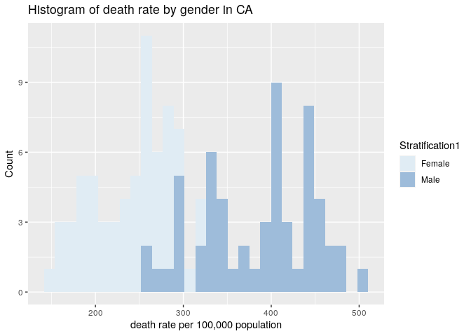
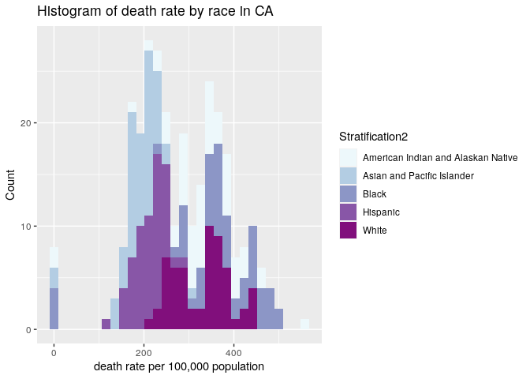

Midterm Project
================
Caroline He
10/19/2021

# PM566 Midterm Project

## Introduction

#### (provide background on your dataset and formulated question)

##### Data Background

This dataset was from National Vital Statistics System and focused on
heart disease mortality data in US during 2014. The data was collected
in county level. Here were the basic information of this dataset:

  - 2013 to 2015, 3-year average. Rates are age-standardized. County
    rates are spatially smoothed. The data can be viewed by gender and
    race/ethnicity. Data source: National Vital Statistics System.
    Additional data, maps, and methodology can be viewed on the
    Interactive Atlas of Heart Disease and Stroke
    <http://www.cdc.gov/dhdsp/maps/atlas>

##### Main question: How gender and races associate with heart disease death rate in CA during 2014?

Sub-question

  - what was the association between gender and heart disease death rate
    in California?
  - what was the association between race and heart disease death rate
    in California?
  - Which county had relatively higher heart disease death rate within
    gender stratification?
  - which county had relatively higher heart disease death rate within
    race stratification?

## Methods

#### (include how and where the data were acquired, how you cleaned and wrangled the data, what tools you used for data exploration)

The data was obtained from CDC chronic disease and health promotion data
& indicators:
<https://chronicdata.cdc.gov/Heart-Disease-Stroke-Prevention/Heart-Disease-Mortality-Data-Among-US-Adults-35-by/i2vk-mgdh>

Data variables included:

  - Year: Center of 3-year average
  - LocationAbbr: State, Territory, or US postal abbreviation
  - LocationDesc: county name
  - GeographicLevel: county/state
  - DataSource
  - Class: Cardiovascular Diseases
  - Topic: Heart Disease Mortality
  - Data\_Value: heart disease death rate
  - Data\_Value\_Unit: per 100,000 population
  - Data\_Value\_Type: Age-adjusted, Spatially Smoothed, 3-year Average
    Rate
  - Data\_Value\_Footnote\_Symbol
  - Data\_Value\_Footnote  
  - StratificationCategory1: gender
  - Stratification1: gender categories
  - StratificationCategory2: race
  - Stratification2: race categories (White, Black Hispanic, Asian and
    Pacific Islander, American Indian and Alaskan Native)
  - TopicID  
  - LocationID  
  - FIPS code
  - Location 1: lat\&lon

<!-- end list -->

``` r
#library R packages
library(gsubfn)
```

    ## Loading required package: proto

``` r
library(data.table)
library(dplyr)
```

    ## 
    ## Attaching package: 'dplyr'

    ## The following objects are masked from 'package:data.table':
    ## 
    ##     between, first, last

    ## The following objects are masked from 'package:stats':
    ## 
    ##     filter, lag

    ## The following objects are masked from 'package:base':
    ## 
    ##     intersect, setdiff, setequal, union

``` r
library(dtplyr)
library(tidyr)
library(readr)
library(ggplot2)
library(leaflet)
library(sf)
```

    ## Linking to GEOS 3.8.0, GDAL 3.0.4, PROJ 7.0.0

``` r
library(raster)
```

    ## Loading required package: sp

    ## 
    ## Attaching package: 'raster'

    ## The following object is masked from 'package:tidyr':
    ## 
    ##     extract

    ## The following object is masked from 'package:dplyr':
    ## 
    ##     select

    ## The following object is masked from 'package:data.table':
    ## 
    ##     shift

``` r
# download and read in the data
if (!file.exists("Heart_Disease_Mortality_Data_Among_US_Adults__35___by_State_Territory_and_County.csv")) {
download.file("https://chronicdata.cdc.gov/api/views/i2vk-mgdh/rows.csv?accessType=DOWNLOAD", 
              method="libcurl", 
              timeout = 60
              )
}
heartdisease <- data.table::fread("Heart_Disease_Mortality_Data_Among_US_Adults__35___by_State_Territory_and_County.csv")
```

``` r
# check for head, tail and whether NAs exist
knitr::kable(dim(heartdisease))
```

|     x |
| ----: |
| 59076 |
|    19 |

``` r
knitr::kable(head(heartdisease))
```

| Year | LocationAbbr | LocationDesc   | GeographicLevel | DataSource | Class                   | Topic                   | Data\_Value | Data\_Value\_Unit      | Data\_Value\_Type                                     | Data\_Value\_Footnote\_Symbol | Data\_Value\_Footnote | StratificationCategory1 | Stratification1 | StratificationCategory2 | Stratification2 | TopicID | LocationID | Location 1               |
| ---: | :----------- | :------------- | :-------------- | :--------- | :---------------------- | :---------------------- | ----------: | :--------------------- | :---------------------------------------------------- | :---------------------------- | :-------------------- | :---------------------- | :-------------- | :---------------------- | :-------------- | :------ | ---------: | :----------------------- |
| 2014 | AK           | Aleutians East | County          | NVSS       | Cardiovascular Diseases | Heart Disease Mortality |       105.3 | per 100,000 population | Age-adjusted, Spatially Smoothed, 3-year Average Rate |                               |                       | Gender                  | Overall         | Race/Ethnicity          | Overall         | T2      |       2013 | (55.440626, -161.962562) |
| 2014 | AK           | Aleutians West | County          | NVSS       | Cardiovascular Diseases | Heart Disease Mortality |       211.9 | per 100,000 population | Age-adjusted, Spatially Smoothed, 3-year Average Rate |                               |                       | Gender                  | Overall         | Race/Ethnicity          | Overall         | T2      |       2016 | (52.995403, -170.251538) |
| 2014 | AK           | Anchorage      | County          | NVSS       | Cardiovascular Diseases | Heart Disease Mortality |       257.9 | per 100,000 population | Age-adjusted, Spatially Smoothed, 3-year Average Rate |                               |                       | Gender                  | Overall         | Race/Ethnicity          | Overall         | T2      |       2020 | (61.159049, -149.103905) |
| 2014 | AK           | Bethel         | County          | NVSS       | Cardiovascular Diseases | Heart Disease Mortality |       351.6 | per 100,000 population | Age-adjusted, Spatially Smoothed, 3-year Average Rate |                               |                       | Gender                  | Overall         | Race/Ethnicity          | Overall         | T2      |       2050 | (60.924483, -159.749655) |
| 2014 | AK           | Bristol Bay    | County          | NVSS       | Cardiovascular Diseases | Heart Disease Mortality |          NA | per 100,000 population | Age-adjusted, Spatially Smoothed, 3-year Average Rate | \~                            | Insufficient Data     | Gender                  | Overall         | Race/Ethnicity          | Overall         | T2      |       2060 | (58.754192, -156.694709) |
| 2014 | AK           | Denali         | County          | NVSS       | Cardiovascular Diseases | Heart Disease Mortality |       305.5 | per 100,000 population | Age-adjusted, Spatially Smoothed, 3-year Average Rate |                               |                       | Gender                  | Overall         | Race/Ethnicity          | Overall         | T2      |       2068 | (63.678399, -149.962076) |

``` r
knitr::kable(tail(heartdisease))
```

| Year | LocationAbbr | LocationDesc     | GeographicLevel | DataSource | Class                   | Topic                   | Data\_Value | Data\_Value\_Unit      | Data\_Value\_Type                                     | Data\_Value\_Footnote\_Symbol | Data\_Value\_Footnote | StratificationCategory1 | Stratification1 | StratificationCategory2 | Stratification2            | TopicID | LocationID | Location 1               |
| ---: | :----------- | :--------------- | :-------------- | :--------- | :---------------------- | :---------------------- | ----------: | :--------------------- | :---------------------------------------------------- | :---------------------------- | :-------------------- | :---------------------- | :-------------- | :---------------------- | :------------------------- | :------ | ---------: | :----------------------- |
| 2014 | AK           | Denali           | County          | NVSS       | Cardiovascular Diseases | Heart Disease Mortality |          NA | per 100,000 population | Age-adjusted, Spatially Smoothed, 3-year Average Rate | \~                            | Insufficient Data     | Gender                  | Overall         | Race/Ethnicity          | Black                      | T2      |       2068 | (63.678399, -149.962076) |
| 2014 | TX           | Lubbock County   | County          | NVSS       | Cardiovascular Diseases | Heart Disease Mortality |          NA | per 100,000 population | Age-adjusted, Spatially Smoothed, 3-year Average Rate | \~                            | Insufficient Data     | Gender                  | Male            | Race/Ethnicity          | Asian and Pacific Islander | T2      |      48303 | (33.613697, -101.820878) |
| 2014 | TX           | Mitchell County  | County          | NVSS       | Cardiovascular Diseases | Heart Disease Mortality |          NA | per 100,000 population | Age-adjusted, Spatially Smoothed, 3-year Average Rate | \~                            | Insufficient Data     | Gender                  | Male            | Race/Ethnicity          | Black                      | T2      |      48335 | (32.306972, -100.919542) |
| 2014 | IA           | Winnebago County | County          | NVSS       | Cardiovascular Diseases | Heart Disease Mortality |          NA | per 100,000 population | Age-adjusted, Spatially Smoothed, 3-year Average Rate | \~                            | Insufficient Data     | Gender                  | Female          | Race/Ethnicity          | Asian and Pacific Islander | T2      |      19189 | (43.375754, -93.73907)   |
| 2014 | WV           | Lewis County     | County          | NVSS       | Cardiovascular Diseases | Heart Disease Mortality |          NA | per 100,000 population | Age-adjusted, Spatially Smoothed, 3-year Average Rate | \~                            | Insufficient Data     | Gender                  | Female          | Race/Ethnicity          | Asian and Pacific Islander | T2      |      54041 | (38.995666, -80.505332)  |
| 2014 | KS           | Republic County  | County          | NVSS       | Cardiovascular Diseases | Heart Disease Mortality |          NA | per 100,000 population | Age-adjusted, Spatially Smoothed, 3-year Average Rate | \~                            | Insufficient Data     | Gender                  | Female          | Race/Ethnicity          | Asian and Pacific Islander | T2      |      20157 | (39.82459, -97.646162)   |

``` r
knitr::kable(summary(is.na(heartdisease)))
```

|  | Year          | LocationAbbr  | LocationDesc  | GeographicLevel | DataSource    | Class         | Topic         | Data\_Value   | Data\_Value\_Unit | Data\_Value\_Type | Data\_Value\_Footnote\_Symbol | Data\_Value\_Footnote | StratificationCategory1 | Stratification1 | StratificationCategory2 | Stratification2 | TopicID       | LocationID    | Location 1    |
| :- | :------------ | :------------ | :------------ | :-------------- | :------------ | :------------ | :------------ | :------------ | :---------------- | :---------------- | :---------------------------- | :-------------------- | :---------------------- | :-------------- | :---------------------- | :-------------- | :------------ | :------------ | :------------ |
|  | Mode :logical | Mode :logical | Mode :logical | Mode :logical   | Mode :logical | Mode :logical | Mode :logical | Mode :logical | Mode :logical     | Mode :logical     | Mode :logical                 | Mode :logical         | Mode :logical           | Mode :logical   | Mode :logical           | Mode :logical   | Mode :logical | Mode :logical | Mode :logical |
|  | FALSE:59076   | FALSE:59076   | FALSE:59076   | FALSE:59076     | FALSE:59076   | FALSE:59076   | FALSE:59076   | FALSE:32149   | FALSE:59076       | FALSE:59076       | FALSE:59076                   | FALSE:59076           | FALSE:59076             | FALSE:59076     | FALSE:59076             | FALSE:59076     | FALSE:59076   | FALSE:59076   | FALSE:59076   |
|  | NA            | NA            | NA            | NA              | NA            | NA            | NA            | TRUE :26927   | NA                | NA                | NA                            | NA                    | NA                      | NA              | NA                      | NA              | NA            | NA            | NA            |

Based on the summary table, only Data\_Value contained NAs which
referred to insufficient data. I decided to replace NAs by 0 for later
convenience.

``` r
#remove NAs
heartdisease$Data_Value <- heartdisease$Data_Value %>% replace_na(0)
knitr::kable(summary(is.na(heartdisease)))
```

|  | Year          | LocationAbbr  | LocationDesc  | GeographicLevel | DataSource    | Class         | Topic         | Data\_Value   | Data\_Value\_Unit | Data\_Value\_Type | Data\_Value\_Footnote\_Symbol | Data\_Value\_Footnote | StratificationCategory1 | Stratification1 | StratificationCategory2 | Stratification2 | TopicID       | LocationID    | Location 1    |
| :- | :------------ | :------------ | :------------ | :-------------- | :------------ | :------------ | :------------ | :------------ | :---------------- | :---------------- | :---------------------------- | :-------------------- | :---------------------- | :-------------- | :---------------------- | :-------------- | :------------ | :------------ | :------------ |
|  | Mode :logical | Mode :logical | Mode :logical | Mode :logical   | Mode :logical | Mode :logical | Mode :logical | Mode :logical | Mode :logical     | Mode :logical     | Mode :logical                 | Mode :logical         | Mode :logical           | Mode :logical   | Mode :logical           | Mode :logical   | Mode :logical | Mode :logical | Mode :logical |
|  | FALSE:59076   | FALSE:59076   | FALSE:59076   | FALSE:59076     | FALSE:59076   | FALSE:59076   | FALSE:59076   | FALSE:59076   | FALSE:59076       | FALSE:59076       | FALSE:59076                   | FALSE:59076           | FALSE:59076             | FALSE:59076     | FALSE:59076             | FALSE:59076     | FALSE:59076   | FALSE:59076   | FALSE:59076   |

The summary table indicated that there were no NAs anymore.

Based on the main question, California data was selected

``` r
# selec data in California
heartdisease_CA <- heartdisease[LocationAbbr == 'CA' & GeographicLevel == 'County']
knitr::kable(head(heartdisease_CA))
```

| Year | LocationAbbr | LocationDesc     | GeographicLevel | DataSource | Class                   | Topic                   | Data\_Value | Data\_Value\_Unit      | Data\_Value\_Type                                     | Data\_Value\_Footnote\_Symbol | Data\_Value\_Footnote | StratificationCategory1 | Stratification1 | StratificationCategory2 | Stratification2 | TopicID | LocationID | Location 1               |
| ---: | :----------- | :--------------- | :-------------- | :--------- | :---------------------- | :---------------------- | ----------: | :--------------------- | :---------------------------------------------------- | :---------------------------- | :-------------------- | :---------------------- | :-------------- | :---------------------- | :-------------- | :------ | ---------: | :----------------------- |
| 2014 | CA           | Alameda County   | County          | NVSS       | Cardiovascular Diseases | Heart Disease Mortality |       225.6 | per 100,000 population | Age-adjusted, Spatially Smoothed, 3-year Average Rate |                               |                       | Gender                  | Overall         | Race/Ethnicity          | Overall         | T2      |       6001 | (37.640732, -121.874174) |
| 2014 | CA           | Alpine County    | County          | NVSS       | Cardiovascular Diseases | Heart Disease Mortality |       286.3 | per 100,000 population | Age-adjusted, Spatially Smoothed, 3-year Average Rate |                               |                       | Gender                  | Overall         | Race/Ethnicity          | Overall         | T2      |       6003 | (38.596494, -119.817775) |
| 2014 | CA           | Amador County    | County          | NVSS       | Cardiovascular Diseases | Heart Disease Mortality |       312.7 | per 100,000 population | Age-adjusted, Spatially Smoothed, 3-year Average Rate |                               |                       | Gender                  | Overall         | Race/Ethnicity          | Overall         | T2      |       6005 | (38.441847, -120.650063) |
| 2014 | CA           | Butte County     | County          | NVSS       | Cardiovascular Diseases | Heart Disease Mortality |       335.6 | per 100,000 population | Age-adjusted, Spatially Smoothed, 3-year Average Rate |                               |                       | Gender                  | Overall         | Race/Ethnicity          | Overall         | T2      |       6007 | (39.663077, -121.592018) |
| 2014 | CA           | Calaveras County | County          | NVSS       | Cardiovascular Diseases | Heart Disease Mortality |       343.2 | per 100,000 population | Age-adjusted, Spatially Smoothed, 3-year Average Rate |                               |                       | Gender                  | Overall         | Race/Ethnicity          | Overall         | T2      |       6009 | (38.202946, -120.544084) |
| 2014 | CA           | Colusa County    | County          | NVSS       | Cardiovascular Diseases | Heart Disease Mortality |       309.2 | per 100,000 population | Age-adjusted, Spatially Smoothed, 3-year Average Rate |                               |                       | Gender                  | Overall         | Race/Ethnicity          | Overall         | T2      |       6011 | (39.178048, -122.229505) |

``` r
knitr::kable(dim(heartdisease_CA))
```

|    x |
| ---: |
| 1044 |
|   19 |

The Location 1 contained latitude and longitude information in one
column, it would efficient to separate them into two columns.

``` r
# remove "()" in strings
heartdisease_CA$`Location 1` <- gsub("[()]", "", heartdisease_CA$`Location 1`)
# separate lat and lon variables
heartdisease_CA <- heartdisease_CA %>%
  separate(col = 'Location 1', into=c('lat', 'lon'), sep=',')
```

Convert Data\_Value, lat, lon into num class

``` r
# convert chr to num
heartdisease_CA$Data_Value <- as.numeric(heartdisease_CA$Data_Value)
heartdisease_CA$lat <- as.numeric(heartdisease_CA$lat)
heartdisease_CA$lon <- as.numeric(heartdisease_CA$lon)
knitr::kable(head(heartdisease_CA))
```

| Year | LocationAbbr | LocationDesc     | GeographicLevel | DataSource | Class                   | Topic                   | Data\_Value | Data\_Value\_Unit      | Data\_Value\_Type                                     | Data\_Value\_Footnote\_Symbol | Data\_Value\_Footnote | StratificationCategory1 | Stratification1 | StratificationCategory2 | Stratification2 | TopicID | LocationID |      lat |        lon |
| ---: | :----------- | :--------------- | :-------------- | :--------- | :---------------------- | :---------------------- | ----------: | :--------------------- | :---------------------------------------------------- | :---------------------------- | :-------------------- | :---------------------- | :-------------- | :---------------------- | :-------------- | :------ | ---------: | -------: | ---------: |
| 2014 | CA           | Alameda County   | County          | NVSS       | Cardiovascular Diseases | Heart Disease Mortality |       225.6 | per 100,000 population | Age-adjusted, Spatially Smoothed, 3-year Average Rate |                               |                       | Gender                  | Overall         | Race/Ethnicity          | Overall         | T2      |       6001 | 37.64073 | \-121.8742 |
| 2014 | CA           | Alpine County    | County          | NVSS       | Cardiovascular Diseases | Heart Disease Mortality |       286.3 | per 100,000 population | Age-adjusted, Spatially Smoothed, 3-year Average Rate |                               |                       | Gender                  | Overall         | Race/Ethnicity          | Overall         | T2      |       6003 | 38.59649 | \-119.8178 |
| 2014 | CA           | Amador County    | County          | NVSS       | Cardiovascular Diseases | Heart Disease Mortality |       312.7 | per 100,000 population | Age-adjusted, Spatially Smoothed, 3-year Average Rate |                               |                       | Gender                  | Overall         | Race/Ethnicity          | Overall         | T2      |       6005 | 38.44185 | \-120.6501 |
| 2014 | CA           | Butte County     | County          | NVSS       | Cardiovascular Diseases | Heart Disease Mortality |       335.6 | per 100,000 population | Age-adjusted, Spatially Smoothed, 3-year Average Rate |                               |                       | Gender                  | Overall         | Race/Ethnicity          | Overall         | T2      |       6007 | 39.66308 | \-121.5920 |
| 2014 | CA           | Calaveras County | County          | NVSS       | Cardiovascular Diseases | Heart Disease Mortality |       343.2 | per 100,000 population | Age-adjusted, Spatially Smoothed, 3-year Average Rate |                               |                       | Gender                  | Overall         | Race/Ethnicity          | Overall         | T2      |       6009 | 38.20295 | \-120.5441 |
| 2014 | CA           | Colusa County    | County          | NVSS       | Cardiovascular Diseases | Heart Disease Mortality |       309.2 | per 100,000 population | Age-adjusted, Spatially Smoothed, 3-year Average Rate |                               |                       | Gender                  | Overall         | Race/Ethnicity          | Overall         | T2      |       6011 | 39.17805 | \-122.2295 |

CA\_gender contained the heart disease mortality data based on gender
category. CA\_race contained the heart disease mortality data based on
race category. CA\_overall contained the data without any
stratification.

``` r
# select data under each stratification
CA_gender <- heartdisease_CA[Stratification1 != 'Overall' & Stratification2 == 'Overall']
knitr::kable(dim(CA_gender))
```

|   x |
| --: |
| 116 |
|  20 |

``` r
knitr::kable(head(CA_gender))
```

| Year | LocationAbbr | LocationDesc     | GeographicLevel | DataSource | Class                   | Topic                   | Data\_Value | Data\_Value\_Unit      | Data\_Value\_Type                                     | Data\_Value\_Footnote\_Symbol | Data\_Value\_Footnote | StratificationCategory1 | Stratification1 | StratificationCategory2 | Stratification2 | TopicID | LocationID |      lat |        lon |
| ---: | :----------- | :--------------- | :-------------- | :--------- | :---------------------- | :---------------------- | ----------: | :--------------------- | :---------------------------------------------------- | :---------------------------- | :-------------------- | :---------------------- | :-------------- | :---------------------- | :-------------- | :------ | ---------: | -------: | ---------: |
| 2014 | CA           | Alameda County   | County          | NVSS       | Cardiovascular Diseases | Heart Disease Mortality |       295.7 | per 100,000 population | Age-adjusted, Spatially Smoothed, 3-year Average Rate |                               |                       | Gender                  | Male            | Race/Ethnicity          | Overall         | T2      |       6001 | 37.64073 | \-121.8742 |
| 2014 | CA           | Alpine County    | County          | NVSS       | Cardiovascular Diseases | Heart Disease Mortality |       374.5 | per 100,000 population | Age-adjusted, Spatially Smoothed, 3-year Average Rate |                               |                       | Gender                  | Male            | Race/Ethnicity          | Overall         | T2      |       6003 | 38.59649 | \-119.8178 |
| 2014 | CA           | Amador County    | County          | NVSS       | Cardiovascular Diseases | Heart Disease Mortality |       408.0 | per 100,000 population | Age-adjusted, Spatially Smoothed, 3-year Average Rate |                               |                       | Gender                  | Male            | Race/Ethnicity          | Overall         | T2      |       6005 | 38.44185 | \-120.6501 |
| 2014 | CA           | Butte County     | County          | NVSS       | Cardiovascular Diseases | Heart Disease Mortality |       450.5 | per 100,000 population | Age-adjusted, Spatially Smoothed, 3-year Average Rate |                               |                       | Gender                  | Male            | Race/Ethnicity          | Overall         | T2      |       6007 | 39.66308 | \-121.5920 |
| 2014 | CA           | Calaveras County | County          | NVSS       | Cardiovascular Diseases | Heart Disease Mortality |       436.7 | per 100,000 population | Age-adjusted, Spatially Smoothed, 3-year Average Rate |                               |                       | Gender                  | Male            | Race/Ethnicity          | Overall         | T2      |       6009 | 38.20295 | \-120.5441 |
| 2014 | CA           | Colusa County    | County          | NVSS       | Cardiovascular Diseases | Heart Disease Mortality |       401.4 | per 100,000 population | Age-adjusted, Spatially Smoothed, 3-year Average Rate |                               |                       | Gender                  | Male            | Race/Ethnicity          | Overall         | T2      |       6011 | 39.17805 | \-122.2295 |

``` r
CA_race <- heartdisease_CA[Stratification2 != 'Overall' & Stratification1 == 'Overall']
knitr::kable(head(CA_race))
```

| Year | LocationAbbr | LocationDesc     | GeographicLevel | DataSource | Class                   | Topic                   | Data\_Value | Data\_Value\_Unit      | Data\_Value\_Type                                     | Data\_Value\_Footnote\_Symbol | Data\_Value\_Footnote | StratificationCategory1 | Stratification1 | StratificationCategory2 | Stratification2 | TopicID | LocationID |      lat |        lon |
| ---: | :----------- | :--------------- | :-------------- | :--------- | :---------------------- | :---------------------- | ----------: | :--------------------- | :---------------------------------------------------- | :---------------------------- | :-------------------- | :---------------------- | :-------------- | :---------------------- | :-------------- | :------ | ---------: | -------: | ---------: |
| 2014 | CA           | Alameda County   | County          | NVSS       | Cardiovascular Diseases | Heart Disease Mortality |       257.9 | per 100,000 population | Age-adjusted, Spatially Smoothed, 3-year Average Rate |                               |                       | Gender                  | Overall         | Race/Ethnicity          | White           | T2      |       6001 | 37.64073 | \-121.8742 |
| 2014 | CA           | Alpine County    | County          | NVSS       | Cardiovascular Diseases | Heart Disease Mortality |       295.4 | per 100,000 population | Age-adjusted, Spatially Smoothed, 3-year Average Rate |                               |                       | Gender                  | Overall         | Race/Ethnicity          | White           | T2      |       6003 | 38.59649 | \-119.8178 |
| 2014 | CA           | Amador County    | County          | NVSS       | Cardiovascular Diseases | Heart Disease Mortality |       322.2 | per 100,000 population | Age-adjusted, Spatially Smoothed, 3-year Average Rate |                               |                       | Gender                  | Overall         | Race/Ethnicity          | White           | T2      |       6005 | 38.44185 | \-120.6501 |
| 2014 | CA           | Butte County     | County          | NVSS       | Cardiovascular Diseases | Heart Disease Mortality |       348.8 | per 100,000 population | Age-adjusted, Spatially Smoothed, 3-year Average Rate |                               |                       | Gender                  | Overall         | Race/Ethnicity          | White           | T2      |       6007 | 39.66308 | \-121.5920 |
| 2014 | CA           | Calaveras County | County          | NVSS       | Cardiovascular Diseases | Heart Disease Mortality |       356.4 | per 100,000 population | Age-adjusted, Spatially Smoothed, 3-year Average Rate |                               |                       | Gender                  | Overall         | Race/Ethnicity          | White           | T2      |       6009 | 38.20295 | \-120.5441 |
| 2014 | CA           | Colusa County    | County          | NVSS       | Cardiovascular Diseases | Heart Disease Mortality |       358.2 | per 100,000 population | Age-adjusted, Spatially Smoothed, 3-year Average Rate |                               |                       | Gender                  | Overall         | Race/Ethnicity          | White           | T2      |       6011 | 39.17805 | \-122.2295 |

``` r
knitr::kable(dim(CA_race))
```

|   x |
| --: |
| 290 |
|  20 |

``` r
CA_overall <- heartdisease_CA[Stratification1 == 'Overall' & Stratification2 == 'Overall']
knitr::kable(head(CA_overall))
```

| Year | LocationAbbr | LocationDesc     | GeographicLevel | DataSource | Class                   | Topic                   | Data\_Value | Data\_Value\_Unit      | Data\_Value\_Type                                     | Data\_Value\_Footnote\_Symbol | Data\_Value\_Footnote | StratificationCategory1 | Stratification1 | StratificationCategory2 | Stratification2 | TopicID | LocationID |      lat |        lon |
| ---: | :----------- | :--------------- | :-------------- | :--------- | :---------------------- | :---------------------- | ----------: | :--------------------- | :---------------------------------------------------- | :---------------------------- | :-------------------- | :---------------------- | :-------------- | :---------------------- | :-------------- | :------ | ---------: | -------: | ---------: |
| 2014 | CA           | Alameda County   | County          | NVSS       | Cardiovascular Diseases | Heart Disease Mortality |       225.6 | per 100,000 population | Age-adjusted, Spatially Smoothed, 3-year Average Rate |                               |                       | Gender                  | Overall         | Race/Ethnicity          | Overall         | T2      |       6001 | 37.64073 | \-121.8742 |
| 2014 | CA           | Alpine County    | County          | NVSS       | Cardiovascular Diseases | Heart Disease Mortality |       286.3 | per 100,000 population | Age-adjusted, Spatially Smoothed, 3-year Average Rate |                               |                       | Gender                  | Overall         | Race/Ethnicity          | Overall         | T2      |       6003 | 38.59649 | \-119.8178 |
| 2014 | CA           | Amador County    | County          | NVSS       | Cardiovascular Diseases | Heart Disease Mortality |       312.7 | per 100,000 population | Age-adjusted, Spatially Smoothed, 3-year Average Rate |                               |                       | Gender                  | Overall         | Race/Ethnicity          | Overall         | T2      |       6005 | 38.44185 | \-120.6501 |
| 2014 | CA           | Butte County     | County          | NVSS       | Cardiovascular Diseases | Heart Disease Mortality |       335.6 | per 100,000 population | Age-adjusted, Spatially Smoothed, 3-year Average Rate |                               |                       | Gender                  | Overall         | Race/Ethnicity          | Overall         | T2      |       6007 | 39.66308 | \-121.5920 |
| 2014 | CA           | Calaveras County | County          | NVSS       | Cardiovascular Diseases | Heart Disease Mortality |       343.2 | per 100,000 population | Age-adjusted, Spatially Smoothed, 3-year Average Rate |                               |                       | Gender                  | Overall         | Race/Ethnicity          | Overall         | T2      |       6009 | 38.20295 | \-120.5441 |
| 2014 | CA           | Colusa County    | County          | NVSS       | Cardiovascular Diseases | Heart Disease Mortality |       309.2 | per 100,000 population | Age-adjusted, Spatially Smoothed, 3-year Average Rate |                               |                       | Gender                  | Overall         | Race/Ethnicity          | Overall         | T2      |       6011 | 39.17805 | \-122.2295 |

``` r
knitr::kable(dim(CA_overall))
```

|  x |
| -: |
| 58 |
| 20 |

Since there were 58 counties in CA in total, the dataset seemed to be
reasonable.

## Preliminary Results

#### (provide summary statistics in tabular form and publication-quality figures, take a look at the kable function from knitr to write nice tables in Rmarkdown)

``` r
# create histogram to find association between gender and death rate
CA_gender %>%
    ggplot(mapping = aes(x = Data_Value)) + 
    geom_histogram(mapping = aes (fill = Stratification1)) +
    scale_fill_brewer(palette = "BuPu") +
    labs(
      x = "death rate per 100,000 population",
      y = "Count",
      title = "Histogram of death rate by gender in CA")
```

    ## `stat_bin()` using `bins = 30`. Pick better value with `binwidth`.

<!-- -->

The histogram of death rate for both male and female was constructed,
and insufficient data was represented by 0. From the graph,
distributions of heart disease death rate for both male and female were
slightly skewed to the left. However, the distribution of female located
more left compared to the distribution of male, and only a small portion
overlapped. It indicated that the female had a lower heart disease death
rate compared to the male in general in CA during 2014.

``` r
# create histogram to find association between race and death rate
CA_race %>%
    ggplot(mapping = aes(x = Data_Value)) + 
    geom_histogram(mapping = aes (fill = Stratification2)) +
    scale_fill_brewer(palette = "BuPu") +
    labs(
      x = "death rate per 100,000 population",
      y = "Count",
      title = "Histogram of death rate by race in CA")
```

    ## `stat_bin()` using `bins = 30`. Pick better value with `binwidth`.

<!-- -->

The histogram of death rate for different race/ethnicity was
constructed, and insufficient data was represented by 0. From the graph,
both Hispanic and Asian and Pacific Islander seemed to be skewed to the
left and had one modal. The White, Black and American Indian and Alaska
Native seemed to have two modals. Among all races in CA during 2014, the
Black had the highest heart disease death rate. The White and American
Indian and Alaska Native were next and had similar distribution of death
rate. The White seemed to have a slightly more right distribution. The
Asian and Pacific Islander had a fourth highest heart disease death
rate. The Hispanic had the lowest heart disease death rate.

``` r
# create subset of male and female
CA_male <- heartdisease_CA[Stratification1 == 'Male']
CA_female <- heartdisease_CA[Stratification1 == 'Female']

temp.pal1 <- colorNumeric(palette = "YlGnBu", domain = CA_male$Data_Value, na.color = "#808080")
# visualize by leaflet
map_gender <- leaflet() %>% 
  addProviderTiles('CartoDB.Positron') %>% 
  addCircles(
    data = CA_male,
    lat = ~lat, lng=~lon,
    label = CA_male$LocationDesc, color = ~ temp.pal1(Data_Value),
    opacity = 1, fillOpacity = 1, radius = 500, group = "Male"
    ) %>%
  addCircles(
    data = CA_female,
    lat = ~lat, lng=~lon,
    label = CA_female$LocationDesc, color = ~ temp.pal1(Data_Value),
    opacity = 1, fillOpacity = 1, radius = 500, group = "Female"
    ) %>%
  addCircles(
    data = CA_overall,
    lat = ~lat, lng=~lon,
    label = CA_overall$LocationDesc, color = ~ temp.pal1(Data_Value),
    opacity = 1, fillOpacity = 1, radius = 500, group = "Overall"
    ) %>%
  addLayersControl(baseGroups = c("Male", "Famle", "Overall")) %>%
  addLegend('bottomleft', pal=temp.pal1, values=CA_male$Data_Value,
          title='heart diseases death rate per 100,000 population based on gender in CA', opacity=1)
map_gender
```

Within gender stratification and female category, Kern County, Tulare
County and Glenn County had relatively higher heart disease death rate
during 2014. For male category, Tulare County and Tuolumne County had
relatvely higher heart disease death rate during 2014. Without any
stratification, kern County and Tulare County had relatively higher
heart disease death rate during 2014. The counties along the coast
generally had a lower death rate than the counties not along the coast.
The possible reason might be the different medical levels in each
county. Compare the general trend, male had a higher death rate than
female in general, which also indicated by histogram before. The
possible reason might be the different lifestyle.

``` r
# create race subset 
CA_white <- heartdisease_CA[Stratification2 == 'White']
CA_hispanic <- heartdisease_CA[Stratification2 == 'Hispanic']
CA_black <- heartdisease_CA[Stratification2 == 'Black']
CA_asian_pacific <- heartdisease_CA[Stratification2 == 'Asian and Pacific Islander']
CA_indian_alaskan <- heartdisease_CA[Stratification2 == 'American Indian and Alaskan Native']

temp.pal2 <- colorNumeric(palette = "YlGnBu", domain = CA_race$Data_Value, na.color = "#808080")
#visualize by leaflet
map_race <- leaflet() %>% 
  addProviderTiles('CartoDB.Positron') %>% 
  addCircles(
    data = CA_white,
    lat = ~lat, lng=~lon,
    label = CA_white$LocationDesc, color = ~ temp.pal2(Data_Value),
    opacity = 1, fillOpacity = 1, radius = 500, group = "White"
    ) %>%
  addCircles(
    data = CA_hispanic,
    lat = ~lat, lng=~lon,
    label = CA_hispanic$LocationDesc, color = ~ temp.pal2(Data_Value),
    opacity = 1, fillOpacity = 1, radius = 500, group = "Hispanic"
    ) %>%
  addCircles(
    data = CA_black,
    lat = ~lat, lng=~lon,
    label = CA_black$LocationDesc, color = ~ temp.pal2(Data_Value),
    opacity = 1, fillOpacity = 1, radius = 500, group = "Black"
    ) %>%
  addCircles(
    data = CA_asian_pacific,
    lat = ~lat, lng=~lon,
    label = CA_asian_pacific$LocationDesc, color = ~ temp.pal2(Data_Value),
    opacity = 1, fillOpacity = 1, radius = 500, group = "Asian and Pacific Islander"
    ) %>%
  addCircles(
    data = CA_indian_alaskan,
    lat = ~lat, lng=~lon,
    label = CA_indian_alaskan$LocationDesc, color = ~ temp.pal2(Data_Value),
    opacity = 1, fillOpacity = 1, radius = 500, group = "American Indian and Alaskan Native"
    ) %>%
  addLayersControl(baseGroups = c("White", "Hispanic", "Black", "Asian and Pacific Islander", "American Indian and Alaskan Native")) %>%
  addLegend('bottomleft', pal=temp.pal2, values=CA_race$Data_Value,
          title='heart diseases death rate per 100,000 population based on race in CA', opacity=1)
map_race
```

<div id="htmlwidget-bdb853983e74546cc249" style="width:672px;height:480px;" class="leaflet html-widget"></div>
<script type="application/json" data-for="htmlwidget-bdb853983e74546cc249">{"x":{"options":{"crs":{"crsClass":"L.CRS.EPSG3857","code":null,"proj4def":null,"projectedBounds":null,"options":{}}},"calls":[{"method":"addProviderTiles","args":["CartoDB.Positron",null,null,{"errorTileUrl":"","noWrap":false,"detectRetina":false}]},{"method":"addCircles","args":[[37.640732,38.596494,38.441847,39.663077,38.202946,39.178048,37.913598,41.738952,38.775788,36.754708,39.597469,40.698187,33.041824,36.508867,35.345591,36.078649,39.09737,40.669961,34.322796,37.212682,38.073204,37.575843,39.436309,37.186923,41.583941,37.933321,36.216903,38.508289,39.295924,33.704545,39.061511,40.002158,33.745425,38.465312,36.605701,34.844701,33.035423,37.746542,37.932727,35.390034,37.423939,34.672496,37.224522,37.052057,40.758306,39.576693,41.588337,38.288602,38.527617,37.553933,39.033545,40.12057,40.64749,36.220455,38.024398,34.472949,38.68661,39.268646,37.640732,38.596494,38.441847,39.663077,38.202946,39.178048,37.913598,41.738952,38.775788,36.754708,39.597469,40.698187,33.041824,36.508867,35.345591,36.078649,39.09737,40.669961,34.322796,37.212682,38.073204,37.575843,39.436309,37.186923,41.583941,37.933321,36.216903,38.508289,39.295924,33.704545,39.061511,40.002158,33.745425,38.465312,36.605701,34.844701,33.035423,37.746542,37.932727,35.390034,37.423939,34.672496,37.224522,37.052057,40.758306,39.576693,41.588337,38.288602,38.527617,37.553933,39.033545,40.12057,40.64749,36.220455,38.024398,34.472949,38.68661,39.268646,37.640732,38.596494,38.441847,39.663077,38.202946,39.178048,37.913598,41.738952,38.775788,36.754708,39.597469,40.698187,33.041824,36.508867,35.345591,36.078649,39.09737,40.669961,34.322796,37.212682,38.073204,37.575843,39.436309,37.186923,41.583941,37.933321,36.216903,38.508289,39.295924,33.704545,39.061511,40.002158,33.745425,38.465312,36.605701,34.844701,33.035423,37.746542,37.932727,35.390034,37.423939,34.672496,37.224522,37.052057,40.758306,39.576693,41.588337,38.288602,38.527617,37.553933,39.033545,40.12057,40.64749,36.220455,38.024398,34.472949,38.68661,39.268646],[-121.874174,-119.817775,-120.650063,-121.592018,-120.544084,-122.229505,-121.912906,-123.889508,-120.518515,-119.641323,-122.383535,-123.863888,-115.364568,-117.407146,-118.73308,-119.803263,-122.744185,-120.589843,-118.221787,-119.74733,-122.720114,-119.896002,-123.377828,-120.704731,-120.718904,-118.882552,-121.227026,-122.327344,-120.761996,-117.756775,-120.710638,-120.838191,-115.994935,-121.31769,-121.060133,-116.176459,-116.737646,-122.430647,-121.264123,-120.400968,-122.322358,-120.012285,-121.684758,-121.982295,-122.03692,-120.505271,-122.533844,-121.913023,-122.887364,-120.989631,-121.687339,-122.226655,-123.104847,-118.792225,-119.946028,-119.076397,-121.897776,-121.340045,-121.874174,-119.817775,-120.650063,-121.592018,-120.544084,-122.229505,-121.912906,-123.889508,-120.518515,-119.641323,-122.383535,-123.863888,-115.364568,-117.407146,-118.73308,-119.803263,-122.744185,-120.589843,-118.221787,-119.74733,-122.720114,-119.896002,-123.377828,-120.704731,-120.718904,-118.882552,-121.227026,-122.327344,-120.761996,-117.756775,-120.710638,-120.838191,-115.994935,-121.31769,-121.060133,-116.176459,-116.737646,-122.430647,-121.264123,-120.400968,-122.322358,-120.012285,-121.684758,-121.982295,-122.03692,-120.505271,-122.533844,-121.913023,-122.887364,-120.989631,-121.687339,-122.226655,-123.104847,-118.792225,-119.946028,-119.076397,-121.897776,-121.340045,-121.874174,-119.817775,-120.650063,-121.592018,-120.544084,-122.229505,-121.912906,-123.889508,-120.518515,-119.641323,-122.383535,-123.863888,-115.364568,-117.407146,-118.73308,-119.803263,-122.744185,-120.589843,-118.221787,-119.74733,-122.720114,-119.896002,-123.377828,-120.704731,-120.718904,-118.882552,-121.227026,-122.327344,-120.761996,-117.756775,-120.710638,-120.838191,-115.994935,-121.31769,-121.060133,-116.176459,-116.737646,-122.430647,-121.264123,-120.400968,-122.322358,-120.012285,-121.684758,-121.982295,-122.03692,-120.505271,-122.533844,-121.913023,-122.887364,-120.989631,-121.687339,-122.226655,-123.104847,-118.792225,-119.946028,-119.076397,-121.897776,-121.340045],500,null,"White",{"interactive":true,"className":"","stroke":true,"color":["#58BDC1","#3BADC3","#2E9FC2","#1D91C0","#1F8BBD","#208ABD","#6AC4BF","#2377B4","#45B7C4","#227FB8","#1D90C0","#2093C0","#2458A5","#1F8BBD","#2552A2","#1E8DBE","#2372B1","#2372B1","#1E8FBF","#2186BB","#85CFBB","#1E8FBF","#2798C1","#236BAE","#227DB7","#3FB4C4","#5EBFC1","#38AAC3","#6CC4BE","#35A6C2","#59BDC1","#2093C0","#2187BB","#2093C0","#51BBC2","#2456A4","#3FB3C4","#56BCC2","#2280B8","#64C1C0","#60C0C0","#47B8C3","#61C0C0","#60C0C0","#227DB7","#3AACC3","#2184BA","#53BBC2","#4FBAC3","#2553A3","#236FB0","#1F8CBE","#2087BC","#2554A3","#2597C1","#40B4C4","#3AADC3","#264CA0","#2194C0","#2376B3","#235BA6","#263B97","#26439B","#263F99","#35A6C2","#26469D","#2194C0","#26409A","#26419A","#264DA0","#0A1E5C","#263E99","#102367","#2553A3","#263996","#243392","#254EA0","#26489E","#45B7C4","#26479D","#2458A5","#263996","#26419A","#2186BB","#2A9BC1","#2370B0","#3EB2C4","#2373B2","#2899C1","#263F99","#264B9F","#254EA0","#1F8CBE","#162874","#2183BA","#2A9BC1","#263996","#35A6C2","#2C9DC1","#2089BC","#31A1C2","#2E9EC2","#26419A","#236FB0","#26479D","#1D90C0","#2294C0","#13266E","#263996","#26439B","#26479D","#0E2264","#2456A4","#2281B9","#2371B1","#808080","#90D3BA","#76C9BD","#65C2C0","#61C0C0","#43B7C4","#5ABDC1","#9ED8B8","#45B7C4","#7BCBBC","#39ABC3","#56BCC2","#50BAC2","#4BB9C3","#38AAC3","#1E91C0","#40B4C4","#45B7C4","#38A9C3","#4AB8C3","#3EB2C4","#B9E3B6","#3DB1C3","#62C0C0","#299AC1","#3AADC3","#58BDC1","#92D4B9","#74C8BD","#8DD2BA","#65C2C0","#8CD1BA","#5EBFC1","#3FB3C4","#50BAC2","#8ED2BA","#1E8FBF","#7ACBBC","#96D5B9","#3EB2C4","#8DD2BA","#93D4B9","#7FCDBB","#91D3BA","#95D5B9","#3AADC3","#5BBEC1","#4AB9C3","#8AD1BA","#7FCDBB","#2089BC","#36A7C3","#4BB9C3","#40B5C4","#2193C0","#52BBC2","#79CABC","#6FC6BE","#2E9EC2"],"weight":5,"opacity":1,"fill":true,"fillColor":["#58BDC1","#3BADC3","#2E9FC2","#1D91C0","#1F8BBD","#208ABD","#6AC4BF","#2377B4","#45B7C4","#227FB8","#1D90C0","#2093C0","#2458A5","#1F8BBD","#2552A2","#1E8DBE","#2372B1","#2372B1","#1E8FBF","#2186BB","#85CFBB","#1E8FBF","#2798C1","#236BAE","#227DB7","#3FB4C4","#5EBFC1","#38AAC3","#6CC4BE","#35A6C2","#59BDC1","#2093C0","#2187BB","#2093C0","#51BBC2","#2456A4","#3FB3C4","#56BCC2","#2280B8","#64C1C0","#60C0C0","#47B8C3","#61C0C0","#60C0C0","#227DB7","#3AACC3","#2184BA","#53BBC2","#4FBAC3","#2553A3","#236FB0","#1F8CBE","#2087BC","#2554A3","#2597C1","#40B4C4","#3AADC3","#264CA0","#2194C0","#2376B3","#235BA6","#263B97","#26439B","#263F99","#35A6C2","#26469D","#2194C0","#26409A","#26419A","#264DA0","#0A1E5C","#263E99","#102367","#2553A3","#263996","#243392","#254EA0","#26489E","#45B7C4","#26479D","#2458A5","#263996","#26419A","#2186BB","#2A9BC1","#2370B0","#3EB2C4","#2373B2","#2899C1","#263F99","#264B9F","#254EA0","#1F8CBE","#162874","#2183BA","#2A9BC1","#263996","#35A6C2","#2C9DC1","#2089BC","#31A1C2","#2E9EC2","#26419A","#236FB0","#26479D","#1D90C0","#2294C0","#13266E","#263996","#26439B","#26479D","#0E2264","#2456A4","#2281B9","#2371B1","#808080","#90D3BA","#76C9BD","#65C2C0","#61C0C0","#43B7C4","#5ABDC1","#9ED8B8","#45B7C4","#7BCBBC","#39ABC3","#56BCC2","#50BAC2","#4BB9C3","#38AAC3","#1E91C0","#40B4C4","#45B7C4","#38A9C3","#4AB8C3","#3EB2C4","#B9E3B6","#3DB1C3","#62C0C0","#299AC1","#3AADC3","#58BDC1","#92D4B9","#74C8BD","#8DD2BA","#65C2C0","#8CD1BA","#5EBFC1","#3FB3C4","#50BAC2","#8ED2BA","#1E8FBF","#7ACBBC","#96D5B9","#3EB2C4","#8DD2BA","#93D4B9","#7FCDBB","#91D3BA","#95D5B9","#3AADC3","#5BBEC1","#4AB9C3","#8AD1BA","#7FCDBB","#2089BC","#36A7C3","#4BB9C3","#40B5C4","#2193C0","#52BBC2","#79CABC","#6FC6BE","#2E9EC2"],"fillOpacity":1},null,null,["Alameda County","Alpine County","Amador County","Butte County","Calaveras County","Colusa County","Contra Costa County","Del Norte County","El Dorado County","Fresno County","Glenn County","Humboldt County","Imperial County","Inyo County","Kern County","Kings County","Lake County","Lassen County","Los Angeles County","Madera County","Marin County","Mariposa County","Mendocino County","Merced County","Modoc County","Mono County","Monterey County","Napa County","Nevada County","Orange County","Placer County","Plumas County","Riverside County","Sacramento County","San Benito County","San Bernardino County","San Diego County","San Francisco County","San Joaquin County","San Luis Obispo County","San Mateo County","Santa Barbara County","Santa Clara County","Santa Cruz County","Shasta County","Sierra County","Siskiyou County","Solano County","Sonoma County","Stanislaus County","Sutter County","Tehama County","Trinity County","Tulare County","Tuolumne County","Ventura County","Yolo County","Yuba County","Alameda County","Alpine County","Amador County","Butte County","Calaveras County","Colusa County","Contra Costa County","Del Norte County","El Dorado County","Fresno County","Glenn County","Humboldt County","Imperial County","Inyo County","Kern County","Kings County","Lake County","Lassen County","Los Angeles County","Madera County","Marin County","Mariposa County","Mendocino County","Merced County","Modoc County","Mono County","Monterey County","Napa County","Nevada County","Orange County","Placer County","Plumas County","Riverside County","Sacramento County","San Benito County","San Bernardino County","San Diego County","San Francisco County","San Joaquin County","San Luis Obispo County","San Mateo County","Santa Barbara County","Santa Clara County","Santa Cruz County","Shasta County","Sierra County","Siskiyou County","Solano County","Sonoma County","Stanislaus County","Sutter County","Tehama County","Trinity County","Tulare County","Tuolumne County","Ventura County","Yolo County","Yuba County","Alameda County","Alpine County","Amador County","Butte County","Calaveras County","Colusa County","Contra Costa County","Del Norte County","El Dorado County","Fresno County","Glenn County","Humboldt County","Imperial County","Inyo County","Kern County","Kings County","Lake County","Lassen County","Los Angeles County","Madera County","Marin County","Mariposa County","Mendocino County","Merced County","Modoc County","Mono County","Monterey County","Napa County","Nevada County","Orange County","Placer County","Plumas County","Riverside County","Sacramento County","San Benito County","San Bernardino County","San Diego County","San Francisco County","San Joaquin County","San Luis Obispo County","San Mateo County","Santa Barbara County","Santa Clara County","Santa Cruz County","Shasta County","Sierra County","Siskiyou County","Solano County","Sonoma County","Stanislaus County","Sutter County","Tehama County","Trinity County","Tulare County","Tuolumne County","Ventura County","Yolo County","Yuba County"],{"interactive":false,"permanent":false,"direction":"auto","opacity":1,"offset":[0,0],"textsize":"10px","textOnly":false,"className":"","sticky":true},null,null]},{"method":"addCircles","args":[[37.640732,38.596494,38.441847,39.663077,38.202946,39.178048,37.913598,41.738952,38.775788,36.754708,39.597469,40.698187,33.041824,36.508867,35.345591,36.078649,39.09737,40.669961,34.322796,37.212682,38.073204,37.575843,39.436309,37.186923,41.583941,37.933321,36.216903,38.508289,39.295924,33.704545,39.061511,40.002158,33.745425,38.465312,36.605701,34.844701,33.035423,37.746542,37.932727,35.390034,37.423939,34.672496,37.224522,37.052057,40.758306,39.576693,41.588337,38.288602,38.527617,37.553933,39.033545,40.12057,40.64749,36.220455,38.024398,34.472949,38.68661,39.268646,37.640732,38.596494,38.441847,39.663077,38.202946,39.178048,37.913598,41.738952,38.775788,36.754708,39.597469,40.698187,33.041824,36.508867,35.345591,36.078649,39.09737,40.669961,34.322796,37.212682,38.073204,37.575843,39.436309,37.186923,41.583941,37.933321,36.216903,38.508289,39.295924,33.704545,39.061511,40.002158,33.745425,38.465312,36.605701,34.844701,33.035423,37.746542,37.932727,35.390034,37.423939,34.672496,37.224522,37.052057,40.758306,39.576693,41.588337,38.288602,38.527617,37.553933,39.033545,40.12057,40.64749,36.220455,38.024398,34.472949,38.68661,39.268646,37.640732,38.596494,38.441847,39.663077,38.202946,39.178048,37.913598,41.738952,38.775788,36.754708,39.597469,40.698187,33.041824,36.508867,35.345591,36.078649,39.09737,40.669961,34.322796,37.212682,38.073204,37.575843,39.436309,37.186923,41.583941,37.933321,36.216903,38.508289,39.295924,33.704545,39.061511,40.002158,33.745425,38.465312,36.605701,34.844701,33.035423,37.746542,37.932727,35.390034,37.423939,34.672496,37.224522,37.052057,40.758306,39.576693,41.588337,38.288602,38.527617,37.553933,39.033545,40.12057,40.64749,36.220455,38.024398,34.472949,38.68661,39.268646],[-121.874174,-119.817775,-120.650063,-121.592018,-120.544084,-122.229505,-121.912906,-123.889508,-120.518515,-119.641323,-122.383535,-123.863888,-115.364568,-117.407146,-118.73308,-119.803263,-122.744185,-120.589843,-118.221787,-119.74733,-122.720114,-119.896002,-123.377828,-120.704731,-120.718904,-118.882552,-121.227026,-122.327344,-120.761996,-117.756775,-120.710638,-120.838191,-115.994935,-121.31769,-121.060133,-116.176459,-116.737646,-122.430647,-121.264123,-120.400968,-122.322358,-120.012285,-121.684758,-121.982295,-122.03692,-120.505271,-122.533844,-121.913023,-122.887364,-120.989631,-121.687339,-122.226655,-123.104847,-118.792225,-119.946028,-119.076397,-121.897776,-121.340045,-121.874174,-119.817775,-120.650063,-121.592018,-120.544084,-122.229505,-121.912906,-123.889508,-120.518515,-119.641323,-122.383535,-123.863888,-115.364568,-117.407146,-118.73308,-119.803263,-122.744185,-120.589843,-118.221787,-119.74733,-122.720114,-119.896002,-123.377828,-120.704731,-120.718904,-118.882552,-121.227026,-122.327344,-120.761996,-117.756775,-120.710638,-120.838191,-115.994935,-121.31769,-121.060133,-116.176459,-116.737646,-122.430647,-121.264123,-120.400968,-122.322358,-120.012285,-121.684758,-121.982295,-122.03692,-120.505271,-122.533844,-121.913023,-122.887364,-120.989631,-121.687339,-122.226655,-123.104847,-118.792225,-119.946028,-119.076397,-121.897776,-121.340045,-121.874174,-119.817775,-120.650063,-121.592018,-120.544084,-122.229505,-121.912906,-123.889508,-120.518515,-119.641323,-122.383535,-123.863888,-115.364568,-117.407146,-118.73308,-119.803263,-122.744185,-120.589843,-118.221787,-119.74733,-122.720114,-119.896002,-123.377828,-120.704731,-120.718904,-118.882552,-121.227026,-122.327344,-120.761996,-117.756775,-120.710638,-120.838191,-115.994935,-121.31769,-121.060133,-116.176459,-116.737646,-122.430647,-121.264123,-120.400968,-122.322358,-120.012285,-121.684758,-121.982295,-122.03692,-120.505271,-122.533844,-121.913023,-122.887364,-120.989631,-121.687339,-122.226655,-123.104847,-118.792225,-119.946028,-119.076397,-121.897776,-121.340045],500,null,"Hispanic",{"interactive":true,"className":"","stroke":true,"color":["#A2DAB8","#B2E0B6","#73C8BD","#A1D9B8","#69C3BF","#A3DAB8","#A9DDB7","#5DBFC1","#90D3BA","#61C0C0","#84CFBB","#63C1C0","#6DC5BE","#5EBFC1","#3AADC3","#5DBFC1","#9AD7B9","#7DCCBB","#6EC5BE","#66C2BF","#D3EEB3","#68C3BF","#8FD2BA","#72C7BD","#83CEBB","#69C3BF","#99D6B9","#B5E1B6","#81CEBB","#85CFBB","#73C7BD","#7DCCBB","#6AC4BF","#74C8BD","#74C8BD","#62C0C0","#7DCCBB","#A2DAB8","#71C7BE","#BBE4B5","#A1D9B8","#8CD1BA","#9AD7B9","#7FCDBB","#6BC4BF","#8AD1BA","#72C7BD","#A4DBB8","#BAE4B5","#64C1C0","#8ED2BA","#83CEBB","#71C7BE","#4BB9C3","#65C2C0","#89D0BA","#94D4B9","#87D0BA","#6EC5BE","#9BD7B9","#3BADC3","#61C0C0","#34A4C2","#83CEBB","#74C8BD","#808080","#74C8BD","#39ABC3","#51BAC2","#2280B8","#37A9C3","#39ABC3","#2294C0","#38AAC3","#7FCDBB","#2B9BC1","#3CAFC3","#3FB4C4","#91D3BA","#39ABC3","#63C1C0","#4FBAC2","#47B7C3","#45B7C4","#79CABC","#84CFBB","#41B6C4","#59BDC1","#2395C0","#30A1C2","#3FB3C4","#41B6C4","#4AB8C3","#3AACC3","#51BAC2","#6FC6BE","#34A5C2","#8ED2BA","#6CC4BE","#60C0C0","#69C3BF","#6EC5BE","#2088BC","#4DB9C3","#3BADC3","#78CABC","#89D0BA","#36A8C3","#57BDC2","#3BAEC3","#2597C1","#35A6C2","#41B6C4","#59BDC1","#6FC6BE","#38AAC3","#C8E9B4","#CAEAB4","#AADDB7","#D4EEB3","#A4DAB8","#C1E6B5","#CBEAB4","#C2E7B5","#B2E0B6","#88D0BA","#BCE5B5","#BBE4B5","#A3DAB8","#7CCCBC","#67C2BF","#80CDBB","#C2E7B5","#C6E9B4","#98D6B9","#89D0BA","#E9F6B1","#8DD2BA","#CAEAB4","#93D4B9","#C7E9B4","#89D0BA","#B3E0B6","#CCEBB4","#CAEAB4","#ABDDB7","#C0E6B5","#CCEBB4","#8ED2BA","#A2DAB8","#9FD8B8","#85CFBB","#A6DBB8","#C6E9B4","#B5E1B6","#D0ECB3","#C6E8B4","#B7E2B6","#C4E8B4","#99D6B9","#BDE5B5","#C7E9B4","#CEECB3","#C5E8B4","#D5EEB3","#97D6B9","#C4E8B4","#C6E9B4","#C3E7B5","#6BC4BF","#8DD2BA","#B0DFB7","#B4E1B6","#D2EDB3"],"weight":5,"opacity":1,"fill":true,"fillColor":["#A2DAB8","#B2E0B6","#73C8BD","#A1D9B8","#69C3BF","#A3DAB8","#A9DDB7","#5DBFC1","#90D3BA","#61C0C0","#84CFBB","#63C1C0","#6DC5BE","#5EBFC1","#3AADC3","#5DBFC1","#9AD7B9","#7DCCBB","#6EC5BE","#66C2BF","#D3EEB3","#68C3BF","#8FD2BA","#72C7BD","#83CEBB","#69C3BF","#99D6B9","#B5E1B6","#81CEBB","#85CFBB","#73C7BD","#7DCCBB","#6AC4BF","#74C8BD","#74C8BD","#62C0C0","#7DCCBB","#A2DAB8","#71C7BE","#BBE4B5","#A1D9B8","#8CD1BA","#9AD7B9","#7FCDBB","#6BC4BF","#8AD1BA","#72C7BD","#A4DBB8","#BAE4B5","#64C1C0","#8ED2BA","#83CEBB","#71C7BE","#4BB9C3","#65C2C0","#89D0BA","#94D4B9","#87D0BA","#6EC5BE","#9BD7B9","#3BADC3","#61C0C0","#34A4C2","#83CEBB","#74C8BD","#808080","#74C8BD","#39ABC3","#51BAC2","#2280B8","#37A9C3","#39ABC3","#2294C0","#38AAC3","#7FCDBB","#2B9BC1","#3CAFC3","#3FB4C4","#91D3BA","#39ABC3","#63C1C0","#4FBAC2","#47B7C3","#45B7C4","#79CABC","#84CFBB","#41B6C4","#59BDC1","#2395C0","#30A1C2","#3FB3C4","#41B6C4","#4AB8C3","#3AACC3","#51BAC2","#6FC6BE","#34A5C2","#8ED2BA","#6CC4BE","#60C0C0","#69C3BF","#6EC5BE","#2088BC","#4DB9C3","#3BADC3","#78CABC","#89D0BA","#36A8C3","#57BDC2","#3BAEC3","#2597C1","#35A6C2","#41B6C4","#59BDC1","#6FC6BE","#38AAC3","#C8E9B4","#CAEAB4","#AADDB7","#D4EEB3","#A4DAB8","#C1E6B5","#CBEAB4","#C2E7B5","#B2E0B6","#88D0BA","#BCE5B5","#BBE4B5","#A3DAB8","#7CCCBC","#67C2BF","#80CDBB","#C2E7B5","#C6E9B4","#98D6B9","#89D0BA","#E9F6B1","#8DD2BA","#CAEAB4","#93D4B9","#C7E9B4","#89D0BA","#B3E0B6","#CCEBB4","#CAEAB4","#ABDDB7","#C0E6B5","#CCEBB4","#8ED2BA","#A2DAB8","#9FD8B8","#85CFBB","#A6DBB8","#C6E9B4","#B5E1B6","#D0ECB3","#C6E8B4","#B7E2B6","#C4E8B4","#99D6B9","#BDE5B5","#C7E9B4","#CEECB3","#C5E8B4","#D5EEB3","#97D6B9","#C4E8B4","#C6E9B4","#C3E7B5","#6BC4BF","#8DD2BA","#B0DFB7","#B4E1B6","#D2EDB3"],"fillOpacity":1},null,null,["Alameda County","Alpine County","Amador County","Butte County","Calaveras County","Colusa County","Contra Costa County","Del Norte County","El Dorado County","Fresno County","Glenn County","Humboldt County","Imperial County","Inyo County","Kern County","Kings County","Lake County","Lassen County","Los Angeles County","Madera County","Marin County","Mariposa County","Mendocino County","Merced County","Modoc County","Mono County","Monterey County","Napa County","Nevada County","Orange County","Placer County","Plumas County","Riverside County","Sacramento County","San Benito County","San Bernardino County","San Diego County","San Francisco County","San Joaquin County","San Luis Obispo County","San Mateo County","Santa Barbara County","Santa Clara County","Santa Cruz County","Shasta County","Sierra County","Siskiyou County","Solano County","Sonoma County","Stanislaus County","Sutter County","Tehama County","Trinity County","Tulare County","Tuolumne County","Ventura County","Yolo County","Yuba County","Alameda County","Alpine County","Amador County","Butte County","Calaveras County","Colusa County","Contra Costa County","Del Norte County","El Dorado County","Fresno County","Glenn County","Humboldt County","Imperial County","Inyo County","Kern County","Kings County","Lake County","Lassen County","Los Angeles County","Madera County","Marin County","Mariposa County","Mendocino County","Merced County","Modoc County","Mono County","Monterey County","Napa County","Nevada County","Orange County","Placer County","Plumas County","Riverside County","Sacramento County","San Benito County","San Bernardino County","San Diego County","San Francisco County","San Joaquin County","San Luis Obispo County","San Mateo County","Santa Barbara County","Santa Clara County","Santa Cruz County","Shasta County","Sierra County","Siskiyou County","Solano County","Sonoma County","Stanislaus County","Sutter County","Tehama County","Trinity County","Tulare County","Tuolumne County","Ventura County","Yolo County","Yuba County","Alameda County","Alpine County","Amador County","Butte County","Calaveras County","Colusa County","Contra Costa County","Del Norte County","El Dorado County","Fresno County","Glenn County","Humboldt County","Imperial County","Inyo County","Kern County","Kings County","Lake County","Lassen County","Los Angeles County","Madera County","Marin County","Mariposa County","Mendocino County","Merced County","Modoc County","Mono County","Monterey County","Napa County","Nevada County","Orange County","Placer County","Plumas County","Riverside County","Sacramento County","San Benito County","San Bernardino County","San Diego County","San Francisco County","San Joaquin County","San Luis Obispo County","San Mateo County","Santa Barbara County","Santa Clara County","Santa Cruz County","Shasta County","Sierra County","Siskiyou County","Solano County","Sonoma County","Stanislaus County","Sutter County","Tehama County","Trinity County","Tulare County","Tuolumne County","Ventura County","Yolo County","Yuba County"],{"interactive":false,"permanent":false,"direction":"auto","opacity":1,"offset":[0,0],"textsize":"10px","textOnly":false,"className":"","sticky":true},null,null]},{"method":"addCircles","args":[[37.640732,38.441847,39.663077,38.202946,39.178048,37.913598,41.738952,38.775788,36.754708,39.597469,33.041824,36.508867,35.345591,36.078649,39.09737,40.669961,34.322796,37.212682,38.073204,37.575843,39.436309,37.186923,41.583941,37.933321,36.216903,38.508289,39.295924,33.704545,39.061511,40.002158,33.745425,38.465312,36.605701,34.844701,33.035423,37.746542,37.932727,35.390034,37.423939,34.672496,37.224522,37.052057,40.758306,39.576693,41.588337,38.288602,38.527617,37.553933,39.033545,40.12057,40.64749,36.220455,38.024398,34.472949,38.68661,39.268646,37.640732,38.441847,39.663077,38.202946,39.178048,37.913598,41.738952,38.775788,36.754708,39.597469,33.041824,36.508867,35.345591,36.078649,39.09737,40.669961,34.322796,37.212682,38.073204,37.575843,39.436309,37.186923,41.583941,37.933321,36.216903,38.508289,39.295924,33.704545,39.061511,40.002158,33.745425,38.465312,36.605701,34.844701,33.035423,37.746542,37.932727,35.390034,37.423939,34.672496,37.224522,37.052057,39.576693,38.288602,38.527617,37.553933,39.033545,40.12057,40.64749,36.220455,38.024398,34.472949,38.68661,39.268646,37.640732,38.596494,38.441847,38.202946,39.178048,37.913598,41.738952,38.775788,36.754708,39.597469,40.698187,33.041824,36.508867,35.345591,36.078649,39.09737,40.669961,34.322796,37.212682,38.073204,37.575843,39.436309,37.186923,41.583941,37.933321,36.216903,38.508289,39.295924,33.704545,39.061511,40.002158,33.745425,38.465312,36.605701,34.844701,33.035423,37.746542,37.932727,35.390034,37.423939,34.672496,37.224522,37.052057,40.758306,39.576693,41.588337,38.288602,38.527617,37.553933,39.033545,40.12057,40.64749,36.220455,38.024398,34.472949,38.68661,39.268646,40.698187,38.596494,38.596494,40.758306,39.663077,40.698187,41.588337],[-121.874174,-120.650063,-121.592018,-120.544084,-122.229505,-121.912906,-123.889508,-120.518515,-119.641323,-122.383535,-115.364568,-117.407146,-118.73308,-119.803263,-122.744185,-120.589843,-118.221787,-119.74733,-122.720114,-119.896002,-123.377828,-120.704731,-120.718904,-118.882552,-121.227026,-122.327344,-120.761996,-117.756775,-120.710638,-120.838191,-115.994935,-121.31769,-121.060133,-116.176459,-116.737646,-122.430647,-121.264123,-120.400968,-122.322358,-120.012285,-121.684758,-121.982295,-122.03692,-120.505271,-122.533844,-121.913023,-122.887364,-120.989631,-121.687339,-122.226655,-123.104847,-118.792225,-119.946028,-119.076397,-121.897776,-121.340045,-121.874174,-120.650063,-121.592018,-120.544084,-122.229505,-121.912906,-123.889508,-120.518515,-119.641323,-122.383535,-115.364568,-117.407146,-118.73308,-119.803263,-122.744185,-120.589843,-118.221787,-119.74733,-122.720114,-119.896002,-123.377828,-120.704731,-120.718904,-118.882552,-121.227026,-122.327344,-120.761996,-117.756775,-120.710638,-120.838191,-115.994935,-121.31769,-121.060133,-116.176459,-116.737646,-122.430647,-121.264123,-120.400968,-122.322358,-120.012285,-121.684758,-121.982295,-120.505271,-121.913023,-122.887364,-120.989631,-121.687339,-122.226655,-123.104847,-118.792225,-119.946028,-119.076397,-121.897776,-121.340045,-121.874174,-119.817775,-120.650063,-120.544084,-122.229505,-121.912906,-123.889508,-120.518515,-119.641323,-122.383535,-123.863888,-115.364568,-117.407146,-118.73308,-119.803263,-122.744185,-120.589843,-118.221787,-119.74733,-122.720114,-119.896002,-123.377828,-120.704731,-120.718904,-118.882552,-121.227026,-122.327344,-120.761996,-117.756775,-120.710638,-120.838191,-115.994935,-121.31769,-121.060133,-116.176459,-116.737646,-122.430647,-121.264123,-120.400968,-122.322358,-120.012285,-121.684758,-121.982295,-122.03692,-120.505271,-122.533844,-121.913023,-122.887364,-120.989631,-121.687339,-122.226655,-123.104847,-118.792225,-119.946028,-119.076397,-121.897776,-121.340045,-123.863888,-119.817775,-119.817775,-122.03692,-121.592018,-123.863888,-122.533844],500,null,"Black",{"interactive":true,"className":"","stroke":true,"color":["#2093C0","#FFFFD9","#2194C0","#1D2D82","#2089BC","#208ABD","#FFFFD9","#3CAEC3","#2455A4","#2184BA","#2369AD","#26419A","#1F2F88","#2374B2","#1E8EBF","#254FA1","#263C98","#253594","#4FBAC3","#26479D","#1F8BBD","#263996","#2551A2","#235BA7","#40B4C4","#30A0C2","#2365AC","#2373B2","#2187BB","#2282B9","#225EA8","#2377B4","#2B9CC1","#254EA0","#2370B0","#2283B9","#2552A2","#6BC4BF","#2495C1","#26439B","#3CAEC3","#3CAFC3","#1E8DBE","#26489D","#3CAEC3","#299AC1","#32A2C2","#235CA7","#237CB6","#31A1C2","#2089BD","#263997","#1E90BF","#264DA0","#2183BA","#2093C0","#2554A3","#FFFFD9","#1E92C0","#808080","#263F99","#2455A4","#FFFFD9","#237BB6","#12256C","#263A97","#26469C","#808080","#808080","#2550A1","#26489D","#225DA7","#808080","#808080","#2B9BC1","#808080","#254EA0","#0C205F","#2363AA","#1A2B7D","#32A3C2","#2362AA","#2458A5","#2553A3","#264C9F","#236AAE","#253795","#22328E","#235BA6","#102367","#26479D","#264C9F","#192A79","#90D3BA","#225EA8","#808080","#2369AD","#227EB7","#26439B","#2456A4","#236FB0","#20308A","#26499E","#2597C1","#FFFFD9","#808080","#2193C0","#0A1E5B","#263E99","#2378B5","#40B5C4","#FFFFD9","#34A5C2","#2184BA","#48B8C3","#36A7C3","#FFFFD9","#3DB1C3","#1F8BBD","#FFFFD9","#FFFFD9","#1E90BF","#2377B4","#237BB6","#236CAF","#69C3BF","#26449B","#2280B8","#2183BA","#6CC4BE","#2280B8","#5CBEC1","#2280B8","#FFFFD9","#1D90C0","#3DB1C3","#61C0C0","#2282B9","#2087BC","#3BADC3","#2089BC","#1F8DBE","#3BAEC3","#59BDC1","#2183B9","#2294C0","#38A9C3","#2496C1","#1D91C0","#56BCC2","#2294C0","#75C8BD","#79CABC","#FFFFD9","#2459A5","#FFFFD9","#42B6C4","#69C3BF","#30A1C2","#3CAEC3","#FFFFD9","#FFFFD9","#2368AD","#1D91C0","#2183BA","#43B6C4","#48B8C3","#FFFFD9","#FFFFD9","#FFFFD9","#FFFFD9","#FFFFD9","#FFFFD9","#FFFFD9"],"weight":5,"opacity":1,"fill":true,"fillColor":["#2093C0","#FFFFD9","#2194C0","#1D2D82","#2089BC","#208ABD","#FFFFD9","#3CAEC3","#2455A4","#2184BA","#2369AD","#26419A","#1F2F88","#2374B2","#1E8EBF","#254FA1","#263C98","#253594","#4FBAC3","#26479D","#1F8BBD","#263996","#2551A2","#235BA7","#40B4C4","#30A0C2","#2365AC","#2373B2","#2187BB","#2282B9","#225EA8","#2377B4","#2B9CC1","#254EA0","#2370B0","#2283B9","#2552A2","#6BC4BF","#2495C1","#26439B","#3CAEC3","#3CAFC3","#1E8DBE","#26489D","#3CAEC3","#299AC1","#32A2C2","#235CA7","#237CB6","#31A1C2","#2089BD","#263997","#1E90BF","#264DA0","#2183BA","#2093C0","#2554A3","#FFFFD9","#1E92C0","#808080","#263F99","#2455A4","#FFFFD9","#237BB6","#12256C","#263A97","#26469C","#808080","#808080","#2550A1","#26489D","#225DA7","#808080","#808080","#2B9BC1","#808080","#254EA0","#0C205F","#2363AA","#1A2B7D","#32A3C2","#2362AA","#2458A5","#2553A3","#264C9F","#236AAE","#253795","#22328E","#235BA6","#102367","#26479D","#264C9F","#192A79","#90D3BA","#225EA8","#808080","#2369AD","#227EB7","#26439B","#2456A4","#236FB0","#20308A","#26499E","#2597C1","#FFFFD9","#808080","#2193C0","#0A1E5B","#263E99","#2378B5","#40B5C4","#FFFFD9","#34A5C2","#2184BA","#48B8C3","#36A7C3","#FFFFD9","#3DB1C3","#1F8BBD","#FFFFD9","#FFFFD9","#1E90BF","#2377B4","#237BB6","#236CAF","#69C3BF","#26449B","#2280B8","#2183BA","#6CC4BE","#2280B8","#5CBEC1","#2280B8","#FFFFD9","#1D90C0","#3DB1C3","#61C0C0","#2282B9","#2087BC","#3BADC3","#2089BC","#1F8DBE","#3BAEC3","#59BDC1","#2183B9","#2294C0","#38A9C3","#2496C1","#1D91C0","#56BCC2","#2294C0","#75C8BD","#79CABC","#FFFFD9","#2459A5","#FFFFD9","#42B6C4","#69C3BF","#30A1C2","#3CAEC3","#FFFFD9","#FFFFD9","#2368AD","#1D91C0","#2183BA","#43B6C4","#48B8C3","#FFFFD9","#FFFFD9","#FFFFD9","#FFFFD9","#FFFFD9","#FFFFD9","#FFFFD9"],"fillOpacity":1},null,null,["Alameda County","Amador County","Butte County","Calaveras County","Colusa County","Contra Costa County","Del Norte County","El Dorado County","Fresno County","Glenn County","Imperial County","Inyo County","Kern County","Kings County","Lake County","Lassen County","Los Angeles County","Madera County","Marin County","Mariposa County","Mendocino County","Merced County","Modoc County","Mono County","Monterey County","Napa County","Nevada County","Orange County","Placer County","Plumas County","Riverside County","Sacramento County","San Benito County","San Bernardino County","San Diego County","San Francisco County","San Joaquin County","San Luis Obispo County","San Mateo County","Santa Barbara County","Santa Clara County","Santa Cruz County","Shasta County","Sierra County","Siskiyou County","Solano County","Sonoma County","Stanislaus County","Sutter County","Tehama County","Trinity County","Tulare County","Tuolumne County","Ventura County","Yolo County","Yuba County","Alameda County","Amador County","Butte County","Calaveras County","Colusa County","Contra Costa County","Del Norte County","El Dorado County","Fresno County","Glenn County","Imperial County","Inyo County","Kern County","Kings County","Lake County","Lassen County","Los Angeles County","Madera County","Marin County","Mariposa County","Mendocino County","Merced County","Modoc County","Mono County","Monterey County","Napa County","Nevada County","Orange County","Placer County","Plumas County","Riverside County","Sacramento County","San Benito County","San Bernardino County","San Diego County","San Francisco County","San Joaquin County","San Luis Obispo County","San Mateo County","Santa Barbara County","Santa Clara County","Santa Cruz County","Sierra County","Solano County","Sonoma County","Stanislaus County","Sutter County","Tehama County","Trinity County","Tulare County","Tuolumne County","Ventura County","Yolo County","Yuba County","Alameda County","Alpine County","Amador County","Calaveras County","Colusa County","Contra Costa County","Del Norte County","El Dorado County","Fresno County","Glenn County","Humboldt County","Imperial County","Inyo County","Kern County","Kings County","Lake County","Lassen County","Los Angeles County","Madera County","Marin County","Mariposa County","Mendocino County","Merced County","Modoc County","Mono County","Monterey County","Napa County","Nevada County","Orange County","Placer County","Plumas County","Riverside County","Sacramento County","San Benito County","San Bernardino County","San Diego County","San Francisco County","San Joaquin County","San Luis Obispo County","San Mateo County","Santa Barbara County","Santa Clara County","Santa Cruz County","Shasta County","Sierra County","Siskiyou County","Solano County","Sonoma County","Stanislaus County","Sutter County","Tehama County","Trinity County","Tulare County","Tuolumne County","Ventura County","Yolo County","Yuba County","Humboldt County","Alpine County","Alpine County","Shasta County","Butte County","Humboldt County","Siskiyou County"],{"interactive":false,"permanent":false,"direction":"auto","opacity":1,"offset":[0,0],"textsize":"10px","textOnly":false,"className":"","sticky":true},null,null]},{"method":"addCircles","args":[[37.640732,38.596494,38.441847,39.663077,38.202946,39.178048,37.913598,41.738952,38.775788,36.754708,39.597469,33.041824,36.508867,35.345591,36.078649,39.09737,40.669961,34.322796,37.212682,38.073204,37.575843,39.436309,37.186923,41.583941,37.933321,36.216903,38.508289,39.295924,33.704545,39.061511,40.002158,33.745425,38.465312,36.605701,34.844701,33.035423,37.746542,37.932727,35.390034,37.423939,34.672496,37.224522,37.052057,40.758306,39.576693,41.588337,38.288602,38.527617,37.553933,39.033545,40.12057,40.64749,36.220455,38.024398,34.472949,38.68661,39.268646,37.746542,37.575843,40.12057,37.186923,36.508867,38.073204,37.933321,36.216903,39.295924,35.390034,37.212682,37.186923,37.913598,38.68661,39.295924,37.224522,40.758306,41.738952,39.033545,38.073204,36.078649,37.933321,37.640732,38.465312,39.09737,37.423939,35.345591,34.322796,33.041824,34.472949,38.527617,41.583941,37.423939,38.527617,39.061511,41.738952,36.078649,39.663077,33.035423,38.596494,37.640732,37.913598,40.758306,40.669961,39.268646,33.035423,37.553933,34.672496,34.844701,33.745425,36.220455,36.605701,38.508289,33.745425,40.698187,38.288602,38.024398,37.746542,40.64749,37.052057,37.052057,33.704545,33.041824,41.588337,40.669961,38.775788,39.061511,39.178048,36.220455,37.553933,38.68661,40.698187,40.698187,40.64749,41.588337,41.583941,33.704545,34.472949,36.754708,36.754708,38.465312,39.663077,37.575843,38.441847,40.002158,35.390034,34.844701,39.033545,39.268646,38.441847,39.597469,39.597469,35.345591,36.508867,39.436309,38.775788,39.178048,37.224522,38.596494,38.202946,37.212682,36.216903,39.576693,34.672496,39.576693,40.002158,39.436309,38.024398,38.508289,39.09737,37.932727,37.932727,34.322796,36.605701,40.12057,38.288602,38.202946],[-121.874174,-119.817775,-120.650063,-121.592018,-120.544084,-122.229505,-121.912906,-123.889508,-120.518515,-119.641323,-122.383535,-115.364568,-117.407146,-118.73308,-119.803263,-122.744185,-120.589843,-118.221787,-119.74733,-122.720114,-119.896002,-123.377828,-120.704731,-120.718904,-118.882552,-121.227026,-122.327344,-120.761996,-117.756775,-120.710638,-120.838191,-115.994935,-121.31769,-121.060133,-116.176459,-116.737646,-122.430647,-121.264123,-120.400968,-122.322358,-120.012285,-121.684758,-121.982295,-122.03692,-120.505271,-122.533844,-121.913023,-122.887364,-120.989631,-121.687339,-122.226655,-123.104847,-118.792225,-119.946028,-119.076397,-121.897776,-121.340045,-122.430647,-119.896002,-122.226655,-120.704731,-117.407146,-122.720114,-118.882552,-121.227026,-120.761996,-120.400968,-119.74733,-120.704731,-121.912906,-121.897776,-120.761996,-121.684758,-122.03692,-123.889508,-121.687339,-122.720114,-119.803263,-118.882552,-121.874174,-121.31769,-122.744185,-122.322358,-118.73308,-118.221787,-115.364568,-119.076397,-122.887364,-120.718904,-122.322358,-122.887364,-120.710638,-123.889508,-119.803263,-121.592018,-116.737646,-119.817775,-121.874174,-121.912906,-122.03692,-120.589843,-121.340045,-116.737646,-120.989631,-120.012285,-116.176459,-115.994935,-118.792225,-121.060133,-122.327344,-115.994935,-123.863888,-121.913023,-119.946028,-122.430647,-123.104847,-121.982295,-121.982295,-117.756775,-115.364568,-122.533844,-120.589843,-120.518515,-120.710638,-122.229505,-118.792225,-120.989631,-121.897776,-123.863888,-123.863888,-123.104847,-122.533844,-120.718904,-117.756775,-119.076397,-119.641323,-119.641323,-121.31769,-121.592018,-119.896002,-120.650063,-120.838191,-120.400968,-116.176459,-121.687339,-121.340045,-120.650063,-122.383535,-122.383535,-118.73308,-117.407146,-123.377828,-120.518515,-122.229505,-121.684758,-119.817775,-120.544084,-119.74733,-121.227026,-120.505271,-120.012285,-120.505271,-120.838191,-123.377828,-119.946028,-122.327344,-122.744185,-121.264123,-121.264123,-118.221787,-121.060133,-122.226655,-121.913023,-120.544084],500,null,"Asian and Pacific Islander",{"interactive":true,"className":"","stroke":true,"color":["#C8EAB4","#86CFBA","#82CEBB","#6BC4BF","#79CABC","#89D0BA","#C2E7B5","#FFFFD9","#92D4B9","#6FC6BE","#57BCC2","#A7DCB8","#73C7BD","#6CC4BE","#7ECCBB","#33A3C2","#7CCCBC","#94D4B9","#72C7BD","#C7E9B4","#79CABC","#A0D9B8","#A0D9B8","#7DCCBB","#6BC4BF","#8ED2BA","#A3DAB8","#99D6B9","#ACDEB7","#9DD8B8","#83CEBB","#A4DBB8","#84CFBB","#BCE4B5","#84CFBB","#AADDB7","#BDE5B5","#7FCDBB","#7FCDBB","#A4DBB8","#B9E3B6","#CCEBB4","#ABDDB7","#8AD1BA","#80CDBB","#91D3BA","#A3DAB8","#A9DCB7","#85CFBB","#7CCCBC","#7DCCBB","#8AD1BA","#58BDC1","#74C8BD","#ADDEB7","#A5DBB8","#8FD2BA","#93D4B9","#BCE4B5","#9CD8B9","#CAEAB4","#A3DAB8","#D3EDB3","#37A9C3","#BDE5B5","#B6E2B6","#B1E0B6","#3DB1C3","#7FCDBB","#8CD1BA","#ACDEB7","#63C1C0","#B8E3B6","#FFFFD9","#FFFFD9","#41B6C4","#C2E7B5","#3DB0C3","#9ED8B8","#DBF1B3","#BBE4B5","#A9DCB7","#65C1C0","#54BCC2","#62C0C0","#7BCBBC","#D2EDB3","#CBEBB4","#9ED8B8","#D2EDB3","#5DBFC1","#CDEBB4","#FFFFD9","#A2DAB8","#37A8C3","#80CDBB","#FFFFD9","#9DD8B8","#D9F0B3","#FFFFD9","#50BAC2","#CAEAB4","#C5E8B4","#D1EDB3","#E4F5B2","#5ABEC1","#C2E7B5","#2698C1","#D3EEB3","#84CFBB","#7ECCBB","#FFFFD9","#BFE6B5","#2B9CC1","#D1EDB3","#FFFFD9","#76C9BD","#D4EEB3","#C2E7B5","#C5E8B4","#66C2BF","#A3DAB8","#C7E9B4","#4AB8C3","#92D4B9","#8BD1BA","#3AACC3","#B9E3B6","#FFFFD9","#FFFFD9","#FFFFD9","#FFFFD9","#58BDC1","#8CD2BA","#63C1C0","#39AAC3","#B3E0B6","#49B8C3","#A4DAB8","#39ABC3","#45B7C4","#C4E8B4","#43B6C4","#B2E0B6","#B8E3B6","#4DB9C3","#B9E3B6","#BEE5B5","#82CEBB","#8DD2BA","#3CAFC3","#B1E0B7","#4BB9C3","#54BBC2","#D7EFB3","#FFFFD9","#3AADC3","#A2DAB8","#3EB2C4","#5BBEC1","#5ABDC1","#A4DAB8","#FFFFD9","#A3DAB8","#C2E7B5","#C5E8B4","#FFFFD9","#BFE6B5","#46B7C3","#BFE5B5","#95D5B9","#58BDC1","#72C7BD","#B8E2B6"],"weight":5,"opacity":1,"fill":true,"fillColor":["#C8EAB4","#86CFBA","#82CEBB","#6BC4BF","#79CABC","#89D0BA","#C2E7B5","#FFFFD9","#92D4B9","#6FC6BE","#57BCC2","#A7DCB8","#73C7BD","#6CC4BE","#7ECCBB","#33A3C2","#7CCCBC","#94D4B9","#72C7BD","#C7E9B4","#79CABC","#A0D9B8","#A0D9B8","#7DCCBB","#6BC4BF","#8ED2BA","#A3DAB8","#99D6B9","#ACDEB7","#9DD8B8","#83CEBB","#A4DBB8","#84CFBB","#BCE4B5","#84CFBB","#AADDB7","#BDE5B5","#7FCDBB","#7FCDBB","#A4DBB8","#B9E3B6","#CCEBB4","#ABDDB7","#8AD1BA","#80CDBB","#91D3BA","#A3DAB8","#A9DCB7","#85CFBB","#7CCCBC","#7DCCBB","#8AD1BA","#58BDC1","#74C8BD","#ADDEB7","#A5DBB8","#8FD2BA","#93D4B9","#BCE4B5","#9CD8B9","#CAEAB4","#A3DAB8","#D3EDB3","#37A9C3","#BDE5B5","#B6E2B6","#B1E0B6","#3DB1C3","#7FCDBB","#8CD1BA","#ACDEB7","#63C1C0","#B8E3B6","#FFFFD9","#FFFFD9","#41B6C4","#C2E7B5","#3DB0C3","#9ED8B8","#DBF1B3","#BBE4B5","#A9DCB7","#65C1C0","#54BCC2","#62C0C0","#7BCBBC","#D2EDB3","#CBEBB4","#9ED8B8","#D2EDB3","#5DBFC1","#CDEBB4","#FFFFD9","#A2DAB8","#37A8C3","#80CDBB","#FFFFD9","#9DD8B8","#D9F0B3","#FFFFD9","#50BAC2","#CAEAB4","#C5E8B4","#D1EDB3","#E4F5B2","#5ABEC1","#C2E7B5","#2698C1","#D3EEB3","#84CFBB","#7ECCBB","#FFFFD9","#BFE6B5","#2B9CC1","#D1EDB3","#FFFFD9","#76C9BD","#D4EEB3","#C2E7B5","#C5E8B4","#66C2BF","#A3DAB8","#C7E9B4","#4AB8C3","#92D4B9","#8BD1BA","#3AACC3","#B9E3B6","#FFFFD9","#FFFFD9","#FFFFD9","#FFFFD9","#58BDC1","#8CD2BA","#63C1C0","#39AAC3","#B3E0B6","#49B8C3","#A4DAB8","#39ABC3","#45B7C4","#C4E8B4","#43B6C4","#B2E0B6","#B8E3B6","#4DB9C3","#B9E3B6","#BEE5B5","#82CEBB","#8DD2BA","#3CAFC3","#B1E0B7","#4BB9C3","#54BBC2","#D7EFB3","#FFFFD9","#3AADC3","#A2DAB8","#3EB2C4","#5BBEC1","#5ABDC1","#A4DAB8","#FFFFD9","#A3DAB8","#C2E7B5","#C5E8B4","#FFFFD9","#BFE6B5","#46B7C3","#BFE5B5","#95D5B9","#58BDC1","#72C7BD","#B8E2B6"],"fillOpacity":1},null,null,["Alameda County","Alpine County","Amador County","Butte County","Calaveras County","Colusa County","Contra Costa County","Del Norte County","El Dorado County","Fresno County","Glenn County","Imperial County","Inyo County","Kern County","Kings County","Lake County","Lassen County","Los Angeles County","Madera County","Marin County","Mariposa County","Mendocino County","Merced County","Modoc County","Mono County","Monterey County","Napa County","Nevada County","Orange County","Placer County","Plumas County","Riverside County","Sacramento County","San Benito County","San Bernardino County","San Diego County","San Francisco County","San Joaquin County","San Luis Obispo County","San Mateo County","Santa Barbara County","Santa Clara County","Santa Cruz County","Shasta County","Sierra County","Siskiyou County","Solano County","Sonoma County","Stanislaus County","Sutter County","Tehama County","Trinity County","Tulare County","Tuolumne County","Ventura County","Yolo County","Yuba County","San Francisco County","Mariposa County","Tehama County","Merced County","Inyo County","Marin County","Mono County","Monterey County","Nevada County","San Luis Obispo County","Madera County","Merced County","Contra Costa County","Yolo County","Nevada County","Santa Clara County","Shasta County","Del Norte County","Sutter County","Marin County","Kings County","Mono County","Alameda County","Sacramento County","Lake County","San Mateo County","Kern County","Los Angeles County","Imperial County","Ventura County","Sonoma County","Modoc County","San Mateo County","Sonoma County","Placer County","Del Norte County","Kings County","Butte County","San Diego County","Alpine County","Alameda County","Contra Costa County","Shasta County","Lassen County","Yuba County","San Diego County","Stanislaus County","Santa Barbara County","San Bernardino County","Riverside County","Tulare County","San Benito County","Napa County","Riverside County","Humboldt County","Solano County","Tuolumne County","San Francisco County","Trinity County","Santa Cruz County","Santa Cruz County","Orange County","Imperial County","Siskiyou County","Lassen County","El Dorado County","Placer County","Colusa County","Tulare County","Stanislaus County","Yolo County","Humboldt County","Humboldt County","Trinity County","Siskiyou County","Modoc County","Orange County","Ventura County","Fresno County","Fresno County","Sacramento County","Butte County","Mariposa County","Amador County","Plumas County","San Luis Obispo County","San Bernardino County","Sutter County","Yuba County","Amador County","Glenn County","Glenn County","Kern County","Inyo County","Mendocino County","El Dorado County","Colusa County","Santa Clara County","Alpine County","Calaveras County","Madera County","Monterey County","Sierra County","Santa Barbara County","Sierra County","Plumas County","Mendocino County","Tuolumne County","Napa County","Lake County","San Joaquin County","San Joaquin County","Los Angeles County","San Benito County","Tehama County","Solano County","Calaveras County"],{"interactive":false,"permanent":false,"direction":"auto","opacity":1,"offset":[0,0],"textsize":"10px","textOnly":false,"className":"","sticky":true},null,null]},{"method":"addCircles","args":[[37.640732,38.596494,38.441847,39.663077,38.202946,39.178048,37.913598,41.738952,38.775788,36.754708,39.597469,40.698187,33.041824,36.508867,35.345591,36.078649,39.09737,40.669961,34.322796,37.212682,38.073204,37.575843,39.436309,37.186923,41.583941,37.933321,36.216903,38.508289,39.295924,33.704545,39.061511,40.002158,33.745425,38.465312,36.605701,34.844701,33.035423,37.746542,37.932727,35.390034,37.423939,34.672496,37.224522,37.052057,40.758306,39.576693,41.588337,38.288602,38.527617,37.553933,39.033545,40.12057,40.64749,36.220455,38.024398,34.472949,38.68661,39.268646,37.640732,38.596494,38.441847,39.663077,38.202946,39.178048,37.913598,41.738952,38.775788,36.754708,39.597469,40.698187,33.041824,36.508867,35.345591,36.078649,39.09737,40.669961,34.322796,37.212682,38.073204,37.575843,39.436309,37.186923,41.583941,37.933321,36.216903,38.508289,39.295924,33.704545,39.061511,40.002158,33.745425,38.465312,36.605701,34.844701,33.035423,37.746542,37.932727,35.390034,37.423939,34.672496,37.224522,37.052057,40.758306,39.576693,41.588337,38.288602,38.527617,37.553933,39.033545,40.12057,40.64749,36.220455,38.024398,34.472949,38.68661,39.268646,37.640732,38.596494,38.441847,38.202946,39.178048,37.913598,41.738952,38.775788,36.754708,39.597469,40.698187,33.041824,36.508867,35.345591,36.078649,39.09737,40.669961,34.322796,37.212682,38.073204,37.575843,39.436309,37.186923,41.583941,37.933321,36.216903,38.508289,39.295924,33.704545,39.061511,40.002158,33.745425,38.465312,36.605701,34.844701,33.035423,37.746542,37.932727,35.390034,34.672496,37.224522,40.758306,39.576693,41.588337,38.288602,38.527617,37.553933,39.033545,40.12057,40.64749,36.220455,38.024398,34.472949,38.68661,39.663077,37.423939,37.052057,39.268646],[-121.874174,-119.817775,-120.650063,-121.592018,-120.544084,-122.229505,-121.912906,-123.889508,-120.518515,-119.641323,-122.383535,-123.863888,-115.364568,-117.407146,-118.73308,-119.803263,-122.744185,-120.589843,-118.221787,-119.74733,-122.720114,-119.896002,-123.377828,-120.704731,-120.718904,-118.882552,-121.227026,-122.327344,-120.761996,-117.756775,-120.710638,-120.838191,-115.994935,-121.31769,-121.060133,-116.176459,-116.737646,-122.430647,-121.264123,-120.400968,-122.322358,-120.012285,-121.684758,-121.982295,-122.03692,-120.505271,-122.533844,-121.913023,-122.887364,-120.989631,-121.687339,-122.226655,-123.104847,-118.792225,-119.946028,-119.076397,-121.897776,-121.340045,-121.874174,-119.817775,-120.650063,-121.592018,-120.544084,-122.229505,-121.912906,-123.889508,-120.518515,-119.641323,-122.383535,-123.863888,-115.364568,-117.407146,-118.73308,-119.803263,-122.744185,-120.589843,-118.221787,-119.74733,-122.720114,-119.896002,-123.377828,-120.704731,-120.718904,-118.882552,-121.227026,-122.327344,-120.761996,-117.756775,-120.710638,-120.838191,-115.994935,-121.31769,-121.060133,-116.176459,-116.737646,-122.430647,-121.264123,-120.400968,-122.322358,-120.012285,-121.684758,-121.982295,-122.03692,-120.505271,-122.533844,-121.913023,-122.887364,-120.989631,-121.687339,-122.226655,-123.104847,-118.792225,-119.946028,-119.076397,-121.897776,-121.340045,-121.874174,-119.817775,-120.650063,-120.544084,-122.229505,-121.912906,-123.889508,-120.518515,-119.641323,-122.383535,-123.863888,-115.364568,-117.407146,-118.73308,-119.803263,-122.744185,-120.589843,-118.221787,-119.74733,-122.720114,-119.896002,-123.377828,-120.704731,-120.718904,-118.882552,-121.227026,-122.327344,-120.761996,-117.756775,-120.710638,-120.838191,-115.994935,-121.31769,-121.060133,-116.176459,-116.737646,-122.430647,-121.264123,-120.400968,-120.012285,-121.684758,-122.03692,-120.505271,-122.533844,-121.913023,-122.887364,-120.989631,-121.687339,-122.226655,-123.104847,-118.792225,-119.946028,-119.076397,-121.897776,-121.592018,-122.322358,-121.982295,-121.340045],500,null,"American Indian and Alaskan Native",{"interactive":true,"className":"","stroke":true,"color":["#65C2BF","#31A2C2","#2596C1","#1D91C0","#1E92C0","#26479D","#70C6BE","#26439B","#1E92C0","#3BADC3","#2459A5","#2367AC","#2378B4","#1F92C0","#2697C1","#2FA0C2","#081D58","#225EA8","#34A4C2","#38AAC3","#FFFFD9","#5FBFC0","#39ABC3","#3CAFC3","#236FB0","#4EBAC3","#3BAEC3","#60C0C0","#2186BB","#38AAC3","#1F8DBE","#2370B1","#236EB0","#2E9EC2","#2E9EC2","#2378B5","#2193C0","#FFFFD9","#50BAC2","#2899C1","#A2DAB8","#31A2C2","#3FB3C4","#227DB7","#2260A9","#2B9CC1","#236FB0","#40B4C4","#78CABC","#6DC5BE","#2183BA","#2376B3","#236CAF","#2D9DC1","#3EB2C4","#3AACC3","#1F8BBD","#2A9AC1","#233390","#FFFFD9","#2553A3","#2281B9","#0B1F5D","#808080","#4CB9C3","#253493","#51BBC2","#1F8DBE","#26439B","#091E5A","#253594","#26489E","#2261A9","#2375B3","#808080","#808080","#208ABD","#2194C0","#FFFFD9","#54BCC2","#112369","#2367AC","#0E2163","#1F8BBD","#39ABC3","#2459A5","#26429A","#2375B3","#808080","#2260A9","#264DA0","#13256D","#2378B4","#243392","#2367AD","#FFFFD9","#2798C1","#236DAF","#FFFFD9","#2369AD","#3BAEC3","#35A6C2","#263996","#26449B","#253896","#264B9F","#2456A4","#5ABEC1","#172876","#26419A","#808080","#236CAF","#3DB1C4","#2093C0","#21318C","#3FB3C4","#9ED8B8","#FFFFD9","#5BBEC1","#FFFFD9","#2280B8","#FFFFD9","#808080","#66C2BF","#65C2C0","#1E92C0","#59BDC1","#33A4C2","#51BBC2","#40B5C4","#41B6C4","#2187BB","#37A8C3","#44B7C4","#4EBAC3","#FFFFD9","#FFFFD9","#98D6B9","#67C3BF","#43B6C4","#7DCCBB","#48B8C3","#FFFFD9","#FFFFD9","#47B8C3","#75C9BD","#2183B9","#36A7C3","#71C7BE","#40B4C4","#3EB1C4","#40B5C4","#FFFFD9","#88D0BA","#3BAEC3","#4CB9C3","#4AB8C3","#2373B2","#FFFFD9","#77C9BD","#92D4B9","#C9EAB4","#74C8BD","#5FBFC0","#2FA0C2","#3FB3C4","#44B7C4","#FFFFD9","#46B7C4","#61C0C0","#FFFFD9","#FFFFD9","#FFFFD9","#FFFFD9"],"weight":5,"opacity":1,"fill":true,"fillColor":["#65C2BF","#31A2C2","#2596C1","#1D91C0","#1E92C0","#26479D","#70C6BE","#26439B","#1E92C0","#3BADC3","#2459A5","#2367AC","#2378B4","#1F92C0","#2697C1","#2FA0C2","#081D58","#225EA8","#34A4C2","#38AAC3","#FFFFD9","#5FBFC0","#39ABC3","#3CAFC3","#236FB0","#4EBAC3","#3BAEC3","#60C0C0","#2186BB","#38AAC3","#1F8DBE","#2370B1","#236EB0","#2E9EC2","#2E9EC2","#2378B5","#2193C0","#FFFFD9","#50BAC2","#2899C1","#A2DAB8","#31A2C2","#3FB3C4","#227DB7","#2260A9","#2B9CC1","#236FB0","#40B4C4","#78CABC","#6DC5BE","#2183BA","#2376B3","#236CAF","#2D9DC1","#3EB2C4","#3AACC3","#1F8BBD","#2A9AC1","#233390","#FFFFD9","#2553A3","#2281B9","#0B1F5D","#808080","#4CB9C3","#253493","#51BBC2","#1F8DBE","#26439B","#091E5A","#253594","#26489E","#2261A9","#2375B3","#808080","#808080","#208ABD","#2194C0","#FFFFD9","#54BCC2","#112369","#2367AC","#0E2163","#1F8BBD","#39ABC3","#2459A5","#26429A","#2375B3","#808080","#2260A9","#264DA0","#13256D","#2378B4","#243392","#2367AD","#FFFFD9","#2798C1","#236DAF","#FFFFD9","#2369AD","#3BAEC3","#35A6C2","#263996","#26449B","#253896","#264B9F","#2456A4","#5ABEC1","#172876","#26419A","#808080","#236CAF","#3DB1C4","#2093C0","#21318C","#3FB3C4","#9ED8B8","#FFFFD9","#5BBEC1","#FFFFD9","#2280B8","#FFFFD9","#808080","#66C2BF","#65C2C0","#1E92C0","#59BDC1","#33A4C2","#51BBC2","#40B5C4","#41B6C4","#2187BB","#37A8C3","#44B7C4","#4EBAC3","#FFFFD9","#FFFFD9","#98D6B9","#67C3BF","#43B6C4","#7DCCBB","#48B8C3","#FFFFD9","#FFFFD9","#47B8C3","#75C9BD","#2183B9","#36A7C3","#71C7BE","#40B4C4","#3EB1C4","#40B5C4","#FFFFD9","#88D0BA","#3BAEC3","#4CB9C3","#4AB8C3","#2373B2","#FFFFD9","#77C9BD","#92D4B9","#C9EAB4","#74C8BD","#5FBFC0","#2FA0C2","#3FB3C4","#44B7C4","#FFFFD9","#46B7C4","#61C0C0","#FFFFD9","#FFFFD9","#FFFFD9","#FFFFD9"],"fillOpacity":1},null,null,["Alameda County","Alpine County","Amador County","Butte County","Calaveras County","Colusa County","Contra Costa County","Del Norte County","El Dorado County","Fresno County","Glenn County","Humboldt County","Imperial County","Inyo County","Kern County","Kings County","Lake County","Lassen County","Los Angeles County","Madera County","Marin County","Mariposa County","Mendocino County","Merced County","Modoc County","Mono County","Monterey County","Napa County","Nevada County","Orange County","Placer County","Plumas County","Riverside County","Sacramento County","San Benito County","San Bernardino County","San Diego County","San Francisco County","San Joaquin County","San Luis Obispo County","San Mateo County","Santa Barbara County","Santa Clara County","Santa Cruz County","Shasta County","Sierra County","Siskiyou County","Solano County","Sonoma County","Stanislaus County","Sutter County","Tehama County","Trinity County","Tulare County","Tuolumne County","Ventura County","Yolo County","Yuba County","Alameda County","Alpine County","Amador County","Butte County","Calaveras County","Colusa County","Contra Costa County","Del Norte County","El Dorado County","Fresno County","Glenn County","Humboldt County","Imperial County","Inyo County","Kern County","Kings County","Lake County","Lassen County","Los Angeles County","Madera County","Marin County","Mariposa County","Mendocino County","Merced County","Modoc County","Mono County","Monterey County","Napa County","Nevada County","Orange County","Placer County","Plumas County","Riverside County","Sacramento County","San Benito County","San Bernardino County","San Diego County","San Francisco County","San Joaquin County","San Luis Obispo County","San Mateo County","Santa Barbara County","Santa Clara County","Santa Cruz County","Shasta County","Sierra County","Siskiyou County","Solano County","Sonoma County","Stanislaus County","Sutter County","Tehama County","Trinity County","Tulare County","Tuolumne County","Ventura County","Yolo County","Yuba County","Alameda County","Alpine County","Amador County","Calaveras County","Colusa County","Contra Costa County","Del Norte County","El Dorado County","Fresno County","Glenn County","Humboldt County","Imperial County","Inyo County","Kern County","Kings County","Lake County","Lassen County","Los Angeles County","Madera County","Marin County","Mariposa County","Mendocino County","Merced County","Modoc County","Mono County","Monterey County","Napa County","Nevada County","Orange County","Placer County","Plumas County","Riverside County","Sacramento County","San Benito County","San Bernardino County","San Diego County","San Francisco County","San Joaquin County","San Luis Obispo County","Santa Barbara County","Santa Clara County","Shasta County","Sierra County","Siskiyou County","Solano County","Sonoma County","Stanislaus County","Sutter County","Tehama County","Trinity County","Tulare County","Tuolumne County","Ventura County","Yolo County","Butte County","San Mateo County","Santa Cruz County","Yuba County"],{"interactive":false,"permanent":false,"direction":"auto","opacity":1,"offset":[0,0],"textsize":"10px","textOnly":false,"className":"","sticky":true},null,null]},{"method":"addLayersControl","args":[["White","Hispanic","Black","Asian and Pacific Islander","American Indian and Alaskan Native"],[],{"collapsed":true,"autoZIndex":true,"position":"topright"}]},{"method":"addLegend","args":[{"colors":["#FFFFD9 , #FFFFD9 0%, #DDF1B2 17.9468772433597%, #89D1BA 35.8937544867193%, #39AAC3 53.840631730079%, #236BAE 71.7875089734386%, #203089 89.7343862167983%, #081D58 "],"labels":["0","100","200","300","400","500"],"na_color":null,"na_label":"NA","opacity":1,"position":"bottomleft","type":"numeric","title":"heart diseases death rate per 100,000 population based on race in CA","extra":{"p_1":0,"p_n":0.897343862167983},"layerId":null,"className":"info legend","group":null}]}],"limits":{"lat":[33.035423,41.738952],"lng":[-123.889508,-115.364568]}},"evals":[],"jsHooks":[]}</script>

Within race stratification, for the white, Stanislaus County had
relatively higher heart disease death rate during 2014. The death rate
fell in the middle range. For the Hispanic, Kern county had relatively
higher heart disease death rate during 2014. The death rate fell in a
lower range. For the Black, Lassen County, Kings County and Tulare
County had relatively higher heart disease death rate during 2014. The
death rate fell in the higher range. For Asian and Pacific Islander,
Mariposa County had relatively higher heart disease death rate during
2014. The death rate fell in the lower middle range. For American Indian
and Alaska Native, Shasta County had relatively higher heart disease
death rate during 2014. The death rate fall in the middle range. The
possible reasons included uneven distribution of race/ethnicity,
education level, income level and access to medical services.

## Conclusion

There were association between both gender and race stratification and
heart disease death rate in California during 2014. For gender
stratification, female had a lower death rate than male in general. The
female in Kern County, Tulare County and Glenn County had relatively
higher heart disease death rate. The male in Tulare County and Tuolumne
County had relatvely higher heart disease death rate. From a overall
view, Kern County and Tulare County had relatively higher heart disease
death rate. The possible reason might be that different county had
different medical services level. The overall trend show that counties
along the coast had lower death rate, which might due to higher
developmental level. For race/ethnicity level, the Black had the highest
death rate. especially in Lassen County, Kings County and Tulare County.
The White and American Indian and Alaska Native had middle level of
death rate, but slightly higher in Stanislaus County and Shasta County
correspondingly. The Asian and Pacific Islander had a lower middle death
range, and slghtly higher in Mariposa County. The Hispanic had the
lowest death rate, and slightly higher in Kern county. The possible
reasons may be different in distribution of races, education level,
income level, healthcare availability and access to medical services.
